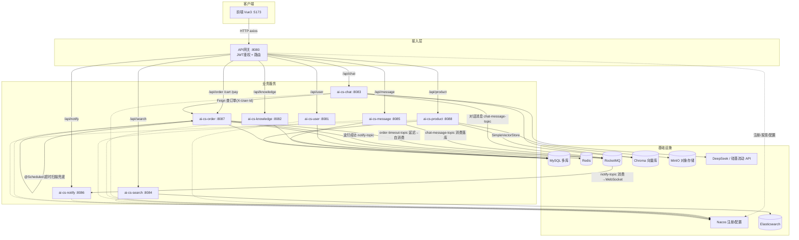

# 18 - 业务服务调度关系分析

> 分析日期：2026-08-07（初版）
> 更新日期：2026-08-07（调度层改造完成：chat 接真实订单 / MQ 落库 / notify 联动 / 定时任务 / Feign）
> 范围：ai-customer-service 全部 8 个业务服务 + 网关 + 前端 + 基础设施

---

## 一、总体架构：同步请求调度（HTTP / 网关 + Feign）

```
浏览器（Vue3 :5173）
   │  HTTP（axios + JWT）
   ▼
API 网关（ai-cs-gateway :8080）── AuthFilter JWT 鉴权 → RouteConfig 路由转发
   │
   ├── /api/user      ──▶ ai-cs-user      (8081) ──▶ user_db
   ├── /api/chat      ──▶ ai-cs-chat      (8083) ──▶ DeepSeek + Chroma(RAG) + 硅基流动(embedding)
   ├── /api/knowledge ──▶ ai-cs-knowledge (8082) ──▶ knowledge_db
   ├── /api/search    ──▶ ai-cs-search    (8084) ──▶ Elasticsearch
   ├── /api/message   ──▶ ai-cs-message   (8085) ──▶ chat_db + RocketMQ
   ├── /api/notify    ──▶ ai-cs-notify    (8086) ──▶ WebSocket 实时推送
   ├── /api/order     ──▶ ai-cs-order     (8087) ──▶ ai_customer_service + Redis
   ├── /api/cart      ──▶ ai-cs-order     （购物车归属订单模块）
   ├── /api/pay       ──▶ ai-cs-order     （支付回调）
   └── /api/product   ──▶ ai-cs-product   (8088) ──▶ product_db + MinIO(文件) + SimpleVectorStore
```

> 关键点（改造后）：
> - 外部请求统一经网关路由；**服务间同步调用**（如 chat → order 查订单）通过 **OpenFeign + 注册中心负载均衡** 完成；
> - 服务间**异步解耦**靠 RocketMQ 事件（对话消息、订单通知、超时消息）；
> - 该设计符合 CLAUDE.md 架构约束（服务间禁止直接依赖，通过 Feign/HTTP 或 MQ 协作）。

---

## 二、事件调度（异步 / RocketMQ）

### 2.1 订单超时取消链路（延迟消息 + 定时兜底）

```
OrderService.createOrder()
   │ ① 写入订单(状态=PENDING_PAY, expireTime=now+30min)
   ▼
RocketMQ syncSend("order-timeout-topic", orderNo, delayLevel=16≈30min)   ── 主路径
   │
   ▼（30 分钟后投递）
OrderTimeoutListener（ai-cs-order 内自消费）
   │
   ▼
OrderService.cancelExpiredOrder(orderNo) → 未支付则取消订单

另外：OrderTimeoutScheduler（@Scheduled 每 5 分钟）扫描超时未支付订单 ── 兜底路径
   │ 防止延迟消息丢失/延迟导致订单长期滞留
   ▼
OrderService.cancelExpiredOrder(orderNo)
```

### 2.2 聊天消息落库链路（chat 对话已接入）

```
ai-cs-chat ChatServiceImpl（对话完成）
   │  投递 user + assistant 消息
   ▼
RocketMQ "chat-message-topic"（sessionKey/role/content）
   │
   ▼
ChatMessageConsumer（ai-cs-message）
   │
   ▼
MessageService.saveMessage() → chat_db 持久化（跨服务复用）

另外：MessageController POST /api/message/send 也可投递该 Topic（原有人工入口）
```

### 2.3 订单状态变更通知链路（notify 联动）

```
OrderService.handlePayCallback()（支付成功）
   │  投递 notify-topic
   ▼
OrderNotifyConsumer（ai-cs-notify）
   │
   ▼
NotifyWebSocketHandler.sendMessageToUser(userId, message) → WebSocket 实时推送
```

### 2.4 chat 订单查询链路（OpenFeign 同步调用）

```
ChatController /chat/send（携带 X-User-Id，网关 JWT 透传）
   ▼
ChatUserContext（ThreadLocal 保存当前用户）
   ▼
OrderQueryService @Tool（模型识别意图触发）
   ▼
OrderFeignClient（@FeignClient("ai-cs-order")，注册中心负载均衡）
   ├── GET /order/{orderNo}      订单详情
   └── GET /order/list           当前用户订单列表（改造新增接口）
   ▼
ai-cs-order → ai_customer_service（MySQL 真实数据）
   │
   ▼（order 服务不可用时）
降级本地 mock 数据（容错）
```

---

## 三、各服务数据域与外部依赖

| 服务 | 数据库 | 外部依赖 | 关键接口 |
|---|---|---|---|
| ai-cs-user | user_db | - | 注册、登录（JWT 签发）、用户查询 |
| ai-cs-chat | -（无库） | DeepSeek、硅基流动、Chroma、RocketMQ、**Feign→order** | 对话 send / rag / stream、知识库入库/检索、订单查询工具 |
| ai-cs-knowledge | knowledge_db | - | 文档 CRUD + 分页 |
| ai-cs-search | - | Elasticsearch | 建索引、索引文档、搜索、删索引 |
| ai-cs-message | chat_db | RocketMQ | 消息发送(MQ)、会话管理、消息查询 |
| ai-cs-notify | - | WebSocket、RocketMQ | 单发、广播、在线数、订单通知消费 |
| ai-cs-order | ai_customer_service | MySQL、Redis、RocketMQ | 购物车、下单、支付回调、取消订单、**订单列表**、定时超时扫描 |
| ai-cs-product | product_db | MySQL、MinIO、向量存储 | 商品 CRUD、相似推荐、库存扣减/回补、分类 |

---

## 四、Mermaid 调度关系图



---

## 五、前端页面 → 服务映射

| 页面 | 调用 API | 目标服务 |
|---|---|---|
| LoginView / UserView | userApi | ai-cs-user |
| ChatView | chatApi | ai-cs-chat |
| KnowledgeView | knowledgeApi | ai-cs-knowledge |
| SearchView | searchApi | ai-cs-search |
| MessageView | messageApi | ai-cs-message |
| NotifyView | notifyApi | ai-cs-notify |
| CartView | cartApi | ai-cs-order（购物车） |
| ProductView | productApi | ai-cs-product |

---

## 六、调度层改造状态

### 6.1 已完成改造（详见 docs/19-调度层改造说明.md）

| 改造项 | 状态 | 说明 |
|---|---|---|
| chat 订单查询接真实 ai-cs-order | ✅ 完成 | OpenFeign 调用 + mock 降级，返回真实 MySQL 订单数据 |
| chat 对话接入 MQ 落库 | ✅ 完成 | chat 投递 chat-message-topic，message 消费落库 chat_db |
| 订单状态变更联动 notify | ✅ 完成 | 支付成功 → notify-topic → notify 消费 → WebSocket 推送 |
| 定时任务兜底订单超时 | ✅ 完成 | @Scheduled 每 5 分钟扫描超时订单（与延迟消息双保险） |
| 服务间调用规范化 | ✅ 完成 | 同步用 OpenFeign，异步用 RocketMQ 事件驱动 |

### 6.2 当前遗留说明

1. **order 下单链路依赖本地 Redis**（库存预扣）：本地未装 Redis，`createOrder` 未完整验证（查询链路不依赖 Redis，已验证）。
2. **WebSocket 实时推送**需浏览器连接（前端 NotifyView）才可见；测试中用户离线，仅验证了 notify 消费链路。
3. **RocketMQ / Elasticsearch 为本地部署**（tools/）：生产应使用集群部署；`deploy/nacos/configs/` 未入库（含敏感配置）。
4. **定时任务固定 5 分钟**：如需精确分钟级调度，可升级为 XXL-Job（引入 xxl-job-core + 调度中心）。
5. **测试数据**：订单表含测试订单（ORD202608070001/002），chat_message 含测试对话消息，可按需清理。
