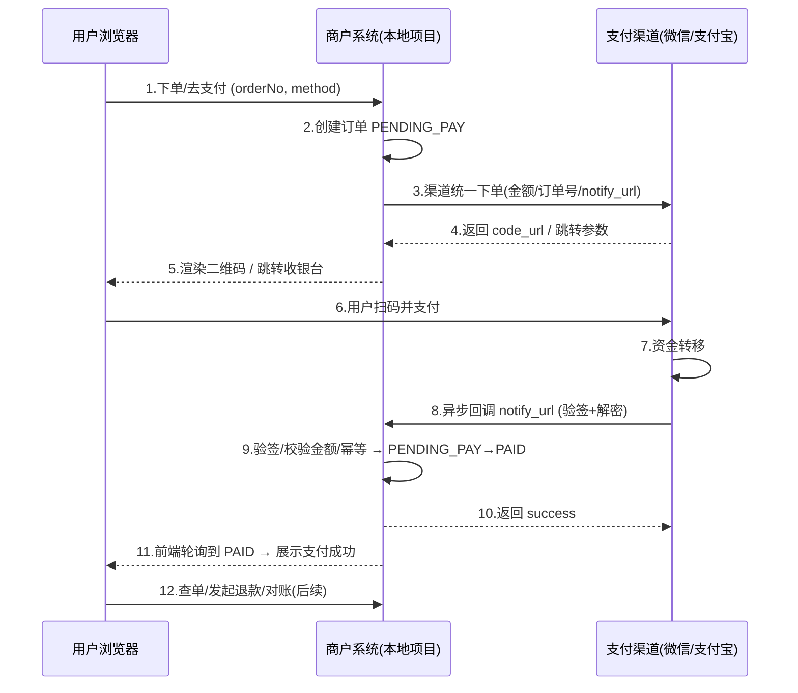

# 一套完整支付流程 · 学习指南

> 目标：从零讲清"线上支付"到底是怎么跑通的——包括用户、商户系统、支付渠道三方如何协作，
> 以及回调、验签、幂等、查单、退款、对账这些核心环节。并对照本地 ai-customer-service 项目逐个落点。

---

## 0. 先建立全景认知

一笔线上支付，永远是**三方参与**：

```text
用户(买家)  ── ① 在商城下单/发起支付
   │
   ├──────────► 商户系统(你的后端+前端)
   │                 │
   │                 │ ② 调用渠道"预下单/下单"接口
   │                 ▼
   │            支付渠道(微信支付/支付宝/银联)
   │                 │
   │ ③ 用户在支付App内完成支付
   ├────────────────► 支付App(微信/支付宝)   ← 钱在这里真实发生转移
   │
   └────────── ④ 渠道异步回调 通知商户"支付成功"
```

**最重要的一句话：资金变化只能相信"渠道的异步回调/查单结果"，页面跳转只是展示。**

---

## 1. 完整流程分阶段拆解

### 阶段 0：前置准备（一次性的）
- 商户资质：营业执照 → 申请**商户号**（微信 mchid / 支付宝 partnerId）。
- 开通支付产品：Native(扫码)、JSAPI(公众号/小程序)、电脑网站支付、当面付等。
- 拿到密钥/证书：支付宝 RSA2 密钥对、微信 APIv3 密钥 + 商户证书 + 平台证书。
- 配置回调地址 notify_url（必须公网可访问；H5/JSAPI 还要求域名 ICP 备案）。
- 开发环境用**沙箱**（支付宝沙箱免费，微信沙箱需申请）。

### 阶段 1：下单 & 渠道预下单
商户系统流程：
1. 校验购物车/库存/优惠 → 生成**订单**（状态 `PENDING_PAY`，金额，过期时间）。
2. 调渠道"统一下单"接口，传：
   - 商户订单号 `out_trade_no`（你自己的订单号，渠道侧幂等键）
   - 金额（支付宝用元、微信用分）
   - 商品描述、`notify_url`、`appid`/`mchid`
3. 渠道返回支付参数：
   - 微信 Native → `code_url`（前端渲染成二维码）
   - 支付宝电脑网站 → `form`/跳转 URL
   - 微信 JSAPI → 需再用 `prepay_id` 调起支付
4. 商户系统保存渠道交易号（prepay_id/trade_no），订单仍是待支付。

### 阶段 2：收银台 & 用户支付
- 前端展示二维码 / 跳转收银台。
- 用户在微信/支付宝 App 输入密码/指纹，完成支付；钱记到渠道账上。
- **此时商户系统还不知道**——这就是为什么必须靠回调。

### 阶段 3：异步回调（整个流程的心脏）
1. 渠道异步 POST 到 `notify_url`，**失败会自动重试**（多次，间隔递增）。
2. 商户系统**验签**（防止伪造通知）：
   - 微信 v3：验签（Wechatpay-Signature）+ AES-256-GCM 解密 resource。
   - 支付宝：RSA2（应用私钥签名、支付宝公钥验签）。
3. 校验业务一致性：订单号存在、金额一致、订单处于待支付。
4. **幂等更新**：若订单已 `PAID`，直接返回成功（渠道会重试，必须幂等）。
   否则 `PENDING_PAY → PAID`，记录支付时间、渠道流水号（transaction_id）。
5. 返回渠道要求的应答（微信 `{"code":"SUCCESS"}`，支付宝 `success`），表示已收到。
6. 商户系统内部继续：发通知（WebSocket/短信）、触发后续业务（如准备发货）。

### 阶段 4：同步跳转（仅展示，不可信）
- 渠道支付成功后同步跳回 `return_url`（支付宝）或前端轮询。
- 前端轮询 `GET /pay/status/{orderNo}`，看到 `PAID` 就展示"支付成功"。
- **同步结果不参与资金判断**，防止用户伪造跳转。

### 阶段 5：查单兜底 & 关单
- 回调可能丢失/延迟 → 主动**查单**：定时任务或前端轮询触发，调渠道查询接口，
  若渠道已支付而本地未更新，则补更新（状态修复）。
- 超时未支付 → **关单**：调渠道关闭订单 + 本地取消订单，释放库存/优惠券。
  （本地项目已有 RocketMQ 延迟消息 30 分钟自动取消。）

### 阶段 6：退款（逆向流程）
1. 用户/客服发起退款 → 生成退款单。
2. 调渠道**退款接口**：原订单号 + 商户退款单号 + 退款金额（退款单号是幂等键）。
3. 渠道异步**退款回调** → 更新退款状态（部分退款/全额退款）。
4. 退款同样要验签、幂等、对账。

### 阶段 7：对账 & 结算
- 日终下载渠道账单（对账单文件），与本地订单/退款逐笔比对。
- 处理**单边账**：渠道有本地没有（补单）、本地有渠道没有（异常挂起）。
- 资金按结算周期（常见 T+1）到商户对公账户。

### 阶段 8：贯穿全程的工程要点
- 验签/加解密（安全红线）
- 幂等（回调重试、退款重试）
- 金额单位统一（元/分换算）
- 订单状态机（只允许合法流转）
- 全链路日志 + 监控告警
- 密钥不进代码仓库（放配置中心/环境变量）

---

## 2. 时序图（Native 扫码为例）



---

## 3. 订单状态机

```text
                下单
                  │
                  ▼
            ┌───────────┐     支付回调/查单       ┌──────────┐
            │ PENDING_PAY│ ───────────────────► │   PAID   │
            └───────────┘                        └──────────┘
                  │
                  │ 超时/用户取消
                  ▼
            ┌───────────┐     退款成功
            │ CANCELLED │ ◄───────────────────────  (PAID 之后可退款)
            └───────────┘
```

合法流转只有：`PENDING_PAY → PAID`、`PENDING_PAY → CANCELLED`；`PAID → 退款状态(RE_FUNDING/REFUNDED)`。
状态判断是幂等的第一道防线。

---

## 4. 对照本地项目：每个环节在代码里长什么样

| 支付流程环节 | 本地项目位置 | 当前状态 |
|---|---|---|
| 购物车/结算 | `CartController`、`CheckoutController`（ai-cs-order） | ✅ 已有 |
| 创建订单 | `OrderServiceImpl.createOrder`（状态 PENDING_PAY + 过期时间 + 延迟取消消息） | ✅ 已有 |
| 渠道预下单 | `PaymentService.createPayment` / `PayController /pay/create` | ⏳ 占位（返回模拟 URL） |
| 收银台/二维码 | 前端 `/shop`「去支付」+ `/order/:orderNo`「立即支付」 | ⏳ 占位（打开模拟 URL） |
| 异步回调 | `PayCallbackController /pay/callback/{method}` | ⏳ 验签是 mock，未更新订单 |
| 验签/解密 | 需新增（微信 v3 / 支付宝 RSA2） | ❌ 待开发 |
| 幂等更新状态 | 需在回调里实现 `PENDING_PAY→PAID` | ❌ 待开发 |
| 查单兜底 | `PayController /pay/status/{orderNo}` 占位 | ⏳ 待接入渠道查询 |
| 超时关单 | `OrderServiceImpl.cancelExpiredOrder`（RocketMQ 延迟消息） | ✅ 已有 |
| 退款 | 未实现 | ❌ 待开发 |
| 对账 | 未实现 | ❌ 待开发 |

> 结论：本地项目已经把"用户侧交易链路"（购物车→订单→超时取消）做完了，
> 缺的正是支付特有的核心：**渠道下单、回调验签、幂等状态更新、查单、退款、对账**。

---

## 5. 学习路线（建议按顺序动手）

### 第 1 步：先跑通"模拟支付"全流程（本地可运行，推荐先做这个）
不接任何真实渠道，在项目里做一个**模拟支付渠道**，把完整状态流转跑起来：
- 下单 → 生成"模拟收银台"（或二维码）
- 点击"模拟支付成功" → 系统自己触发**模拟回调**（走真实的验签/幂等/状态更新代码路径）
- 前端轮询到 `PAID` → 展示成功
- 再做一个"模拟退款"
这样你能亲手点完整个流程，理解状态怎么变、回调为什么是核心。

### 第 2 步：对接支付宝沙箱（真实协议）
- 注册支付宝开放平台，建应用，申请沙箱（免费）。
- 用官方 `alipay-sdk-java`，把第 1 步的模拟渠道换成 `AlipayChannel`。
- 回调地址用内网穿透（ngrok/cpolar）让支付宝沙箱能回调到本地。
- 亲手体验：真实签名、真实回调、验签。

### 第 3 步：对接微信支付 Native（真实协议）
- 申请微信商户号（需营业执照/个体户）。
- 用官方 `wechatpay-java`（APIv3），体验"分"单位、证书、回调验签+解密。

### 第 4 步：补完工程能力
- 退款、查单兜底、对账任务、监控告警、幂等/并发测试。

---

## 6. 关键概念速查表

| 概念 | 一句话解释 |
|---|---|
| 商户号(mchid/partnerId) | 你在支付渠道的收款身份 |
| appid | 公众号/小程序/App 的应用标识，和商户号绑定 |
| out_trade_no | 商户订单号（你自己生成），渠道侧幂等键 |
| transaction_id | 渠道生成的交易流水号 |
| notify_url | 渠道异步通知地址（必须公网可访问） |
| 异步回调 | 渠道主动通知"支付结果"，**唯一可信来源** |
| 同步跳转 | 支付完跳回商户页面，仅展示，不可信 |
| 验签 | 用公钥验证通知/响应确实来自渠道 |
| 幂等 | 同一事件处理多次结果一致（回调会重试） |
| 状态机 | 订单状态只允许合法流转，防止重复入账 |
| 查单 | 主动问渠道"这笔单支付了吗"（兜底） |
| 单边账 | 渠道与本地账不平（对账要处理的差错） |

---

## 7. 常见面试/理解自测题

1. 为什么支付结果要以异步回调为准，而不是同步跳转？
2. 回调处理为什么要"验签 + 校验金额 + 幂等"三步？
3. 如果回调丢了，怎么保证订单最终能变成已支付？（查单兜底）
4. 微信金额单位是分、支付宝是元，怎么避免精度问题？
5. 退款为什么要用独立的退款单号？（幂等）
6. 超时未支付为什么要"关渠道订单 + 释放本地库存"两步？

---

## 8. 下一步（可选动手项）

在本地项目 ai-cs-order 落地"模拟支付渠道"，实现：
- `PayChannel` 接口 + `MockPayChannel`（模拟收银台 + 自动模拟回调）
- 回调验签（mock 密钥）+ 幂等更新订单状态
- 前端"模拟收银台"页面 + 支付状态轮询
- 模拟退款

完成后，这套代码稍加改造（把 `MockPayChannel` 换成 `AlipayChannel`/`WechatNativeChannel`）就是真实支付。

---

## 9. 已落地：模拟支付渠道（本地可实操）

本项目的模拟支付渠道已实现，代码位置与流程对照：

| 环节 | 代码 | 说明 |
|---|---|---|
| 渠道抽象（解耦核心） | `ai-cs-order/.../pay/channel/PayChannel.java` | 接口：下单/查单/验签/退款 |
| 渠道工厂 | `pay/channel/PayChannelFactory.java` | 按 `method()` 路由，新增渠道=新增实现类 |
| 模拟渠道 | `pay/channel/MockPayChannel.java` | 生成模拟收银台地址、模拟渠道记账 |
| 支付下单/状态查询 | `controller/PayController.java`（`/pay/create`、`/pay/status/{orderNo}`） | 通过工厂路由到渠道 |
| 通知统一处理 | `service/PayNotifyService.java` | 验签 → 幂等更新订单状态 |
| 渠道回调入口 | `controller/PayCallbackController.java`（`/pay/callback/{method}`） | 真实回调也走这里 |
| 模拟收银台/退款 | `controller/MockPayController.java`（`/pay/mock/pay`、`/pay/mock/refund`） | 模拟用户在收银台支付/退款 |
| 订单退款 | `OrderServiceImpl.refundOrder` | PAID → REFUNDED，回补库存 |
| 前端模拟收银台 | `ai-cs-frontend/src/views/MockCashierView.vue`（`/mock-pay`） | 模拟支付成功/失败 + 状态轮询 |

**实操路径**：商品商城(/shop) → 加入购物车 → 购物车(/cart) → 结算(/checkout，选「模拟支付」) → 下单 → 订单详情「立即支付」→ 模拟收银台(/mock-pay)「模拟支付成功」→ 订单变「已支付」→「模拟退款」→ 订单变「已退款」。

**如何扩展真实渠道**：复制 `MockPayChannel` 为 `AlipayChannel` / `WechatNativeChannel`，
实现 `createPayment / queryPayment / verifyNotify / refund`，在 Spring 中注册即可，业务代码零改动。

> **更新**：支付宝（AlipayChannel）、微信 Native（WechatNativeChannel）、银联云闪付（UnionpayChannel）三个渠道的代码已按
> `PayChannel` 接口实现并注册（对应类在 `ai-cs-order/.../pay/channel/`），商户参数统一走 Nacos `ai-cs-order.yml` 的 `pay.*`
> 配置，接入时填入真实密钥/证书即可，业务代码无需改动。`PayChannelFactory` 启动日志会打印已注册渠道列表。

> **架构更新**：支付已拆分为独立服务 `ai-cs-pay`（端口 8089），订单服务（ai-cs-order）不再包含支付代码。
> 支付服务负责：渠道下单/回调/查单/关单/退款/补偿对账 + 支付流水表 pay_transaction；
> 订单服务通过内部接口（/order/pay/confirm、/order/pay/refund-confirm、/order/pay/detail）与支付服务协作。
> 网关路由：`/api/pay/**` → `lb://ai-cs-pay`。