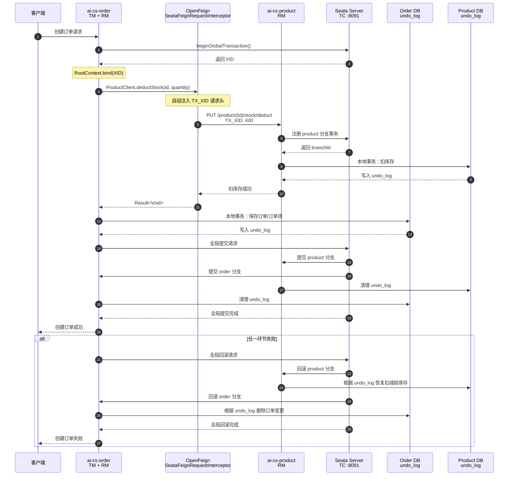

# 06-Seata 分布式事务 AT 模式：从零开始理解与实战

> 本文面向第一次接触 Seata 的读者。示例来自本项目的真实下单链路：
> `ai-cs-order` 创建订单时调用 `ai-cs-product` 扣减库存。
>
> 当前实现：Seata Server 1.7.1、AT 模式、file 注册/配置、order 发起全局事务、
> product 参与分支事务。代码验证已经完成；依赖真实 MySQL + Seata Server 的故障注入验收
> 需要 Docker 或可运行的基础设施环境。

---

## 一、完整调用图：order → OpenFeign → product + Seata Server

下面的图同时展示两条路径：

- **业务调用路径**：order 通过 OpenFeign 调用 product 的扣库存接口
- **事务协调路径**：order/product 各自向 Seata Server（TC）注册、提交或回滚分支



### 图中四个核心节点

| 节点 | 职责 |
|------|------|
| `ai-cs-order` | 全局事务发起方，既是 TM，也是本地数据库 RM；`OrderServiceImpl.doCreateOrder` 上有 `@GlobalTransactional` |
| `OpenFeign` | 业务 HTTP 调用工具；Seata 的 `SeataFeignRequestInterceptor` 将 order 线程中的 XID 注入 `TX_XID` 请求头 |
| `ai-cs-product` | 分支事务参与方 RM；接收 `TX_XID`，执行扣库存本地事务，并通过数据源代理记录 undo_log |
| `Seata Server` | TC 事务协调器；记录全局事务/分支事务，统一通知各 RM 提交或回滚 |

### 只看成功路径，可以简化为

```text
客户端
  │ 创建订单
  ▼
ai-cs-order（@GlobalTransactional，生成 XID）
  │
  │ ProductClient + SeataFeignRequestInterceptor
  │ HTTP 请求头：TX_XID=XID
  ▼
ai-cs-product（绑定 XID，扣库存，写 product.undo_log）
  │
  └──────────────┐
                 ▼
       Seata Server（TC）
       协调 order/product
                 │
       全局提交 → 清理两个 undo_log
```

### 失败时最重要的一点

OpenFeign 负责的是**业务请求和 XID 传播**，它本身不负责回滚；真正决定回滚的是 Seata Server：

```text
product 扣库存成功
  → order 后续保存失败
  → order TM 请求 Seata Server 回滚
  → Seata Server 通知 product RM
  → product 根据 product.undo_log 恢复库存
```

如果 OpenFeign 没有传播 `TX_XID`，product 就不会注册为这个全局事务的分支，
Seata Server 也就无法通过 AT 自动恢复 product 库存。

---

## 二、先理解：什么是分布式事务

### 1.1 单体应用里的本地事务

如果订单和库存都在同一个数据库中，可以使用普通 Spring 事务：

```java
@Transactional
public void createOrder() {
    deductStock();       // 修改库存
    saveOrder();         // 保存订单
}
```

数据库会把这两个 SQL 放在同一个本地事务中：

- 全部成功：一起提交
- 任一步失败：全部回滚

这依赖一个前提：两个操作使用的是**同一个数据库事务管理器和同一个数据库连接资源**。

### 1.2 微服务拆分后发生了什么

本项目把订单和商品拆成了两个服务：

```text
ai-cs-order                         ai-cs-product
订单数据库                          商品数据库
    │                                  │
    └──── HTTP/Feign 调用扣库存 ────────┘
```

创建订单通常包含：

1. 从 order 数据库读取购物车
2. 调用 product 服务扣减库存
3. 在 order 数据库保存订单和订单项
4. 核销优惠券
5. 发送订单超时消息

如果第 2 步已经扣库存，第 3 步保存订单时失败，就会出现：

```text
库存已经减少，但订单不存在
```

普通的 `@Transactional` 只能管理当前服务的本地数据库，无法自动回滚另一个服务的数据库。
这就是分布式事务要解决的问题：**一次业务操作跨越多个服务或多个数据库时，如何尽量保证数据一致**。

---

## 三、Seata 是什么

Seata 是一个开源的分布式事务解决方案。它的核心目标是协调多个服务中的本地事务，
让它们共同完成一次全局事务。

Seata 中有三个重要角色：

| 角色 | 全称 | 作用 | 本项目对应 |
|------|------|------|------------|
| TC | Transaction Coordinator | 事务协调器，记录全局事务和分支事务，决定提交还是回滚 | Seata Server，8091 |
| TM | Transaction Manager | 全局事务管理器，发起、提交、回滚全局事务 | order 服务的 `@GlobalTransactional` |
| RM | Resource Manager | 管理本地数据库资源，向 TC 注册分支并执行提交/回滚 | order/product 的 Seata 数据源代理 |

可以把它理解为：

```text
TM：我要开始一次全局事务
TC：好的，我给你一个全局事务编号
RM：我这里完成了一个本地分支，登记一下
TM：所有步骤成功，请全局提交
TC：通知每个 RM 提交

或者：

TM：某一步失败，请全局回滚
TC：通知每个 RM 按各自的回滚记录恢复数据
```

### 2.1 全局事务和分支事务

- **全局事务**：一次完整的业务操作，例如“创建订单并扣库存”
- **分支事务**：全局事务中的一个本地数据库操作，例如 product 服务扣库存
- **XID**：全局事务的唯一编号，用来把不同服务中的分支事务串起来

示意：

```text
全局事务 XID = 192.168.1.10:8091:123456789
│
├── order 分支：保存 order/order_item
└── product 分支：扣减 product.stock
```

---

## 四、Seata AT 模式是什么

Seata 支持多种事务模式。项目使用的是 **AT（Auto Transaction）模式**。

AT 模式的特点是：

- 业务代码不需要手写反向 SQL
- 数据库需要支持本地事务
- Seata 自动记录 SQL 执行前后的数据镜像
- 全局回滚时根据镜像生成补偿 SQL
- 适合短事务、关系型数据库、业务改动相对少的场景

AT 不是传统数据库意义上的“跨库强一致两阶段提交”。它更接近：

```text
本地事务先提交 + Seata 记录回滚信息 + 失败后自动补偿
```

所以 AT 模式的回滚本质是**补偿回滚**，不是把多个数据库连接放进同一个物理数据库事务。

---

## 五、AT 模式完整流程

下面以本项目“创建订单并扣库存”为例。

### 4.1 一阶段：执行本地业务并记录 undo_log

#### 第一步：order 创建全局事务

```java
@GlobalTransactional(rollbackFor = Exception.class, name = "order-create")
@Transactional(rollbackFor = Exception.class)
public OrderVO doCreateOrder(...) {
    productClient.deductStock(productId, quantity);
    orderMapper.insert(order);
    return result;
}
```

`@GlobalTransactional` 做的是：

1. 向 TC 注册一个全局事务
2. 获取 XID
3. 把 XID 放入当前线程的 Seata 上下文 `RootContext`
4. 执行业务方法
5. 业务方法正常结束时请求 TC 全局提交
6. 业务方法抛异常时请求 TC 全局回滚

`@Transactional` 仍然需要保留，因为全局事务内部每个服务仍然要有自己的本地事务。

#### 第二步：XID 通过 Feign 传给 product

本项目 order 使用：

```java
@FeignClient(
    name = "ai-cs-product",
    contextId = "productClient",
    path = "/product"
)
public interface ProductClient {

    @PutMapping("/{id}/stock/deduct")
    Result<Void> deductStock(
            @PathVariable("id") Long id,
            @RequestParam("quantity") int quantity);
}
```

Seata 的 Spring Cloud Alibaba starter 会自动注册 Feign 拦截器：

```text
RootContext 中的 XID
        │
        └── SeataFeignRequestInterceptor
                │
                └── HTTP 请求头 TX_XID
```

因此，product 收到的请求中会有：

```text
TX_XID: 192.168.1.10:8091:123456789
```

这也是本项目从裸 `RestTemplate` 迁移到 OpenFeign 的关键原因。

> 裸 `RestTemplate` 默认不会自动传播 Seata XID。只把调用方式从 Feign 改成裸 RestTemplate，
> 业务可能仍能调用成功，但 product 分支会脱离全局事务。

#### 第三步：product 绑定 XID 并注册分支

product 服务需要从 HTTP 请求头中读取 `TX_XID`，把它绑定到当前请求线程的 Seata 上下文。
本项目为 product 增加了：

```xml
<dependency>
    <groupId>io.seata</groupId>
    <artifactId>seata-http</artifactId>
</dependency>
```

这个依赖使 `SeataHttpAutoConfiguration` 可以根据类路径条件装配 Boot 3/Jakarta MVC 配置器，
从 `TX_XID` 头绑定和解绑 `RootContext`。

如果没有这一步，Feign 端虽然发出了 XID，product 也可能拿不到全局事务上下文。

#### 第四步：Seata 数据源代理拦截 SQL

product 的库存方法：

```java
@Transactional(rollbackFor = Exception.class)
public void deductStock(Long productId, int quantity) {
    int rows = productMapper.update(null, new LambdaUpdateWrapper<Product>()
            .eq(Product::getId, productId)
            .ge(Product::getStock, quantity)
            .setSql("stock = stock - " + quantity)
            .setSql("sales = sales + " + quantity));
}
```

配置：

```yaml
seata:
  data-source-proxy-mode: AT
  enable-auto-data-source-proxy: true
```

Seata 会代理原始 DataSource：

```text
业务代码
  → SeataDataSourceProxy
      → SQL 执行前查询 before image
      → 执行库存 UPDATE
      → SQL 执行后查询 after image
      → 写入 undo_log
      → 本地事务提交
```

`undo_log` 是每个参与 AT 分支的数据库都必须存在的表。它记录了恢复数据所需的信息，
典型内容包括：

- 全局事务 XID
- 分支事务 ID
- 回滚信息 `rollback_info`
- 日志状态
- 创建时间

一阶段结束后，product 的本地事务已经提交，但 undo_log 暂时保留，等待 TC 的最终决定。

### 4.2 二阶段：全局提交

如果 order 创建订单、product 扣库存等步骤都成功：

```text
order → TM 请求 TC 全局提交
TC → 通知 order/product 分支提交
order/product → 删除或异步清理 undo_log
```

AT 全局提交通常很快，因为业务数据在一阶段本地事务中已经提交，二阶段主要是清理回滚日志。

### 4.3 二阶段：全局回滚

如果后续步骤抛出异常：

```text
order → TM 请求 TC 全局回滚
TC → 通知 product 分支回滚
product → 读取 undo_log
product → 使用 before image 生成补偿 UPDATE
product → 校验 after image，执行反向补偿
product → 删除 undo_log
```

例如库存原来是 100，扣减后是 98：

```text
before image: stock = 100
after image:  stock = 98
```

回滚时 Seata 会把库存恢复为 100。业务代码不需要再写：

```java
stock = stock + quantity;
```

---

## 六、本项目的三层传播条件

很多人只记住 `@GlobalTransactional`，但真正让分支事务生效需要三层条件同时满足：

```text
一、客户端传播
order 的 Feign 拦截器把 RootContext XID 写入 TX_XID

二、服务端绑定
product 的 seata-http MVC 配置器从 TX_XID 恢复 RootContext

三、数据库代理
product 的 DataSource 被 Seata 代理，记录 undo_log 并注册 RM 分支
```

缺少任意一层都会出现“代码看起来有 Seata，但实际上没有全局回滚”的问题。

### 5.1 常见错误组合

| 错误配置 | 表现 |
|----------|------|
| 只加 `@GlobalTransactional` | order 有 XID，但下游可能不参与 |
| 使用裸 RestTemplate | product 收不到 `TX_XID` |
| 缺少 `seata-http` | Boot 3 MVC 端可能没有 HTTP XID 绑定器 |
| `enable-auto-data-source-proxy=false` | SQL 不生成 undo_log，无法 AT 回滚 |
| product 数据库缺 `undo_log` | 分支提交或回滚时报表不存在 |
| order/product 事务组不一致 | 客户端找不到对应 TC |
| Seata Server 不可用 | 全局事务无法注册或完成协调 |

---

## 七、本项目配置逐项解释

order 和 product 的事务配置核心如下：

```yaml
seata:
  enabled: true
  application-id: ${spring.application.name}
  tx-service-group: aics_tx_group
  service:
    vgroup-mapping:
      aics_tx_group: default
    grouplist:
      default: ${SEATA_ADDR:127.0.0.1:8091}
  registry:
    type: file
  config:
    type: file
  data-source-proxy-mode: AT
  enable-auto-data-source-proxy: true
```

### 6.1 `enabled`

```yaml
enabled: true
```

是否启用 Seata 客户端。测试环境如果不需要分布式事务，可以关闭，但关闭后不能验证 AT 行为。

### 6.2 `application-id`

```yaml
application-id: ${spring.application.name}
```

当前客户端应用名。order 和 product 会使用各自的服务名注册到 Seata。

### 6.3 `tx-service-group`

```yaml
tx-service-group: aics_tx_group
```

业务使用的事务服务组名称。它不是数据库名，也不是 RocketMQ topic。

### 6.4 `vgroup-mapping`

```yaml
vgroup-mapping:
  aics_tx_group: default
```

把业务事务组映射到 TC 集群名 `default`。

### 6.5 `grouplist`

```yaml
grouplist:
  default: 127.0.0.1:8091
```

file 注册模式下，客户端直接连接这个 Seata Server 地址。

### 6.6 `registry.type` 和 `config.type`

```yaml
registry:
  type: file
config:
  type: file
```

表示 Seata 客户端不通过 Nacos 获取 Seata Server 注册信息和配置，而是使用本地 file 配置。

本项目已经使用 Nacos 作为微服务注册中心和配置中心，但 Seata 这里单独使用 file 模式，
是为了让本地学习时减少依赖。生产集群可以评估切换到 Nacos 注册/配置模式。

### 6.7 `data-source-proxy-mode`

```yaml
data-source-proxy-mode: AT
```

指定数据源代理使用 AT 模式。

### 6.8 `enable-auto-data-source-proxy`

```yaml
enable-auto-data-source-proxy: true
```

让 Seata 自动代理 Spring 的 DataSource。没有它，`@Transactional` 可能仍然可以执行本地事务，
但不会自动生成 AT 所需的 undo_log。

---

## 八、为什么 order 要使用 Feign，而不是裸 RestTemplate

旧实现：

```java
RestTemplate restTemplate = new RestTemplate();
restTemplate.put("http://ai-cs-product/product/{id}/stock/deduct", ...);
```

问题：

- 服务名、路径和参数容易散落在业务代码中
- 默认没有 Seata XID 传播
- 默认没有统一的超时、降级、链路上下文能力
- API 契约不集中

现实现：

```java
@FeignClient(name = "ai-cs-product", path = "/product")
public interface ProductClient {
    @PutMapping("/{id}/stock/deduct")
    Result<Void> deductStock(Long id, int quantity);
}
```

收益：

1. Seata Feign interceptor 自动传播 XID
2. OpenFeign + LoadBalancer 通过服务名发现实例
3. 接口注解形成清晰的 HTTP 契约
4. 可以直接配置 CircuitBreaker 和 FallbackFactory
5. Micrometer tracing 更容易统一接入

> 不是说 RestTemplate 永远不能用，而是本项目已经选择 Feign 作为服务间调用标准。
> 如果历史原因必须使用 RestTemplate，就必须显式配置 Seata HTTP 客户端传播，并用集成测试
> 验证 product 侧 `RootContext.getXID()` 非空。

---

## 九、Seata 和 Spring 本地事务如何配合

推荐理解为两层：

```java
@GlobalTransactional
@Transactional
public void doCreateOrder() {
    productClient.deductStock(...); // product 分支
    orderMapper.insert(order);      // order 分支
}
```

- `@Transactional`：保证当前服务内部的本地 SQL 一起成功或回滚
- `@GlobalTransactional`：协调多个服务的本地事务

不能只依赖其中一个：

- 只有 `@Transactional`：只能回滚当前服务
- 只有 `@GlobalTransactional`：本地数据库操作仍需要正确的本地事务边界和数据源代理

### 8.1 注解生效的常见要求

- 方法通常应为 `public`
- 方法所在对象应由 Spring 容器管理
- 不要在同一个类里通过 `this.method()` 绕过代理
- 异常不能被提前吞掉，否则 TM 可能认为全局事务成功
- `rollbackFor = Exception.class` 要和业务异常策略保持一致

---

## 十、Seata 不能回滚什么

Seata AT 主要协调数据库资源，不能自动回滚所有外部副作用。

### 9.1 MQ 消息

本项目创建订单时会发送订单超时延迟消息：

```java
rocketMQTemplate.syncSend("order-timeout-topic", message, 5000, 16);
```

MQ 不是 Seata AT 数据库资源。即使数据库全局回滚，消息可能已经发出。

本项目通过消费侧幂等降低风险：

```text
消息到达
  → cancelExpiredOrder 查询订单
  → 查不到订单或订单已不是 PENDING_PAY
  → 直接忽略
```

如果业务要求“数据库提交和消息发送必须绑定”，应评估：

- RocketMQ 事务消息
- Outbox 本地消息表
- 可靠事件最终一致性

不能认为 `@GlobalTransactional` 会自动撤回已经发送的 MQ 消息。

### 9.2 Redis、HTTP、文件和第三方支付

以下副作用也不会被 AT 自动回滚：

- Redis 写入
- 已发送的 HTTP 请求
- MinIO 文件上传
- 第三方支付请求
- WebSocket 推送
- 邮件和短信

因此，跨资源流程通常需要：

- 幂等
- 重试
- 补偿任务
- 对账
- 事务消息或 Outbox

---

## 十一、取消/退款的补偿和 AT 回滚不是一回事

这两个概念很容易混淆。

### 10.1 下单失败时的 AT 回滚

```text
下单中途失败
  → TC 通知 product 分支回滚
  → Seata 根据 undo_log 自动恢复库存
```

这是 Seata AT 的二阶段回滚。

### 10.2 用户取消或退款时的业务补偿

```text
订单已经成功创建并支付
  → 用户申请取消/退款
  → OrderService 主动调用 ProductClient.restoreStock()
```

这是一个新的业务操作，不是旧下单事务的回滚。

本项目明确区分：

- 下单失败：Seata undo_log 自动补偿
- 超时/取消/退款：业务代码主动调用 `restoreStock`
- `restoreStock` 调用失败：通过降级告警、重试和对账兜底

如果把两者都叫“回滚”，会掩盖业务补偿接口失败的风险。

---

## 十二、数据库要求：undo_log 和全局锁

### 11.1 undo_log 表

每个参与 AT 分支的数据库都要执行 Seata 提供的 `undo_log` 建表 SQL：

```text
order 数据库：undo_log
product 数据库：undo_log
```

表不能只建在 order 库，因为 product 也需要记录自己的分支回滚信息。

### 11.2 全局锁

AT 执行过程中，Seata 会维护全局锁，防止两个全局事务同时修改同一行。

例如：

```text
事务 A：准备修改 product 1001
事务 B：也准备修改 product 1001
```

Seata 会让其中一个事务等待或失败，避免两个全局事务的镜像和提交顺序互相覆盖。

注意：全局锁会带来等待和超时，需要结合：

- 数据库本地锁
- Seata 全局锁
- 业务重试
- 超时配置

一起调优。

---

## 十三、项目代码落点

```text
ai-cs-order/
├── pom.xml
│   ├── spring-cloud-starter-alibaba-seata
│   ├── spring-cloud-starter-openfeign
│   └── spring-cloud-starter-circuitbreaker-resilience4j
├── src/main/resources/application.yml
│   └── seata.enabled / tx-service-group / data-source-proxy-mode
├── .../OrderServiceImpl.java
│   ├── doCreateOrder() @GlobalTransactional
│   └── productClient.deductStock()
├── .../client/ProductClient.java
│   └── Feign + Seata XID 自动传播
└── .../client/PayClient.java

ai-cs-product/
├── pom.xml
│   ├── spring-cloud-starter-alibaba-seata
│   └── seata-http
├── src/main/resources/application.yml
│   └── 分支事务和数据源代理配置
└── .../ProductServiceImpl.java
    ├── deductStock() @Transactional
    └── restoreStock() @Transactional

deploy/mysql/seata-undo-log.sql
└── order/product 数据库分别执行

tools/seata/seata/
└── Seata Server 1.7.1，8091
```

---

## 十四、如何自己验证一次 AT 回滚

### 13.1 准备环境

需要：

- MySQL
- Seata Server 1.7.1
- order 服务
- product 服务
- order/product 各自的 `undo_log`
- 两个服务能通过 Nacos 或本地地址互相访问

本机当前没有 Docker CLI，因此这里只给操作步骤，不把未执行的端到端结果当作已验证。

### 13.2 验证正常提交

1. 查询 product 1001 初始库存，例如 100
2. 调用创建订单接口
3. 检查订单已保存
4. 检查库存变为 98
5. 检查 `undo_log` 最终被清理

### 13.3 验证全局回滚

故障注入方式可以是：

- product 扣库存后让 order 后续保存订单抛异常
- 或让 product 分支主动抛异常
- 或在测试代码中 mock product 调用失败

正确结果：

```text
订单未保存
库存恢复到原值
优惠券未被核销或随本地事务回滚
undo_log 被清理
```

关键验收要求：

> 暂时关闭旧的手工库存回补逻辑，故障注入仍能恢复库存，才说明 Seata AT 真正生效。

否则手工回补可能掩盖 Seata XID 没有传播的缺陷。

### 13.4 验证 XID 是否真正传播

在 product 扣库存方法或 MVC 拦截器附近临时打印：

```java
log.info("Seata XID={}", RootContext.getXID());
```

如果是在全局事务调用链中，应该看到非空 XID。

测试完成后不要长期保留敏感或高频日志，生产可以用 traceId/XID 的采样日志替代。

---

## 十五、为什么 AT 不是万能方案

### 14.1 适合场景

- MySQL 等关系型数据库
- 事务持续时间短
- SQL 相对标准
- 参与服务边界清晰
- 可以接受补偿回滚模型
- 业务需要快速接入分布式事务

### 14.2 不适合场景

- 长时间占用资源的事务
- 跨越大量外部系统
- 大量非幂等 HTTP 副作用
- 文件、支付、短信等无法回滚的资源为主
- 对强一致和隔离级别有极高要求

替代或配合方案：

- TCC：业务自己实现 Try/Confirm/Cancel，控制力强但开发成本高
- Saga：长事务、状态补偿流程
- RocketMQ 事务消息：数据库提交和消息投递的最终一致
- Outbox：本地消息表 + 异步投递
- 可靠重试 + 对账：适合最终一致业务

---

## 十六、常见问题速查

### Q1：`@GlobalTransactional` 和 `@Transactional` 要同时写吗？

通常要。前者负责跨服务协调，后者负责当前服务本地事务。

### Q2：为什么 order 用 Feign 后才说 XID 自动传播？

SCA Seata starter 提供 Feign 请求拦截器。裸 RestTemplate 默认没有同等自动传播能力，
除非另外配置 Seata 的 HTTP 客户端集成。

### Q3：product 有 `@Transactional` 就够了吗？

不够。它只能形成 product 的本地事务；还需要收到 XID、注册 RM 分支、数据源被 Seata 代理。

### Q4：undo_log 建一个库可以吗？

不可以。每个参与 AT 分支的数据库都需要自己的 undo_log。

### Q5：MQ 消息能被 Seata 回滚吗？

不能。MQ 不是 AT 数据库资源，需要事务消息、Outbox、幂等消费或补偿任务。

### Q6：取消订单时调用 restoreStock 是 Seata 回滚吗？

不是。这是订单成功后的新业务补偿；下单失败时的 AT 回滚才是 undo_log 补偿。

### Q7：测试通过是不是说明 AT 已经生效？

不一定。Mockito 单测只能验证调用关系，必须用真实 MySQL + Seata Server 做故障注入，
并确认关闭手工回补后 product 库存仍能恢复。

### Q8：为什么 Seata 回滚可能失败？

可能原因包括：数据被其他业务修改、全局锁超时、undo_log 缺失、SQL 不支持、网络异常、
事务组配置错误。生产必须有告警、重试和人工对账机制。

---

## 十七、建议学习顺序

如果你完全没接触过 Seata，按以下顺序学习：

1. 先用本地事务理解 `commit` 和 `rollback`
2. 画出本项目 order→product 的调用链
3. 记住 TC/TM/RM 三个角色
4. 理解 XID 如何从 order 传到 product
5. 理解 before image、after image、undo_log
6. 阅读 `OrderServiceImpl.doCreateOrder`
7. 阅读 `ProductServiceImpl.deductStock`
8. 对比 `ProductClient` 和旧 RestTemplate 实现
9. 起真实基础设施做一次正常提交
10. 做一次故障注入，确认库存自动恢复
11. 最后再学习 TCC、Saga、事务消息和 Outbox

---

## 十八、面试要点总结

可以用下面这段话概括本项目的 Seata AT 实践：

> 本项目在 order 服务通过 `@GlobalTransactional` 发起下单全局事务，库存扣减通过 OpenFeign
> 调用 product 服务。SCA Seata starter 的 Feign 拦截器把 RootContext 中的 XID 注入 `TX_XID`，
> product 侧通过 `seata-http` 的 Jakarta MVC 配置器绑定 XID，两个服务的数据源开启 Seata AT
> 代理后，分别以 RM 身份注册分支并记录 undo_log。正常流程由 TC 协调全局提交，任一分支失败
> 时由 TC 通知各 RM 按 before image 执行补偿。MQ、Redis 和支付等非数据库资源不受 AT 自动回滚，
> 通过幂等、事务消息、重试和对账解决最终一致性问题。

---

## 十九、当前项目验证状态

- ✅ order 已从裸 RestTemplate 迁移到 `ProductClient` OpenFeign
- ✅ product 已补 `seata-http` 依赖
- ✅ order/product 已配置 `enable-auto-data-source-proxy: true`
- ✅ `mvn -pl ai-cs-order verify`：84 个测试全绿，JaCoCo 门禁通过
- ✅ order/product 编译通过
- ⏳ 真实 MySQL + Seata Server 故障注入：依赖 Docker 或完整联调环境
- ⏳ 关闭手工回补后的端到端库存恢复验证：待真实环境执行

相关技术文档：

- [服务调用统一与 Seata XID 传播](07-服务调用统一与SeataXID传播.md)
- [订单状态机治理](12-订单状态机治理.md)
- [Spring Cache 与事务领域事件](09-SpringCache与事务领域事件.md)
