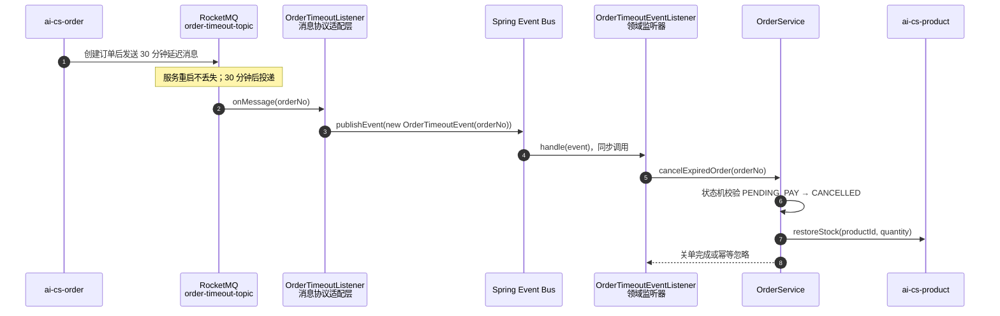

# 09-Spring Cache 与事务领域事件（01-P2 落地记录）

> 2026-08 落地：product 的商品详情/分类列表接 Spring Cache + Redis；
> order 的超时关单、支付成功通知改为进程内领域事件，其中支付通知严格 AFTER_COMMIT。

## 一、Spring Cache：把缓存策略从业务代码中剥离

### 1.1 改造前后的对比

**旧方式**（业务逻辑手写 Redis）：

```java
String json = redisTemplate.opsForValue().get(key);
if (json == null) {
    value = mapper.selectById(id);
    redisTemplate.opsForValue().set(key, serialize(value), ttl);
}
return deserialize(json);
```

问题：命中/回源/序列化/TTL/失效逻辑散落业务方法，测试时要 mock Redis 细节。

**新方式**（声明式）：

```java
@Cacheable(cacheNames = PRODUCT_DETAIL, key = "#id", sync = true)
public ProductVO getProductDetail(Long id) { ... }

@CacheEvict(cacheNames = PRODUCT_DETAIL, key = "#id")
public ProductVO updateProduct(Long id, ProductUpdateDTO dto) { ... }
```

Spring AOP 代理在方法前查 Cache、命中直接返回，未命中执行目标方法并写入；
`@CacheEvict` 默认 `beforeInvocation=false`，方法**成功后**才删除（失败不删）。

### 1.2 本项目缓存边界

| cacheName | 方法 | TTL | 失效点 |
|-----------|------|-----|--------|
| `product:detail` | `getProductDetail(id)` | 30 分钟 | update/delete/deductStock/restoreStock |
| `product:categories` | `listCategories()` | 10 分钟 | createCategory（allEntries） |

**不缓存商品分页列表**：分页+关键词+分类+状态的 key 组合基数高，库存/销量又高频变化，
命中率低、驱逐面大——缓存不是越多越好。

`sync=true`：同一 JVM 同 key 并发 miss 时只允许一个线程回源，其他等待，降低缓存击穿；
它不跨网关实例，跨实例击穿仍需分布式锁/逻辑过期等更重方案（当前流量不需要）。

### 1.3 序列化与 TTL 配置

`ProductCacheConfig`：

- `GenericJackson2JsonRedisSerializer`：跨语言可读 JSON，带类型信息（避免 LinkedHashMap 反序列化问题）
- 禁止缓存 null：商品不存在抛业务异常，不把异常结果缓存（避免长时间假 404）
- 默认 TTL 20 分钟；按 cacheName 覆盖详情 30 / 分类 10 分钟

### 1.4 缓存一致性

采用**先更新数据库，成功后删除缓存**：

1. DB update 提交成功
2. AOP afterInvocation 执行 CacheEvict
3. 下一次读回源拿新值

极端窗口：DB 已更新但删缓存失败 → 短期脏读（最长 TTL）。生产增强路径：
`@TransactionalEventListener(AFTER_COMMIT)` 发缓存删除事件 + MQ 重试，或 CDC/binlog 订阅
（02 计划 P3 Canal）。本阶段流量与业务等级下 TTL + 主动驱逐足够。

## 二、领域事件：进程内解耦与事务边界

### 2.1 领域事件 vs RocketMQ

| 类型 | 适用边界 | 本项目例子 |
|------|----------|------------|
| Spring ApplicationEvent | 同一进程内模块解耦、事务同步回调 | OrderTimeoutEvent / OrderPaidEvent |
| RocketMQ | 跨服务、跨时间、需持久化重试 | order-timeout-topic 延迟消息 / notify-topic |

二者不是替代关系，而是串联：

```
RocketMQ 延迟消息（跨时间唤醒）
 → OrderTimeoutListener（协议适配）
 → publish OrderTimeoutEvent（进程内领域事实）
 → OrderTimeoutEventListener
 → OrderService.cancelExpiredOrder（业务）
```

这样消息协议适配层不再直接依赖关单实现，监听器单测与业务单测分开。

### 2.2 `OrderTimeoutEvent`：为什么超时关单同时使用 MQ 和 Spring 事件

先看需求：订单创建后 30 分钟仍未支付，就要自动取消订单、回补库存、关闭支付渠道、退回优惠券。

这里需要解决两个不同的问题：

| 问题 | 适合的技术 | 原因 |
|------|------------|------|
| **30 分钟后再唤醒处理** | RocketMQ 延迟消息 | 消息可持久化，服务重启后仍能投递，跨进程/跨时间可靠 |
| **收到消息后如何组织 order 服务内部业务** | Spring `OrderTimeoutEvent` | 将消息协议适配与订单领域逻辑解耦，方便单测和未来替换消息来源 |

所以当前链路不是“MQ 和 Spring 事件二选一”，而是两层各司其职：



#### 2.2.1 `OrderTimeoutEvent` 只携带最小事实

事件定义非常简单：

```java
public record OrderTimeoutEvent(String orderNo) {
}
```

它只携带 `orderNo`，不携带订单状态、库存数量、优惠券等可变数据。原因是：

- 延迟消息 30 分钟后才消费，消息中的完整订单快照可能已经过期
- 订单可能已经支付、手动取消或退款
- 监听器应以数据库中的当前订单状态作为事实来源

这是一条重要原则：**事件携带“发生了什么”的标识，业务处理时回查当前事实；不要把可能过期的业务快照当成真相。**

#### 2.2.2 消息监听器为什么不直接调用 `OrderService`

旧结构可以直接写：

```java
@RocketMQMessageListener(...)
public class OrderTimeoutListener implements RocketMQListener<String> {
    public void onMessage(String orderNo) {
        orderService.cancelExpiredOrder(orderNo);
    }
}
```

这样短期能工作，但消息协议和业务逻辑强耦合：

- 改成 XXL-Job 扫描超时订单时，会复制一份关单入口逻辑
- 改成 HTTP 管理端手动触发超时处理时，又会复制一份
- 单测消息 listener 时必须关心订单业务细节

新结构是：

```java
// 1. RocketMQ adapter：只做 String 消息 → 领域事件转换
public void onMessage(String orderNo) {
    eventPublisher.publishEvent(new OrderTimeoutEvent(orderNo));
}

// 2. 领域监听器：只表达“订单超时后要关单”
@EventListener
public void handle(OrderTimeoutEvent event) {
    orderService.cancelExpiredOrder(event.orderNo());
}
```

这样未来即使消息来源改为：

- RocketMQ 延迟消息
- XXL-Job 定时扫描
- 管理员手工操作
- 支付渠道超时回调

都只需要发布同一个 `OrderTimeoutEvent`，业务处理规则保持一个入口。

#### 2.2.3 为什么 `OrderTimeoutEventListener` 使用 `@EventListener`，不使用 AFTER_COMMIT

超时消息到达时，订单创建事务通常已经在 30 分钟前完成。现在要做的是一个新的关单事务，
不是给旧的创建订单事务增加提交后副作用。

因此：

```java
@EventListener
public void handle(OrderTimeoutEvent event) {
    orderService.cancelExpiredOrder(event.orderNo());
}
```

这是**同步进程内事件**：`publishEvent()` 返回前，监听器的 `cancelExpiredOrder()` 已经执行结束。

使用同步监听的原因：

- RocketMQ 消费线程需要知道关单处理是否完成
- 如果监听器抛出异常，消息适配层可以记录错误，RocketMQ 可以按消费策略重试/告警
- 不需要为了这个同服务业务编排再引入线程池、异步事件或额外消息

它与支付成功事件不同：

| 事件 | 注解 | 触发时机 | 目的 |
|------|------|----------|------|
| `OrderTimeoutEvent` | `@EventListener` | RocketMQ 延迟消息到达后立即同步处理 | 触发新的关单业务事务 |
| `OrderPaidEvent` | `@TransactionalEventListener(AFTER_COMMIT)` | 支付订单事务真正提交后 | 发送不可回滚的通知副作用 |

简单记忆：

```text
OrderTimeoutEvent：我要开始做一件新业务 → 同步 @EventListener
OrderPaidEvent：一件事务已经成功，才能通知外部 → AFTER_COMMIT
```

#### 2.2.4 超时消息重复投递时为什么不会重复回补库存

消息系统通常至少一次投递。网络超时、消费者重启、消费确认异常都可能让同一个 `orderNo`
被再次投递。

`cancelExpiredOrder(orderNo)` 的核心幂等保护是订单状态：

```java
Order order = orderMapper.selectOne(...);
if (order == null || !OrderStatus.PENDING_PAY.getCode().equals(order.getStatus())) {
    return; // 订单已支付、已取消、已退款，或根本不存在，直接忽略
}

// 只有待支付订单才允许状态机迁移 PENDING_PAY → CANCELLED
// 后续才会回补库存、关闭支付渠道、退回优惠券
```

重复消息场景：

```text
第一次消息：PENDING_PAY → CANCELLED → 回补库存
第二次消息：当前已是 CANCELLED → 直接 return → 不再回补
```

幂等的关键不是“消息永远不重复”，而是**业务处理重复执行时结果不变**。

#### 2.2.5 与 Seata 下单回滚的关系

创建订单的 Seata AT 事务中也会发送延迟消息。如果下单后续失败导致订单回滚，
延迟消息仍然可能已经存在于 RocketMQ 中：

```text
创建订单
  → 发送延迟消息
  → 后续步骤失败
  → Seata 回滚 order/product 数据库
  → 30 分钟后消息仍到达
  → cancelExpiredOrder 查不到订单
  → 安全忽略
```

这就是为什么 `OrderTimeoutEvent` 必须以 `orderNo` 回查数据库、并且 `cancelExpiredOrder`
必须幂等。Seata 只能协调数据库分支，不能撤回已经投递的 RocketMQ 消息。

#### 2.2.6 异常边界和后续增强

当前 `OrderTimeoutListener` 捕获事件发布/处理异常并记录错误日志，避免消费线程直接崩溃。
生产增强方向：

- 对关单失败指标埋点和告警
- RocketMQ 配置合理重试次数与死信队列
- 对支付渠道关单、库存回补失败建立定时对账任务
- 订单量极大时，将“扫描超时订单”交给 XXL-Job，并复用 `OrderTimeoutEvent`
- 对并发超时和支付回调竞争，增加基于状态条件更新的乐观锁保护

### 2.3 为什么支付通知必须 AFTER_COMMIT

旧代码在 `confirmPay @Transactional` 方法里先更新状态，随后直接发 notify-topic，
再清购物车。若「发完通知后清购物车失败」导致事务回滚，用户却已经收到支付成功通知——
典型的**事务内副作用泄漏**。

新链路：

```java
// confirmPay 的事务内：只记录领域事实
orderMapper.updateById(order);
eventPublisher.publishEvent(new OrderPaidEvent(orderNo, userId));
// 后续清购物车若失败 → 事务回滚

@TransactionalEventListener(phase = AFTER_COMMIT)
void handle(OrderPaidEvent event) {
    rocketMQTemplate.convertAndSend("notify-topic", payload);
}
```

原理：事件发布时，Spring 的 `TransactionalApplicationListener` 把 callback 注册到
`TransactionSynchronizationManager`；事务真正 commit 后执行 `afterCommit()`。
回滚则 callback 永不执行。`fallbackExecution=false`（默认）还确保**无事务发布时也不执行**。

### 2.4 四种 TransactionPhase

| phase | 时机 | 使用场景 |
|-------|------|----------|
| BEFORE_COMMIT | commit 前 | 同事务内最后校验（抛异常可阻止提交） |
| AFTER_COMMIT（默认） | commit 成功后 | 发通知、删缓存、审计记录等不可回滚副作用 |
| AFTER_ROLLBACK | 回滚后 | 补偿告警 |
| AFTER_COMPLETION | commit/rollback 都执行 | 资源清理 |

注意：AFTER_COMMIT 时主事务已提交，此时监听器里的 DB 写操作需要 `REQUIRES_NEW` 才能提交；
本项目监听器只发 MQ，不涉及新 DB 事务。

## 三、代码与验证

```
product/config/ProductCacheConfig.java                CacheManager + TTL
product/service/impl/ProductServiceImpl               @Cacheable / @CacheEvict
order/event/OrderTimeoutEvent(+Listener)               超时领域事件（MQ adapter → 同步领域监听器 → 幂等关单）
order/event/OrderPaidEvent(+Listener)                  AFTER_COMMIT 通知
order/listener/OrderTimeoutListener                    MQ → 领域事件适配
order/service/impl/OrderServiceImpl                    事务内发布 OrderPaidEvent
```

验证结果：

- product：54 测试全绿（新增缓存契约测试 3），JaCoCo 门禁通过
- order：84 测试全绿（领域事件、Feign、状态机与订单业务回归），JaCoCo 门禁通过
- `OrderTimeoutListenerTest`：锁定 RocketMQ 消息只发布 `OrderTimeoutEvent`，发布异常不外抛
- `OrderTimeoutEventListenerTest`：锁定领域监听器委托 `OrderService.cancelExpiredOrder(orderNo)`
- `OrderPaidEventListenerTest`：反射锁定 `phase=AFTER_COMMIT`、`fallbackExecution=false`
- `ProductCacheContractTest`：反射锁定 cacheNames/keys/sync/afterInvocation 契约

## 四、面试要点速记

- Spring Cache 三层抽象：CacheManager（管理多个 Cache）→ Cache（键值容器）→ 注解 AOP
- 缓存一致性为什么选先更库后删缓存；删失败如何用事务事件/MQ/CDC 增强
- `sync=true` 只防单 JVM 击穿，不是分布式锁
- `OrderTimeoutEvent`：RocketMQ 解决延迟可靠投递，Spring 事件解决同服务领域解耦；消息重复依靠订单状态机幂等
- `@TransactionalEventListener` 的四个 phase，AFTER_COMMIT 防副作用泄漏
- 领域事件与 MQ 的边界：同进程解耦 vs 跨进程可靠投递
