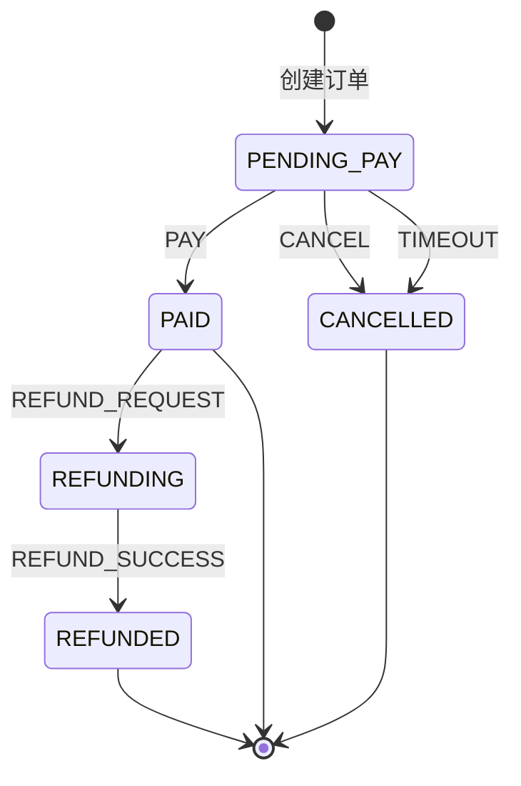

# 12-订单状态机治理：从零开始理解 Spring StateMachine

> 本文面向第一次接触状态机和 Spring StateMachine 的读者。
> 示例来自本项目订单服务：支付、取消、超时、退款都必须按照合法顺序改变订单状态。
>
> 当前实现：Spring StateMachine 4.0，订单表 `order.status` 是唯一事实来源；每次业务请求
> 都从数据库当前状态重置状态机、发送事件、计算目标状态。没有使用内存 persister。

---

## 一、先理解：什么是状态机

状态机是一个用来描述“一个对象在什么状态下，收到什么事件后，可以变成什么状态”的模型。

可以用三个词记住：

```text
State：当前状态
Event：发生的事件
Transition：状态迁移规则
```

生活中的例子：红绿灯。

```text
当前状态：红灯
事件：计时结束
目标状态：绿灯
```

订单也是一个天然的状态机对象：

```text
待支付
  → 用户支付
  → 已支付
  → 用户申请退款
  → 退款中
  → 退款成功
  → 已退款
```

状态机不是为了“看起来高级”，而是为了把合法规则集中起来，阻止不合法操作。

---

## 二、为什么订单适合状态机

订单不是一个普通 CRUD 数据：它的状态不能任意修改。

例如：

```text
PENDING_PAY  → PAID       合法：用户支付
PENDING_PAY  → CANCELLED  合法：用户取消或订单超时
PAID         → REFUNDING  合法：申请退款
REFUNDING    → REFUNDED   合法：退款成功

CANCELLED    → PAID       非法：订单已经取消不能再支付
PENDING_PAY  → REFUNDED   非法：未支付不能直接退款成功
REFUNDED     → PAID       非法：退款完成不能回到支付成功
```

如果不用状态机，规则通常散落在多个 Service 方法中：

```java
if (!OrderStatus.PENDING_PAY.getCode().equals(order.getStatus())) {
    throw new BusinessException(...);
}
order.setStatus(OrderStatus.PAID.getCode());
```

当状态数量和业务入口变多后会出现：

- 支付接口校验了一次，超时任务忘记校验
- 新增“配送中”状态时漏改退款逻辑
- 同一个状态迁移在不同入口返回不同错误
- 取消/支付并发时发生非法覆盖
- 开发者无法一眼看出所有合法迁移

状态机把这些 if 分支收敛为一张明确的状态迁移表。

---

## 三、本项目状态图



状态说明：

| 状态 | 枚举 | 含义 |
|------|------|------|
| 待支付 | `PENDING_PAY` | 订单已创建，等待付款 |
| 已支付 | `PAID` | 支付回调金额校验通过 |
| 已取消 | `CANCELLED` | 用户取消或超时未支付关闭 |
| 退款中 | `REFUNDING` | 已支付订单开始退款流程 |
| 已退款 | `REFUNDED` | 库存回补等退款副作用完成 |

事件说明：

| 事件 | 枚举 | 触发来源 |
|------|------|----------|
| 支付 | `PAY` | 支付成功回调 |
| 取消 | `CANCEL` | 用户主动取消 |
| 超时 | `TIMEOUT` | RocketMQ 延迟消息 → OrderTimeoutEvent |
| 申请退款 | `REFUND_REQUEST` | 退款确认流程开始 |
| 退款成功 | `REFUND_SUCCESS` | 库存回补等副作用完成 |

---

## 四、状态、事件、动作不要混淆

初学者最容易把三个概念混在一起。

### 4.1 状态：订单现在是什么样

```text
PENDING_PAY
PAID
CANCELLED
REFUNDING
REFUNDED
```

状态存到数据库 `order.status` 字段中，是订单当前的持久化事实。

### 4.2 事件：发生了什么

```text
PAY
CANCEL
TIMEOUT
REFUND_REQUEST
REFUND_SUCCESS
```

事件不是状态。`PAY` 表示“收到支付成功这件事”，不是订单最终状态。

### 4.3 动作：迁移后需要做什么

例如：

```text
PENDING_PAY --CANCEL--> CANCELLED
  动作：回补库存、关闭支付渠道、退优惠券
```

本项目没有把动作直接塞进状态机 `Action` 中，而是让状态机只负责“是否合法、目标状态是什么”，
副作用仍放在 `OrderServiceImpl` 的现有事务流程中。原因后面会详细解释。

---

## 五、Spring StateMachine 在项目中的角色

项目新增依赖：

```xml
<dependency>
    <groupId>org.springframework.statemachine</groupId>
    <artifactId>spring-statemachine-starter</artifactId>
    <version>4.0.0</version>
</dependency>
```

主要代码：

```text
ai-cs-order/
└── src/main/java/com/aics/order/statemachine/
    ├── OrderEvent.java
    ├── OrderStateMachineConfig.java
    └── OrderStateTransitionService.java
```

职责分工：

| 类 | 职责 |
|----|------|
| `OrderEvent` | 定义所有订单状态机事件 |
| `OrderStateMachineConfig` | 集中声明合法状态、合法迁移 |
| `OrderStateTransitionService` | 根据数据库当前状态发送事件，返回目标状态或抛非法迁移异常 |
| `OrderServiceImpl` | 调用状态机后，执行库存、优惠券、MQ、支付渠道等业务副作用 |

---

## 六、如何声明状态和迁移

`OrderStateMachineConfig` 的核心结构：

```java
builder.configureStates().withStates()
        .initial(OrderStatus.PENDING_PAY)
        .states(EnumSet.allOf(OrderStatus.class));

builder.configureTransitions()
        .withExternal()
            .source(OrderStatus.PENDING_PAY)
            .target(OrderStatus.PAID)
            .event(OrderEvent.PAY)
        .and()
        .withExternal()
            .source(OrderStatus.PENDING_PAY)
            .target(OrderStatus.CANCELLED)
            .event(OrderEvent.CANCEL)
        .and()
        .withExternal()
            .source(OrderStatus.PENDING_PAY)
            .target(OrderStatus.CANCELLED)
            .event(OrderEvent.TIMEOUT)
        .and()
        .withExternal()
            .source(OrderStatus.PAID)
            .target(OrderStatus.REFUNDING)
            .event(OrderEvent.REFUND_REQUEST)
        .and()
        .withExternal()
            .source(OrderStatus.REFUNDING)
            .target(OrderStatus.REFUNDED)
            .event(OrderEvent.REFUND_SUCCESS);
```

读法：

```java
.source(PENDING_PAY)
.target(PAID)
.event(PAY)
```

意思是：

```text
当前状态是 PENDING_PAY
收到 PAY 事件
目标状态变为 PAID
```

没有声明的组合默认不被接受：

```text
当前 CANCELLED，收到 PAY
→ sendEvent 返回 false
→ OrderStateTransitionService 抛 BusinessException
```

---

## 七、为什么数据库是唯一事实来源

### 7.1 不能只依赖内存状态机

如果状态机只在 JVM 内存中维护：

```text
notify/order 服务重启
  → 内存状态丢失
  → 不知道订单现在是已支付还是已取消
```

多实例更严重：

```text
订单请求 A 进入 order-pod-1
订单请求 B 进入 order-pod-2
两个 Pod 内存里的状态机互相不知道对方状态
```

订单状态必须放在数据库：

```text
order.status = PENDING_PAY / PAID / CANCELLED ...
```

数据库是可持久化、可查询、可审计、跨实例共享的事实来源。

### 7.2 本项目的轻量模式

每次业务请求：

```text
1. 从 DB 查询 order.status
2. 把 StateMachine reset 到这个当前状态
3. 发送 Event
4. 如果不接受，抛非法迁移异常
5. 取得目标状态
6. 在当前 @Transactional 中更新 order.status
7. 执行业务副作用
```

伪代码：

```java
public OrderStatus transit(String currentStatus, OrderEvent event) {
    OrderStatus current = parse(currentStatus);

    stateMachine.stop();
    stateMachine.getStateMachineAccessor().doWithAllRegions(access ->
        access.resetStateMachine(new DefaultStateMachineContext<>(current, null, null, null))
    );
    stateMachine.start();

    boolean accepted = stateMachine.sendEvent(event);
    if (!accepted) {
        throw new BusinessException(ResultCode.BAD_REQUEST, "订单状态不允许迁移");
    }
    return stateMachine.getState().getId();
}
```

### 7.3 为什么当前代码加了 synchronized

`StateMachine` Bean 默认是单例。如果两个线程同时：

```text
线程 A：reset 到 PENDING_PAY
线程 B：reset 到 PAID
线程 A：发 PAY 事件
```

可能造成状态串线。

当前 `OrderStateTransitionService` 使用：

```java
synchronized (orderStateMachine) {
    // reset → sendEvent → getState
}
```

它保证同一 JVM 中状态机操作串行。

注意：这只是保护同一个 JVM 内的 StateMachine Bean，不是分布式锁。真正的订单并发正确性还要依赖：

- 数据库事务
- 条件更新/乐观锁
- Redisson 下单锁
- Seata 分布式事务（order/product）
- 幂等支付回调处理

高并发升级方向：使用 `StateMachineFactory` 每次获取独立状态机实例，减少单例锁竞争。

---

## 八、状态机如何接入订单业务

### 8.1 支付成功：PENDING_PAY → PAID

```text
支付回调
  → 查询订单
  → 校验金额
  → transit(currentStatus, PAY)
  → order.status = PAID
  → 发布 OrderPaidEvent
  → AFTER_COMMIT 后通知用户
```

支付回调是幂等的：如果订单已经是 `PAID`，直接返回，不重复发通知。

### 8.2 用户取消：PENDING_PAY → CANCELLED

```text
用户取消订单
  → transit(currentStatus, CANCEL)
  → order.status = CANCELLED
  → 回补库存
  → 通知支付渠道关闭订单
  → 退回优惠券
```

如果当前不是 `PENDING_PAY`，状态机拒绝。例如支付后不能再走普通取消。

### 8.3 超时取消：PENDING_PAY → CANCELLED

```text
RocketMQ 延迟消息
  → OrderTimeoutEvent
  → cancelExpiredOrder(orderNo)
  → 发现订单已支付/已取消则直接忽略
  → 否则 transit(currentStatus, TIMEOUT)
  → 回补库存、关支付、退券
```

`TIMEOUT` 和 `CANCEL` 都到 `CANCELLED`，但事件不同：

- `CANCEL`：用户主动行为
- `TIMEOUT`：系统超时行为

保留两个事件方便未来做审计、指标、不同的补偿策略。

### 8.4 退款：为什么是两段迁移

退款不是直接：

```text
PAID → REFUNDED
```

项目采用：

```text
PAID --REFUND_REQUEST--> REFUNDING
REFUNDING --REFUND_SUCCESS--> REFUNDED
```

原因：退款往往包含多个副作用：

```text
1. 状态进入退款中
2. 调支付渠道退款
3. 回补库存
4. 写退款记录
5. 通知用户
6. 最终变为已退款
```

当前实现中：

```text
PAID → REFUNDING
  → 回补库存
  → REFUNDING → REFUNDED
```

这些仍在同一个 `@Transactional` 中。任一副作用失败，数据库事务回滚，不会留下不完整的
`REFUNDING` 状态。

未来如果接入真正的异步第三方退款，就可以把 `REFUNDING` 持久化，等待支付渠道回调后再发送
`REFUND_SUCCESS` 事件。这就是状态机为复杂流程预留的扩展空间。

---

## 九、为什么副作用不直接写进 StateMachine Action

Spring StateMachine 支持 `Action`：

```java
.withExternal()
    .source(PENDING_PAY)
    .target(CANCELLED)
    .event(CANCEL)
    .action(context -> restoreStock());
```

看起来很方便，但本项目没有这样做。

原因：状态机 Action 中调用 product/pay/MQ 会让状态机配置承担：

- 跨服务 HTTP 调用
- Seata 事务边界
- RocketMQ 消息发送
- 优惠券数据库更新
- 重试和补偿策略

这样配置类会变成业务编排中心，难测试、难排错，也难区分“状态迁移成功”和“副作用失败”。

当前职责划分更清晰：

```text
StateMachine：是否合法？目标状态是什么？
OrderService：状态落库后需要回补什么、通知什么、调用哪些服务？
Transaction：哪些步骤必须一起成功？
```

未来可以在 StateMachine 中加入轻量 `Guard`，例如：

```text
PAY 前判断订单金额是否匹配
REFUND_REQUEST 前判断退款金额不超过实付金额
```

但跨服务副作用仍建议留在 Service 层或 Saga/工作流层。

---

## 十、状态机、事务、锁、幂等各自解决什么

这四个技术经常被误认为能互相替代。

| 技术 | 解决的问题 | 本项目例子 |
|------|------------|------------|
| 状态机 | 合法状态迁移 | CANCELLED 不能再 PAY |
| 本地事务 | 单库多条 SQL 原子性 | 更新订单状态和订单项 |
| Seata AT | 跨 order/product 数据库一致性 | 下单扣库存失败自动补偿 |
| 分布式锁 | 并发请求互斥 | 同用户并发创建订单 |
| 幂等 | 重复请求结果稳定 | 支付回调重复不重复处理 |

举例：

```text
支付回调同时到两次
```

- 状态机：第二次 PAID → PAY 不合法
- 幂等代码：已 PAID 直接 return
- 数据库事务：单次回调内的订单状态更新和清购物车一致
- 分布式锁/条件更新：避免两个线程都看到 PENDING_PAY

它们是组合关系，不是替代关系。

---

## 十一、测试状态机应该测什么

状态机最重要的是**迁移矩阵测试**，不是只测某个 Controller 返回 200。

项目测试：

```text
OrderStateTransitionServiceTest
```

覆盖：

| 测试 | 意义 |
|------|------|
| PENDING_PAY + PAY → PAID | 支付路径合法 |
| PENDING_PAY + CANCEL → CANCELLED | 用户取消合法 |
| PENDING_PAY + TIMEOUT → CANCELLED | 超时关闭合法 |
| PAID + REFUND_REQUEST → REFUNDING | 退款启动合法 |
| REFUNDING + REFUND_SUCCESS → REFUNDED | 退款完成合法 |
| CANCELLED + PAY | 必须拒绝 |
| PENDING_PAY + REFUND_SUCCESS | 必须拒绝 |

验证命令：

```bash
mvn -pl ai-cs-order verify
```

当前结果：84 个测试全绿，JaCoCo 门禁通过。

---

## 十二、当前代码结构

```text
ai-cs-order/
├── enums/OrderStatus.java
│   └── PENDING_PAY / PAID / CANCELLED / REFUNDING / REFUNDED
├── statemachine/
│   ├── OrderEvent.java
│   ├── OrderStateMachineConfig.java
│   └── OrderStateTransitionService.java
├── service/impl/OrderServiceImpl.java
│   ├── confirmPay()         PAY
│   ├── cancelOrder()        CANCEL
│   ├── cancelExpiredOrder() TIMEOUT
│   └── refundConfirm()      REFUND_REQUEST + REFUND_SUCCESS
└── test/.../statemachine/
    └── OrderStateTransitionServiceTest.java
```

---

## 十三、常见问题

### Q1：为什么不把状态机状态直接持久化到 StateMachinePersister？

因为项目是多实例微服务。内存 persister 不能跨 Pod 共享，数据库 `order.status` 已经是可靠事实源。
每次从 DB reset 状态机更简单、可审计。

### Q2：状态机能解决并发支付和超时取消吗？

状态机只能拒绝非法迁移，不能单独解决两个线程同时读取 `PENDING_PAY` 的竞争。
仍需要数据库条件更新、事务、锁和幂等策略。

### Q3：为什么 `cancelExpiredOrder` 已经先判断 PENDING_PAY，还要状态机？

前置判断用于幂等快速返回；状态机是最终合法迁移的集中规则。前者优化业务入口，后者防规则漂移。

### Q4：为什么 PAY 已支付时直接 return，不让状态机抛异常？

支付回调天然可能重复。对外部重复回调，幂等 return 比抛异常更友好；
对真正非法状态（如 CANCELLED → PAY），项目记录告警并忽略。

### Q5：状态机是否需要覆盖所有订单状态？

`EnumSet.allOf(OrderStatus.class)` 把所有状态注册进来，但不代表任意状态都能任意跳转。
是否合法由 transition 表决定。

### Q6：什么时候需要 Flowable 等工作流引擎？

当流程包含人工审批、多角色任务、并行分支、会签、流程图编排、长时间等待和可视化运维时。
当前 5 态订单线性迁移用 StateMachine 足够，直接上工作流引擎会过重。

---

## 十四、未来扩展方向

### 14.1 增加配送状态

可以新增：

```text
PAID → TO_SHIP → SHIPPING → DELIVERED → COMPLETED
```

并定义：

```text
SHIP、DELIVER、CONFIRM_RECEIPT
```

### 14.2 增加退款失败

```text
REFUNDING → REFUND_FAILED
```

支付渠道失败回调时发送 `REFUND_FAIL` 事件，客服可以重试或人工处理。

### 14.3 增加 Guard

例如退款前校验：

```text
订单必须已支付
退款金额不能大于实付金额
订单没有完成退款
```

### 14.4 使用 StateMachineFactory

订单高并发时，每个请求创建独立状态机实例，替代单例 `synchronized`，降低 JVM 内竞争。

---

## 十五、面试要点总结

可以这样描述本项目：

> 订单状态原来分散在支付、取消、超时和退款方法中的 if 判断，容易出现非法跳转和规则漂移。
> 我们引入 Spring StateMachine 4.0，把 PENDING_PAY、PAID、CANCELLED、REFUNDING、REFUNDED
> 定义为状态，把 PAY、CANCEL、TIMEOUT、REFUND_REQUEST、REFUND_SUCCESS 定义为事件，
> 将合法迁移集中在配置中。数据库 order.status 是唯一事实来源，每次请求从数据库当前态 reset
> 状态机后发送事件并得到目标态，不使用内存 persister。状态机只负责迁移合法性，库存回补、
> 优惠券、MQ 通知等副作用仍在 OrderService 的事务边界中执行。状态机与 Seata、锁、幂等结合，
> 分别解决状态规则、跨库一致性、并发互斥和重复请求问题。

关键词：

```text
State
Event
Transition
Guard
Action
StateMachineBuilder
DB as Source of Truth
resetStateMachine
幂等
并发控制
状态迁移矩阵测试
```
