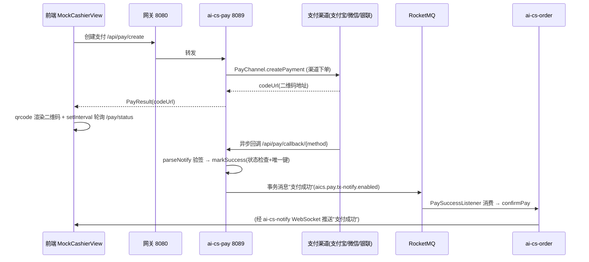

# 13-支付渠道集成与回调一致性：从零开始理解支付对接

> 本文面向第一次对接第三方支付的读者。
> 当前实现：`ai-cs-pay` 已落地支付宝当面付、微信 Native 扫码、银联云闪付二维码、Mock 四个渠道；回调一致性采用「状态检查 + 唯一索引 + RocketMQ 事务消息」三层组合；对账补偿为手动触发（尚无定时调度）。
> 本篇与 [12-订单状态机治理](12-订单状态机治理.md) 是姊妹篇：那篇讲"订单状态怎么流转"，本篇讲"钱怎么安全地进来"。

---

## 一、先理解：支付对接到底难在哪

把支付想象成"快递代收"：你把订单交给快递员（渠道下单），买家在驿站付钱（用户支付），驿站**事后**打电话通知你（异步回调）。难点全在"事后通知"这一步：

1. **签名**：凭什么相信电话真的来自驿站？→ 每个渠道都有一套验签体系。
2. **回调不可靠**：电话可能打不通（网络抖动、你服务重启）。→ 必须有"主动查单"兜底。
3. **回调会重复**：驿站可能连打三次电话。→ 同一笔钱只能入账一次（幂等）。

这三点决定了支付模块的代码形状。如果不管这三点，后果分别是：伪造回调白拿商品、钱到了货没发、钱入账两次订单发两单。

## 二、本项目支付全景图



代码落点（`ai-cs-pay/src/main/java/com/aics/pay/`）：

```text
com.aics.pay
├── channel/     PayChannel(策略接口) · PayChannelFactory(工厂+策略)
│                AlipayChannel · WechatNativeChannel · UnionpayChannel
│                UnionpaySignature · MockPayChannel
│                PayContext/PayResult/NotifyContext/NotifyResult/RefundResult
├── controller/  PayController · PayCallbackController · MockPayController
├── mq/          PaySuccessMessageProducer · PaySuccessTransactionListener
├── service/     PayTransactionService(Impl) · PayNotifyService · PayCompensationService(Impl)
├── client/      OrderPayClient(Feign，feign 模式旧链路)
├── entity/      PayTransaction
└── config/      PaySchemaInitializer(启动建表) · PayMybatisConfig · PayRestTemplateConfig
```

## 三、策略 + 工厂：四渠道统一抽象

### 3.1 策略接口

四个渠道行为差异很大（SDK 不同、验签不同、参数不同），但对上层而言只有一件事：**给我订单，我还你收银台地址**。于是收敛为一个策略接口（`channel/PayChannel.java`，类注释明写"学习要点：策略模式"）：

```java
public interface PayChannel {
    String getMethod();                              // 渠道标识：MOCK/ALIPAY/WECHAT/UNIONPAY
    PayResult createPayment(PayContext context);     // 渠道下单，返回二维码/收银台地址
    String queryPayment(String orderNo);             // 主动查单：PENDING/SUCCESS/CLOSED
    NotifyResult parseNotify(NotifyContext context); // 解析异步通知（验签 + 解密）
    void closeOrder(String orderNo);
    RefundResult refund(String orderNo, BigDecimal refundAmount);
}
```

### 3.2 四渠道对比

| 渠道 | 实现类 | 依赖 | 关键配置键（`@Value`） | 验签方式 |
|---|---|---|---|---|
| 支付宝当面付 | `AlipayChannel` | `com.alipay.sdk:alipay-sdk-java:4.40.943.ALL` | `pay.alipay.gateway/app-id/private-key/alipay-public-key/notify-url/return-url` | RSA2 公钥验签 |
| 微信 Native | `WechatNativeChannel` | `com.github.wechatpay-apiv3:wechatpay-java:0.2.17` | `pay.wechat.app-id/mch-id/api-v3-key/merchant-serial-no/merchant-private-key(-path)/notify-url/gateway` | `NotificationParser` 平台证书解密回调 |
| 银联云闪付 | `UnionpayChannel` | **无官方 SDK**，`RestTemplate` 直连 | `pay.unionpay.gateway/merchant-id/sign-cert-path/sign-cert-pwd/verify-cert-path/notify-url` | 自写 `UnionpaySignature`（RSA 签名/验签） |
| Mock | `MockPayChannel` | 无 | `aics.pay.mock.cashier-url` | 无（本地演练） |

三个值得注意的细节：

- **金额单位陷阱**：微信以"分"计价，`WechatNativeChannel` 提供静态方法 `yuanToFen`/`fenToYuan` 做转换——金额类型必须是 `BigDecimal`（呼应 [01-Java基础/08-语言级细节与序列化](../01-Java基础/08-语言级细节与序列化.md) 的金额规范）。
- **银联的独立 RestTemplate**：`UnionpayChannel` 用的是不走 `@LoadBalanced` 的 `RestTemplate`。因为银联网关是**外网地址**，而 `@LoadBalanced` 的 RestTemplate 会把 host 当服务名去 Nacos 解析，直接报"找不到服务"。这是新手最容易踩的坑之一。
- **银联无官方 Java SDK**：签名逻辑（拼接待签串 → 私钥签名 → 公钥验签 → 证书加载）全部自写在 `UnionpaySignature`（final 工具类 + `record SignCert(PrivateKey, X509Certificate)`）。适合当作"读懂签名原理"的教材。

### 3.3 工厂：为什么构造器注入 List 就是注册表

`channel/PayChannelFactory.java`（注释明写"工厂 + 策略模式"）：

```java
private final Map<String, PayChannel> channelMap;

public PayChannelFactory(List<PayChannel> channels) {   // Spring 注入所有实现
    this.channelMap = channels.stream()
            .collect(Collectors.toMap(PayChannel::getMethod, Function.identity()));
}

public PayChannel getChannel(String method) {
    PayChannel channel = channelMap.get(method);
    if (channel == null) {
        throw new BusinessException(ResultCode.ORDER_PAYMENT_METHOD_INVALID);
    }
    return channel;
}
```

要点：**新增一个渠道 = 新增一个实现类**，工厂零改动——这就是"对扩展开放"在 Spring 里的最低成本实现。渠道路由依据前端传的 `paymentMethod`（枚举 `ai-cs-common/.../enums/PaymentMethod.java`：MOCK/WECHAT/ALIPAY/BANK_CARD/UNIONPAY，默认 MOCK）。

## 四、回调验签与幂等

### 4.1 回调入口：把三路材料组装成 NotifyContext

`PayCallbackController` 暴露统一端点 `POST /pay/callback/{paymentMethod}`（经网关即 `/api/pay/callback/{method}`）。不同渠道的通知"长相"不同：参数可能在 query、可能在校验头、可能在 body。控制器只做一件事——收集后组装：

```java
NotifyContext.builder()
        .params(queryParams)                 // 支付宝：表单参数
        .headers(Map.of(                     // 微信：5 个验签头
            "Wechatpay-Timestamp", ...,
            "Wechatpay-Nonce", ...,
            "Wechatpay-Signature", ...,
            "Wechatpay-Serial", ...,
            "Wechatpay-Signature-Type", ...))
        .body(rawJson)                       // 微信：加密 JSON 报文
        .build();
```

`@Builder` 在这里的价值：三个可选维度的组装如果用 8 个重载构造器会失控（建造者模式实战见 [09-安全与设计模式/04](../09-安全与设计模式/04-设计模式在微服务中的实战.md)）。

随后验签委托给策略：`payChannelFactory.getChannel(method).parseNotify(context)`，验签失败由渠道实现抛异常，回调以非 2xx 应答，渠道会**自动重试**——这正是我们敢做"其余一切异步化"的底气。

### 4.2 幂等：三层防线（其中两层已实现）

支付回调一定会重复（渠道重试机制保证"至少一次"），所以入账必须幂等。本项目实现的是「状态检查 + 唯一索引」两层：

**第一层：状态检查**（`PayTransactionServiceImpl.markSuccess`）：

```java
// javadoc：幂等；返回是否"首次"标记成功
public boolean markSuccess(String orderNo, ...) {
    PayTransaction tx = ...;
    if (tx == null || STATUS_SUCCESS.equals(tx.getStatus())) {
        return false;                    // 已成功过 → 本次直接忽略
    }
    // 仅 PENDING → SUCCESS 才向下走
}
```

**第二层：唯一索引兜底**。`pay_transaction` 表由 `PaySchemaInitializer`（ApplicationRunner + JdbcTemplate）在启动时幂等建表，关键约束：

```sql
order_no VARCHAR(32) NOT NULL,
UNIQUE KEY uk_order_no (order_no),   -- 一个订单只有一条流水
KEY idx_user_id (user_id)
```

并发窗口下即使两个回调同时通过状态检查，`uk_order_no` 也保证只插入一条，后者报唯一键冲突。

**诚实说**：没有第三层（Redis 分布式去重表 / `@Idempotent` 注解）。当前"DB 状态 + 唯一键"已满足语义，但属于**每处手写**，框架化是已列入计划的进阶项（见 [00-学习路线总览/05](../00-学习路线总览/05-技术缺口分析与补全计划.md)）。为什么坚持 DB 是幂等权威而不是 Redis？与 [12-订单状态机治理](12-订单状态机治理.md) 同一个原则：**落库状态是唯一事实来源，内存态（Redis）可以丢、可以清，DB 状态不会**。

### 4.3 双模式开关

`@Value("${aics.pay.tx-notify.enabled:true}")` 控制回调后的下游通知方式：

- `true`（默认）：走 RocketMQ 事务消息（第五节）；
- `false`：走旧链路，同步 Feign `OrderPayClient.confirmPay`。

保留旧链路的价值：一条可以随时切回的降级路径 + 两代实现的对照教材。

## 五、RocketMQ 事务消息：支付成功的一致性

**为什么不在回调里直接调订单服务？** 回调线程是渠道的"耐心额度"内的（应答慢了渠道判失败再重试），而 Feign 调 order + 订单状态机迁移 + 通知推送可能慢、可能挂。于是把"支付成功"包装成消息，但要保证**本地入账**与**消息可见**原子——这正是事务消息的用武之地（通用原理见 [04-中间件/08-RocketMQ事务消息与死信队列](../04-中间件/08-RocketMQ事务消息与死信队列.md)，本篇是支付场景的完整实例）。

`mq/PaySuccessTransactionListener.java`（`@RocketMQTransactionListener`，producer group `pay-producer-group`）：

| 回查/执行时机 | 判定 | 返回 |
|---|---|---|
| `executeLocalTransaction`：half 消息发送后执行本地事务 | `markSuccess` 成功 | COMMIT |
| 同上 | 本地事务异常 | ROLLBACK |
| `checkLocalTransaction`：回查，流水状态 = SUCCESS | 已入账 | COMMIT |
| 回查，流水状态 = PENDING | 还没定论（可能仍在处理） | UNKNOWN（稍后再查） |
| 回查，流水状态 = CLOSED 或流水不存在 | 没付成 | ROLLBACK |

代码注释里那句最值得背：**"回查必须幂等，且以落库状态为唯一权威"**——回查可能被打多次，每次都只是"读状态回答"，绝不在回查里做写动作。

## 六、对账与补偿：回调丢了怎么办

`PayCompensationService.compensate()` 两步走：

1. **查单兜底**：遍历所有 PENDING 流水，调 `PayNotifyService.syncByQuery` → `channel.queryPayment(orderNo)`。渠道说 SUCCESS 就补走 `markSuccess`——这就是"回调永远不来"场景的救命稻草。
2. **对账找单边账**：SUCCESS 流水 vs `OrderPayClient.getOrderDetail` 订单状态，输出 `paySuccessButOrderNotPaid`（钱到了、订单没标已付）这类不一致清单。

**诚实说**：`compensate()` 目前由 `PayController` 的 `POST /pay/compensate` **手动触发**，没有挂 `@Scheduled` 也没有接 XXL-Job。生产化的升级路线现成：注册为 XXL-Job 执行器任务（接入方式见 [07-运维部署/05-XXL-Job分布式调度](../07-运维部署/05-XXL-Job分布式调度.md)），每 5 分钟一轮。

## 七、Mock 渠道与前端收银台

Mock 不是"玩具"，它是**离线演练全链路一致性的工具**：

- `MockPayChannel` 额外提供 `markPaid(orderNo)` / `markClosed(orderNo)`，模拟"用户在收银台付了款/关了页"。
- `MockPayController` 的 `POST /pay/mock/pay` 会校验订单属主与 PENDING_PAY 状态，然后 `markPaid` → **构造 NotifyContext 走与真实渠道完全相同的 `payNotifyService.processNotify`**。也就是说，Mock 之后的验签、幂等、事务消息、订单联动一步不少，只是跳过了外网渠道。
- 前端 `ai-cs-frontend/src/views/MockCashierView.vue`：`qrcode` 库把 `codeUrl` 转 `QRCode.toDataURL` 展示 → 倒计时（expireTime）→ `setInterval` 轮询 `/pay/status/{orderNo}`（该接口内置"查单兜底"）→ 状态到 PAID/REFUNDED/CANCELLED 即停止轮询。这是"回调 + 轮询双保险"在用户侧的体现。

## 八、测试矩阵

`ai-cs-pay/src/test/java/com/aics/pay/` 共 10 个测试类，覆盖是全项目支付语义的"规格书"：

| 分层 | 测试类 |
|---|---|
| channel | `AlipayChannelTest` · `WechatNativeChannelTest` · `UnionpayChannelTest` · `UnionpaySignatureTest` · `MockPayChannelTest` · `PayChannelFactoryTest` |
| controller | `PayControllersTest` |
| mq | `PaySuccessTransactionListenerTest` |
| service | `PayTransactionServiceTest` · `PayNotifyServiceTest` · `PayCompensationServiceTest` |

```bash
mvn -pl ai-cs-pay test        # 只跑支付模块
mvn -pl ai-cs-pay verify      # 测试 + JaCoCo 覆盖率门禁（父 POM：行 ≥40%、分支 ≥30%）
```

## 九、踩坑与要点

1. **`pay.sandbox: true` 是死配置**：该键存在于 Nacos 导出文件（`tools/nacos-config/ai-cs-pay.yml`），但全模块 Java 源码没有任何 `@Value` 消费它——配置漂移的活案例，读到"看似有用的配置"先 grep 引用。
2. **渠道密钥不在 Nacos 导出文件里**：渠道明细键只以 `@Value` 默认值形式存在于各 Channel 类。生产环境应把真实密钥配在 Nacos（或进一步接入配置加密），`@Value` 默认值只该是本地演练值。
3. **回调线程里只做"验签 + 入账 + 发消息"**：查单、对账、订单联动全部异步化，回调快速应答 2xx，重活交给事务消息与补偿任务。
4. **应用级建表是权宜**：`PaySchemaInitializer` 注释自己写明"生产可改用 Flyway/Liquibase"。
5. **微信头一个都不能少**：`Wechatpay-Timestamp/Nonce/Signature/Serial/Signature-Type` 五个头缺一个，`NotificationParser` 验签必失败——调试回调 401/验签失败先数头。

## 十、面试要点总结

> 本项目支付模块以策略模式统一四个支付渠道（支付宝/微信/银联/Mock），PayChannelFactory 通过构造器注入 List 构建渠道注册表，新增渠道零改动工厂；异步回调以"验签 → 幂等入账 → 事务消息"三段处理，幂等靠状态检查与 order_no 唯一索引双保险，并以落库状态作为回查唯一权威；可靠性由主动查单兜底 + 对账找单边账保障，一致性由 RocketMQ 事务消息的 half 消息/回查机制保障。

```text
关键词：策略模式 PayChannel / 工厂 PayChannelFactory / 验签 RSA2·NotificationParser·自写签名
幂等三层 = 状态检查 + uk_order_no 唯一键 + (规划中)注解式去重
事务消息 = executeLocalTransaction(COMMIT/ROLLBACK) + checkLocalTransaction(回查幂等)
补偿 = PENDING 查单兜底 + 单边账对账（当前手动触发）
```

## 下一步

- [ ] 给 `compensate()` 挂上 XXL-Job 定时调度并验证一轮自动对账
- [ ] 在 `pay_transaction` 上加一个并发回调压测（两个线程同时 markSuccess）验证唯一键兜底
- [ ] 阅读 `UnionpaySignature` 源码，手推一遍"拼串 → 签名 → 验签"全过程
