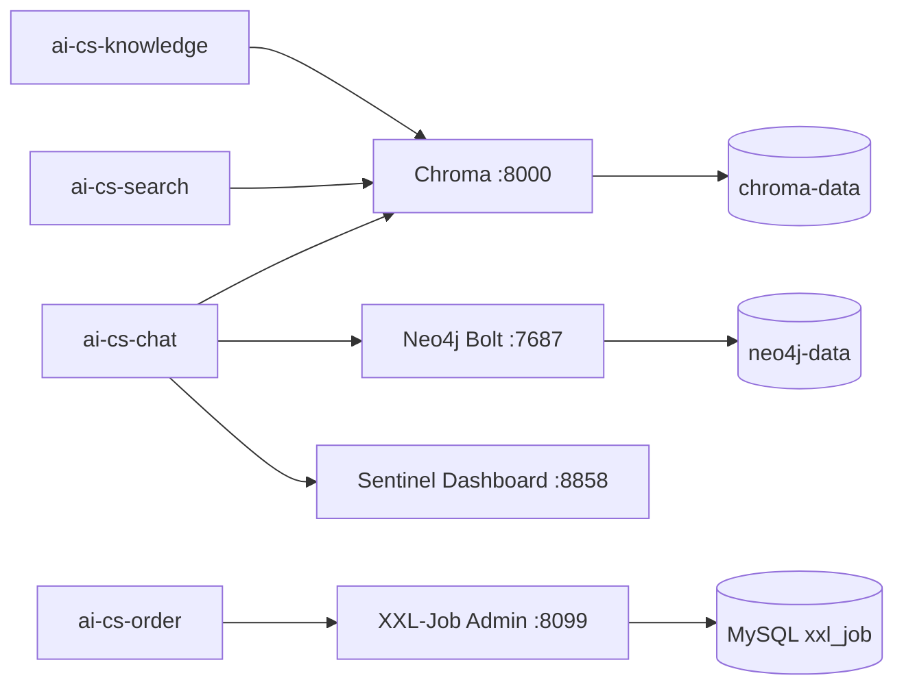

# 09-AI 与治理中间件部署：从零理解部署漂移与基础设施

> 本文面向第一次接触向量数据库、图数据库、调度中心、流控控制台和 Docker/Kubernetes 的读者。
> 示例来自本项目：代码已经使用 Chroma、Neo4j、XXL-Job、Sentinel，但原先基础设施编排中
> 缺少这些服务。本文说明为什么这是问题，以及如何正确补齐。
>
> 当前状态：根 `docker-compose.yml` 和 `deploy/k8s/` 已补 Chroma、Neo4j、XXL-Job Admin、
> Sentinel Dashboard。由于本机无 Docker CLI，完成了编排与静态结构验证；真实容器运行验收
> 需要在有 Docker/Kubernetes 的环境执行。

---

## 一、先理解：什么是中间件

中间件是业务服务和基础资源之间的通用能力层。它通常不直接实现“下单”“聊天”等业务，
但为业务提供存储、消息、调度、检索、协调、限流等能力。

本项目已有：

```text
MySQL          业务数据
Redis          缓存、会话、锁
Nacos          注册与配置
RocketMQ       异步/延迟消息
Elasticsearch  关键词检索
MinIO          文件对象存储
Seata          分布式事务协调
```

本次补齐的四类能力：

| 中间件 | 它解决的问题 | 本项目用途 |
|--------|--------------|------------|
| Chroma | 向量相似检索 | 知识库 RAG、语义搜索 |
| Neo4j | 图关系查询 | GraphRAG、实体关系检索 |
| XXL-Job Admin | 分布式任务调度管理 | 订单超时扫描、管理端触发任务 |
| Sentinel Dashboard | 流控规则可视化与管理 | chat 服务限流、熔断规则观察 |

---

## 二、什么是部署漂移

部署漂移指的是：

```text
代码依赖的能力
≠ 本地 docker-compose 运行的能力
≠ Kubernetes 部署的能力
≠ 文档写的能力
```

例如代码中已经配置：

```yaml
spring:
  ai:
    vectorstore:
      chroma:
        client:
          host: http://localhost
          port: 8000
```

但 `docker-compose.yml` 没有 Chroma：

```text
开发者启动 docker compose up
  → chat/knowledge 尝试连接 8000
  → 连接失败，或者依赖某个人手工启动的临时 Chroma
```

部署漂移的后果：

- 新同事无法一键启动环境
- CI/CD 环境漏掉依赖
- 本地能运行，测试/生产不能运行
- 数据重启丢失，因为没挂数据卷
- 代码以为调度/流控已启用，实际控制台不存在

因此中间件接入不能只改 Maven 依赖或 application.yml，至少要同时考虑：

```text
代码依赖
应用配置
本地 Compose
Kubernetes manifest
数据卷/数据库初始化
密钥管理
健康检查
运行验证
文档
```

---

## 三、本项目新增中间件全景图



这张图中：

- Chroma、Neo4j 是**数据型中间件**：必须持久化数据
- XXL Admin 是**控制平面**：自己需要数据库保存任务配置和执行记录
- Sentinel Dashboard 是**管理控制台**：规则后续要推到 Nacos 才能真正持久化

---

## 四、Chroma：向量数据库是什么

### 4.1 为什么普通数据库不够

普通关键词搜索擅长：

```text
用户搜索：退款
文档包含：退款
```

但用户可能问：

```text
“买的耳机不想要了怎么处理？”
```

文档中却写：

```text
“商品退货退款政策”
```

字面关键词不一定一致，但语义相近。RAG 需要把文本转换为向量：

```text
文本 → Embedding 模型 → 数字向量
```

再根据向量距离查询相似内容：

```text
用户问题向量
  → Chroma similarity search
  → 找到最相近的知识片段
  → 交给 LLM 生成回答
```

### 4.2 Chroma 在项目中的位置

```text
知识文档
  → 解析 PDF/Tika
  → 文本切片
  → Embedding
  → Chroma collection: aics-knowledge

用户问题
  → Embedding
  → Chroma 相似检索
  → RAG 上下文
  → ChatModel 回答
```

Compose 配置核心：

```yaml
chroma:
  image: chromadb/chroma:0.5.20
  ports:
    - "8000:8000"
  volumes:
    - chroma-data:/chroma/chroma
```

`chroma-data` 很重要。没有它：

```text
docker compose down
  → Chroma 容器删除
  → 向量知识库也丢失
  → 所有文档要重新切片、重新 embedding、重新入库
```

### 4.3 为什么 Chroma 适合当前项目

| 方案 | 优点 | 缺点 | 当前适用性 |
|------|------|------|------------|
| Chroma | 轻量、Spring AI 接入简单、适合单机 RAG | 大规模分布式能力有限 | 当前学习/单机部署适合 |
| Milvus | 高性能、分布式、大规模向量检索 | 运维复杂、资源较重 | 大规模知识库时考虑 |
| pgvector | 复用 PostgreSQL、事务方便 | 向量专业能力不如专用库 | 已有 PG 时考虑 |
| Elasticsearch vector | 关键词+向量统一 | 资源和索引设计复杂 | 已有 ES 可评估 |

---

## 五、Neo4j：图数据库和 GraphRAG

### 5.1 关系型数据库和图数据库的区别

关系型表适合：

```text
订单属于用户
商品属于分类
```

但多跳关系查询会越来越复杂：

```text
用户 → 订单 → 商品 → 品牌 → 关联售后政策 → 关联 FAQ
```

Neo4j 用节点和关系表达：

```text
(User)-[:PLACED]->(Order)-[:CONTAINS]->(Product)
(Product)-[:BELONGS_TO]->(Category)
(Product)-[:HAS_POLICY]->(RefundPolicy)
```

查询关系路径是它的强项。

### 5.2 GraphRAG 是什么

普通 RAG：

```text
问题 → 向量检索相似文档 → LLM
```

GraphRAG：

```text
问题 → 识别实体
     → 在图中找相关实体和关系路径
     → 获取结构化关系上下文
     → 再结合向量检索
     → LLM
```

适合回答：

```text
“这个订单里的商品是否支持七天无理由退货？”
“某个品牌下、某类商品的售后规则是什么？”
```

### 5.3 Neo4j 的端口与数据

```yaml
neo4j:
  image: neo4j:5-community
  ports:
    - "7474:7474"  # HTTP / Neo4j Browser
    - "7687:7687"  # Bolt 驱动协议，Java Driver 使用
  volumes:
    - neo4j-data:/data
    - neo4j-logs:/logs
```

连接地址：

```text
宿主机开发：bolt://localhost:7687
Compose 容器内：bolt://neo4j:7687
Kubernetes 内：bolt://neo4j:7687
```

不能把 Neo4j 密码写死在 Git。Kubernetes 使用：

```text
neo4j-secret
  └── auth: neo4j/<strong-password>
```

---

## 六、XXL-Job：为什么定时任务需要调度中心

### 6.1 本地 `@Scheduled` 的局限

单体应用可以写：

```java
@Scheduled(cron = "0 */5 * * * ?")
public void scanTimeoutOrders() { ... }
```

微服务多实例时会出现：

```text
order-1 扫一次
order-2 也扫一次
order-3 还扫一次
```

同一批超时订单被重复扫描。虽然可以靠幂等兜底，但资源浪费、任务监控和重试都很难管理。

### 6.2 XXL-Job 的角色

```text
XXL-Job Admin
  ├── 保存任务配置
  ├── 选择执行器
  ├── 调度任务
  ├── 记录执行日志
  └── 提供 Web 控制台

XXL-Job Executor（order 服务）
  ├── 注册到 Admin
  ├── 接收任务触发
  └── 执行 OrderTimeoutScanJob
```

项目使用：

```text
xxl-job-core: 2.4.1
xxl-job-admin: 2.4.1
```

版本要对齐。Admin 与 Executor 协议不兼容会造成注册或调度失败。

### 6.3 为什么 Admin 需要 MySQL

XXL Admin 不是纯页面服务，它需要保存：

- 执行器列表
- 任务 cron 表达式
- 任务参数
- 调度记录
- 执行日志
- 告警配置

因此 Compose 在 MySQL 初始化阶段挂载：

```text
deploy/mysql/xxl-job-init.sql
```

并启动：

```text
xxl-job-admin → MySQL xxl_job 数据库
```

### 6.4 本地与容器地址区别

```text
宿主机运行 order：
  XXL_JOB_ADMIN=http://127.0.0.1:8099/xxl-job-admin

Compose 内运行 order：
  XXL_JOB_ADMIN=http://xxl-job-admin:8080/xxl-job-admin
```

这是容器网络中最常见的错误之一：容器里的 `localhost` 是容器自己，不是宿主机，也不是别的服务。

---

## 七、Sentinel Dashboard：限流规则为什么需要控制台

### 7.1 Sentinel 解决什么

当 chat 服务调用大模型、向量检索、外部 API 时，可能遇到：

```text
瞬时高并发
下游服务变慢
外部模型失败
雪崩效应
```

Sentinel 可以实现：

- QPS 限流
- 并发线程数限制
- 熔断降级
- 热点参数限流
- 系统自适应保护

### 7.2 Dashboard 做什么

Sentinel Dashboard 提供：

```text
查看资源
配置限流规则
配置熔断规则
查看实时 QPS
查看规则是否生效
```

但要注意一个重要事实：

```text
Dashboard 默认内存规则
  → Dashboard 重启
  → 规则可能丢失
```

生产应将规则持久化到 Nacos：

```text
Dashboard 修改规则
  → Push 到 Nacos
  → chat 服务从 Nacos 拉取/监听 sentinel-rule
```

本项目已部署 Dashboard 编排，但“规则 push 到 Nacos”的实际联调仍需运行环境完成。

---

## 八、Docker Compose：为什么需要 healthcheck 和 depends_on

Compose 中中间件通常不是“容器启动了就可用”。例如 MySQL 进程启动后还要初始化表，
XXL Admin 如果过早连接就会失败。

项目使用：

```yaml
mysql:
  healthcheck:
    test: ["CMD", "mysqladmin", "ping", "-h", "localhost", "-uroot", "-proot"]

xxl-job-admin:
  depends_on:
    mysql:
      condition: service_healthy
```

含义：

```text
MySQL 容器启动
  → healthcheck 成功
  → XXL Admin 才启动
```

不能只写：

```yaml
depends_on:
  - mysql
```

因为那只保证“先启动容器”，不保证数据库已经能接收连接。

---

## 九、Kubernetes：StatefulSet 和 Deployment 怎么选

### 9.1 StatefulSet：有状态数据服务

Chroma/Neo4j 使用 StatefulSet + PVC：

```text
Chroma / Neo4j
  → 数据不能随 Pod 删除丢失
  → 需要稳定存储卷
  → 需要稳定服务标识
```

例如 Neo4j：

```yaml
kind: StatefulSet
volumeClaimTemplates:
  - metadata:
      name: data
    spec:
      resources:
        requests:
          storage: 20Gi
```

PVC 是 PersistentVolumeClaim，表示“这个 Pod 需要一块持久化磁盘”。

### 9.2 Deployment：无状态控制平面

XXL Admin、Sentinel Dashboard 使用 Deployment：

```text
控制台本身不保存核心业务数据到本地磁盘
  → XXL 数据放 MySQL
  → Sentinel 规则应放 Nacos
  → Pod 可以替换
```

### 9.3 Probe 的作用

每个新资源都有：

```yaml
readinessProbe
livenessProbe
```

- `readinessProbe`：服务是否可以接收流量
- `livenessProbe`：服务是否还活着，失败时 Kubernetes 重启容器

例如 Chroma heartbeat：

```text
/api/v1/heartbeat
```

只有 readiness 成功后，Service 才会把流量路由给它。

---

## 十、Secrets：为什么不能把密码提交到 Git

Neo4j 密码、XXL Admin 数据库密码、Token 都属于敏感配置。

错误示例：

```yaml
NEO4J_AUTH: neo4j/my-password
```

写进 Git 后，即使删掉，也可能已经存在于历史提交、缓存或 Fork 中。

项目提供模板：

```text
deploy/k8s/middleware-secrets.example.yaml
```

使用方式：

```bash
cp deploy/k8s/middleware-secrets.example.yaml /secure/path/middleware-secrets.yaml
# 填入真实密码，不提交该文件
kubectl apply -f /secure/path/middleware-secrets.yaml
```

Deployment 使用：

```yaml
env:
  - name: NEO4J_AUTH
    valueFrom:
      secretKeyRef:
        name: neo4j-secret
        key: auth
```

如果 Secret 不存在，Pod 不应该偷偷用默认密码启动，而应该失败等待。这是 fail-closed 安全策略。

---

## 十一、完整启动与验收步骤

### 11.1 Docker 环境

```bash
# 1. 检查 Docker
 docker info

# 2. 启动基础设施
 docker compose up -d

# 3. 观察健康状态
 docker compose ps
```

验收：

```text
Chroma:    http://localhost:8000/api/v1/heartbeat
Neo4j:     http://localhost:7474
XXL Admin: http://localhost:8099/xxl-job-admin
Sentinel:  http://localhost:8858
```

业务验收：

1. knowledge 上传文档，确认 Chroma 有向量写入
2. 重启 Chroma，确认知识库仍能检索（验证数据卷）
3. chat GraphRAG 调用 Neo4j Bolt 连通
4. order 以 `XXL_JOB_ENABLED=true` 启动，Admin 显示 executor 在线
5. Admin 手动触发超时任务，观察 order 日志
6. chat 访问一次受 Sentinel 保护资源，Dashboard 能看到资源
7. 配一条低 QPS 限流规则，确认请求被限流

### 11.2 Kubernetes 环境

```bash
# 1. 先创建真实 Secret
kubectl apply -f /secure/path/middleware-secrets.yaml

# 2. 部署基础设施
bash deploy/scripts/k8s-apply-infra.sh

# 3. 检查 Pod
kubectl get pods -n ai-customer-service

# 4. 检查 PVC
kubectl get pvc -n ai-customer-service
```

当前本机没有 Docker CLI，`docker info` 返回 exit 127。因此文档中上面的实际容器验收步骤
尚未在本机执行，不能把“编排已写”误认为“服务已运行”。

---

## 十二、常见问题

### Q1：为什么 Chroma 或 Neo4j 重启后数据没了？

通常没有挂 volume/PVC，或挂载路径写错。检查：

```text
Chroma: /chroma/chroma
Neo4j:  /data
Mongo:  /data/db
```

### Q2：容器里为什么不能用 localhost 连接 Chroma/Neo4j？

容器内的 localhost 指向当前容器自己。应该使用 Compose service name：

```text
http://chroma:8000
bolt://neo4j:7687
http://xxl-job-admin:8080/xxl-job-admin
```

### Q3：XXL Admin 起不来怎么办？

依次检查：

1. MySQL healthcheck 是否成功
2. `xxl_job` 数据库和表是否已初始化
3. Admin/Core 版本是否同为 2.4.1
4. 数据库 URL、用户名、密码是否正确
5. `PARAMS` 环境变量是否被 shell/Compose 正确解析

### Q4：Sentinel Dashboard 上没有资源？

服务需要先收到一次受 Sentinel 保护的请求；同时检查 Dashboard 地址、应用名、网络连通性。
规则持久化到 Nacos 前，Dashboard 重启会丢规则。

### Q5：Kubernetes Pod 一直 Pending？

常见原因：

- PVC 没有可用 StorageClass
- Secret 不存在
- 镜像拉取失败
- resources requests 超过集群可用资源

---

## 十三、面试要点总结

可以这样描述本项目：

> 项目早期代码已接入 Chroma、Neo4j、XXL-Job 和 Sentinel，但 Compose/K8s 没有对应服务，
> 属于典型部署漂移。我们把依赖补齐到本地 Compose 和 Kubernetes：Chroma/Neo4j 使用
> StatefulSet + PVC 保证数据持久化，XXL Admin/Sentinel Dashboard 使用 Deployment，
> 并加健康检查、资源限制、Secret 模板和部署脚本。XXL Admin 依赖 MySQL 初始化表，
> Sentinel 控制台规则后续需要推 Nacos 才能持久化。通过把代码、配置、编排、密钥、健康检查、
> 验收步骤一起维护，避免“代码能跑、环境起不来”的问题。

关键词：

```text
部署漂移
Docker Compose
healthcheck
depends_on condition: service_healthy
StatefulSet
Deployment
PVC
Secret
Chroma
Neo4j
XXL-Job Admin
Sentinel Dashboard
Nacos 规则持久化
```
