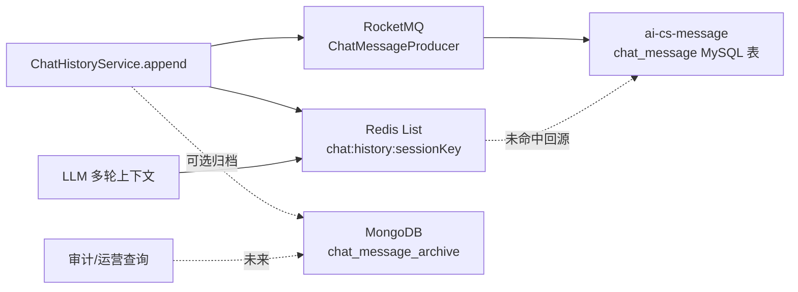
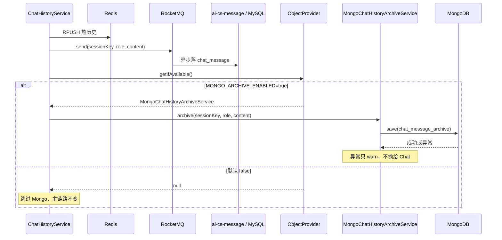

# 10-MongoDB 对话审计归档：从零理解文档数据库与双写边界

> 本文面向第一次接触 MongoDB、文档数据库和多存储分层的读者。
> 示例来自本项目 AI 对话历史：Redis 用于 LLM 热上下文，RocketMQ → message 服务 MySQL 表
> 是当前最终持久化事实源，MongoDB 是默认关闭的可选审计归档副本。
>
> 重要结论：MongoDB 不是“看到聊天记录就必须替换 MySQL”的理由。先确认已有事实源，
> 再决定 Mongo 是否解决新的查询/审计问题；否则会制造双事实源和一致性风险。

---

## 一、MongoDB 是什么

MongoDB 是文档数据库。关系型数据库通常把数据存成行和列：

```text
chat_message 表
+----+------------+-----------+------------------+
| id | session_id | role      | content          |
+----+------------+-----------+------------------+
| 1  | s-100      | user      | 我要退款         |
+----+------------+-----------+------------------+
```

MongoDB 把一条数据存为 BSON 文档，外观类似 JSON：

```json
{
  "_id": "65f...",
  "sessionKey": "s-100",
  "userId": "1001",
  "role": "user",
  "content": "我要退款",
  "model": "Qwen",
  "tokenUsage": 120,
  "feedback": {
    "score": 5,
    "comment": "回答有帮助"
  },
  "createdAt": "2026-08-31T10:00:00Z"
}
```

它的优势不是“没有表”，而是可以方便存储结构经常变化、嵌套层次多的数据。

AI 对话常常会逐步增加：

```text
role
content
model
promptVersion
tokenUsage
latency
feedback
traceId
retrievalDocuments
safetyLabels
```

如果每加一个字段都改 MySQL 表、改 Entity、改 SQL，演进成本会变高。Mongo 适合承接这种
“审计原文 + 可扩展元数据”场景。

---

## 二、先看本项目真实对话存储链路

实施 Mongo 前重新盘点代码，发现项目并不是“聊天记录只在 Redis”：



现有三层职责：

| 存储 | 角色 | 为什么需要 |
|------|------|------------|
| Redis List | 热上下文缓存 | LLM 每轮对话快速读取最近消息 |
| RocketMQ | 异步可靠传递 | 解耦 chat 与 message 服务 |
| MySQL `chat_message` | 当前最终持久化事实源 | 已有回源、查询、MQ 消费幂等逻辑 |
| MongoDB archive | 可选审计副本 | 文档式扩展字段、未来审计分页/运营分析 |

因此 MongoDB **不替代** Redis，也不替代当前 MySQL message 表。

---

## 三、为什么不能随便把 Mongo 变成“唯一事实源”

假设直接改成：

```text
append() → Redis + Mongo
```

同时保留原来的：

```text
append() → Redis + RocketMQ → MySQL
```

就出现两个问题：

### 3.1 双写不可能天然原子

```text
先写 MySQL 成功，写 Mongo 失败
  → 两边数据不一致

先写 Mongo 成功，MQ 投递失败
  → Mongo 有、MySQL 没有
```

没有分布式事务或可靠事件机制时，不能轻易宣称“两个库永远一致”。

### 3.2 查询结果会互相矛盾

如果后台 A 从 MySQL 查，后台 B 从 Mongo 查：

```text
A 看见 10 条消息
B 看见 9 条消息
```

业务人员会不知道哪个是真的。

### 3.3 本项目的决定

明确职责：

```text
MySQL chat_message：当前最终事实源
Mongo chat_message_archive：可重建审计副本
```

Mongo 写入失败：

```text
只记录 warn 日志
不影响 AI 回复
不影响 Redis 热上下文
不影响 RocketMQ → MySQL 主持久化链路
```

这是“可用性优先的审计副本”设计，而不是强一致双写。

---

## 四、当前 Mongo 归档调用图



---

## 五、为什么使用 ObjectProvider

代码核心：

```java
private final ObjectProvider<MongoChatHistoryArchiveService> mongoArchiveProvider;

public void append(String sessionKey, String role, String content) {
    // Redis + MQ 主链路
    chatMessageProducer.send(sessionKey, role, content);

    MongoChatHistoryArchiveService archiveService =
            mongoArchiveProvider.getIfAvailable();
    if (archiveService != null) {
        archiveService.archive(sessionKey, role, content);
    }
}
```

归档服务带条件：

```java
@ConditionalOnProperty(
    prefix = "aics.chat.mongo-archive",
    name = "enabled",
    havingValue = "true"
)
```

配置：

```yaml
aics:
  chat:
    mongo-archive:
      enabled: ${MONGO_ARCHIVE_ENABLED:false}
```

当默认 `false`：

```text
MongoChatHistoryArchiveService 不创建
ObjectProvider.getIfAvailable() 返回 null
append() 继续完成 Redis + MQ 主流程
```

如果直接注入：

```java
private final MongoChatHistoryArchiveService archiveService;
```

而服务又因为配置关闭没有创建，就会启动失败。这就是 `ObjectProvider` 适合可选功能的原因。

---

## 六、文档模型与索引

项目文档：

```java
@Document("chat_message_archive")
@CompoundIndex(
    name = "session_created_idx",
    def = "{'sessionKey': 1, 'createdAt': -1}"
)
public class ChatMessageArchiveDocument {
    @Id
    private String id;
    private String sessionKey;
    private String userId;
    private String role;
    private String content;
    private Instant createdAt;
}
```

### 6.1 `@Document`

```java
@Document("chat_message_archive")
```

表示这个 Java 类对应 Mongo collection：

```text
chat_message_archive
```

关系型数据库里叫表，Mongo 中通常叫 collection。

### 6.2 `@Id`

Mongo 默认主键字段叫 `_id`。Spring Data Mongo 使用：

```java
@Id
private String id;
```

映射为 Mongo 的 `_id`。

### 6.3 复合索引

```java
@CompoundIndex(def = "{'sessionKey': 1, 'createdAt': -1}")
```

适配未来查询：

```text
查询 sessionKey = s-100 的消息
按 createdAt 倒序
取前 50 条
```

没有索引时，Mongo 可能扫描整个 collection；聊天审计数据增长后会越来越慢。

### 6.4 为什么 userId 当前允许为空

当前 `sessionKey` 没有稳定、统一的 userId 编码规则。不能用字符串拆分猜用户：

```text
session-1001-xxx
```

格式一旦变更，归档数据就错。

正确做法是未来在调用 `append()` 时显式传入 userId，或从经过认证的上下文中取得。

---

## 七、TTL：为什么还没有直接启用 90 天自动删除

Mongo 支持 TTL 索引：

```javascript
db.chat_message_archive.createIndex(
  { createdAt: 1 },
  { expireAfterSeconds: 7776000 }
)
```

`7776000` 秒约为 90 天。

它适合：

```text
对话审计只保留 90 天
过期后自动删除
```

但当前实现没有直接启用，原因是：

- 管理端审计查询 API 尚未上线
- 合规保留期限没有最终确认
- TTL 清理是后台异步扫描，不是精确到秒的删除 SLA
- 一旦误设 TTL，历史数据删除不可逆

先保留数据结构和索引，等业务确认保留政策后再启用 TTL 是更稳妥的做法。

---

## 八、部署 MongoDB

根 `docker-compose.yml` 新增：

```yaml
mongodb:
  image: mongo:7.0
  container_name: aics-mongodb
  ports:
    - "27017:27017"
  environment:
    MONGO_INITDB_DATABASE: aics_chat
  volumes:
    - mongodb-data:/data/db
```

含义：

| 配置 | 含义 |
|------|------|
| `mongo:7.0` | MongoDB 7.0 镜像 |
| 27017 | MongoDB 默认端口 |
| `aics_chat` | 默认数据库名 |
| `mongodb-data:/data/db` | 持久化数据卷 |

连接配置：

```yaml
spring:
  data:
    mongodb:
      uri: ${MONGODB_URI:mongodb://127.0.0.1:27017/aics_chat}
```

不同环境：

```text
宿主机开发：mongodb://127.0.0.1:27017/aics_chat
Compose 内服务：mongodb://mongodb:27017/aics_chat
Kubernetes 内服务：mongodb://mongodb:27017/aics_chat
```

容器内不能把 `localhost` 当 Mongo 服务地址；它只表示当前 chat 容器。

生产环境至少应增加：

- 用户名密码认证
- 副本集（replica set）
- 数据备份
- 磁盘监控
- 连接池与超时配置
- TLS/网络隔离

单容器 Mongo 只适合本地学习与开发验证。

---

## 九、如何查询 Mongo 对话归档

Mongo Shell 示例：

```javascript
use aics_chat

db.chat_message_archive.find(
  { sessionKey: "session-100" }
).sort({ createdAt: -1 }).limit(50)
```

未来 Spring Data 查询：

```java
List<ChatMessageArchiveDocument>
findTop50BySessionKeyOrderByCreatedAtDesc(String sessionKey);
```

未来管理端可提供：

```text
GET /admin/chat-archives?sessionKey=...&page=1&size=50
```

但当前没有审计 UI，因此没有为了“技术展示”提前加入未经使用的 API。

---

## 十、异常、监控与补偿

归档服务：

```java
try {
    repository.save(document);
} catch (Exception e) {
    log.warn("Mongo 对话归档失败（不阻断对话）", e);
}
```

为什么不抛异常：

```text
用户发消息
  → AI 正在生成回答
  → Mongo 临时不可用
  → 不能因为审计副本失败让用户得不到回答
```

但“只 warn”不代表可以永远忽略。生产增强：

1. 增加 `mongo_archive_success_total` / `mongo_archive_failure_total` 指标
2. 失败告警
3. 记录可重放的归档事件或 Outbox
4. 定期从 MySQL `chat_message` 回填 Mongo
5. 对比 MySQL/Mongo session 消息数量，做审计对账

当前阶段强调：**业务事实源明确、失败不阻断、风险可观测**。

---

## 十一、测试与验证

项目测试：

```text
MongoChatHistoryArchiveServiceTest
```

覆盖：

| 场景 | 断言 |
|------|------|
| 正常归档 | 保存 sessionKey、role、content、createdAt |
| Mongo 异常 | 只记录警告，不向 AI 主链路抛异常 |

执行：

```bash
mvn -pl ai-cs-chat test -Dtest=MongoChatHistoryArchiveServiceTest
```

当前结果：2 个测试全绿。

真实容器验证需要 Docker：

```bash
docker compose up -d mongodb
MONGO_ARCHIVE_ENABLED=true \
MONGODB_URI=mongodb://127.0.0.1:27017/aics_chat \
mvn -pl ai-cs-chat spring-boot:run
```

然后发一轮对话，使用 Mongo Shell 查询 `chat_message_archive`。

本机当前没有 Docker CLI，因此容器运行验收没有被伪装成已完成。

---

## 十二、MongoDB、Redis、MySQL 的职责对比

| 维度 | Redis | MySQL chat_message | Mongo archive |
|------|-------|--------------------|---------------|
| 定位 | 热缓存 | 当前事实源 | 审计副本 |
| 读取速度 | 极快 | 中等 | 中等 |
| 数据持久性 | 取决于持久化策略 | 高 | 高 |
| Schema 演进 | 弱 | 需迁表 | 强 |
| LLM 上下文 | 适合 | 可回源 | 不作为当前上下文源 |
| 运营审计 | 不适合 | 基础查询 | 适合扩展元数据 |
| 失败影响 | 降级回源 | 影响事实链路 | 当前只影响审计副本 |

这不是“选一个数据库”的问题，而是**不同访问模式使用不同存储层**的问题。

---

## 十三、常见问题

### Q1：MongoDB 有了，能删掉 MySQL chat_message 吗？

当前不能。MySQL 已是 RocketMQ 消费链路、历史回源和已有查询逻辑的事实源。要迁移必须制定
双读、回填、切流、回滚和一致性验证方案。

### Q2：为什么不直接用 Mongo 存 Redis 热历史？

LLM 每轮都要读取上下文，Redis 的低延迟更适合。Mongo 更适合持久化查询，不应替代热缓存。

### Q3：为什么归档服务默认关闭？

避免无 Mongo 环境影响 chat 启动和对话主链路；功能通过配置逐步启用，先验证再扩大范围。

### Q4：Mongo 写失败为什么不重试？

当前选择主回复可用性优先。生产可引入 Outbox、MQ、补偿任务或批量回填，不能在同步用户请求里
无限重试拖慢 AI 回复。

### Q5：TTL 会不会立刻删除过期数据？

不会。Mongo TTL Monitor 周期性扫描，删除存在延迟；不能把 TTL 当精确时钟任务。

---

## 十四、面试要点总结

可以这样描述本项目：

> 我们最初以为聊天记录只在 Redis，但盘点后发现已经有 Redis 热上下文和 RocketMQ→MySQL
> 最终持久化链路。为了避免随意引入 Mongo 形成双事实源，我们把 Mongo 定位为默认关闭的可选
> 审计归档：Redis 负责低延迟上下文，MySQL 仍是事实源，Mongo 承担可扩展文档元数据和未来
> 审计查询。归档服务用 `@ConditionalOnProperty` 控制开关，主服务用 `ObjectProvider` 可选注入，
> Mongo 异常只告警不阻断 AI 回复。后续可通过指标、Outbox 或 MySQL 回填解决审计副本一致性。

关键词：

```text
MongoDB
Document
BSON
Collection
CompoundIndex
TTL Index
Redis 热缓存
MySQL 事实源
RocketMQ
可选双写
ObjectProvider
ConditionalOnProperty
审计副本
最终一致性
```
