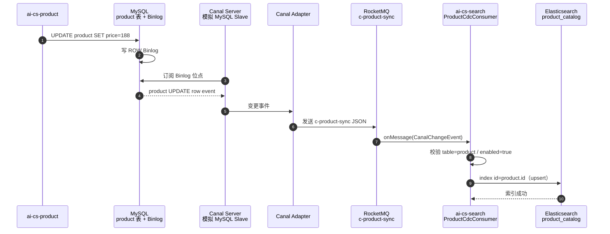

# 11-Canal CDC 商品索引同步：从零理解 Binlog 与最终一致性

> 本文面向第一次接触 MySQL Binlog、CDC、Canal、读模型和最终一致性的读者。
> 示例来自本项目商品搜索：商品在 MySQL 中改价、上下架或删除后，需要同步到
> Elasticsearch `product_catalog` 索引，让搜索结果及时反映商品变化。
>
> 当前状态：MySQL Binlog 前置配置、Canal 最小权限账号、search 消费端及 ES 幂等逻辑已落地；
> Canal Server/Adapter 的真实容器联调依赖 Docker 环境，当前没有被伪装成已完成。

---

## 一、先理解：为什么 MySQL 改了，Elasticsearch 不会自动变

本项目中：

```text
商品事实数据：MySQL product 表
搜索读模型：Elasticsearch product_catalog 索引
```

它们是两个独立系统：

```text
ProductService 更新 MySQL
  ≠ Elasticsearch 自动知道这条更新
```

如果没有同步机制：

```text
MySQL：耳机价格已从 199 改为 188
ES：搜索仍显示 199
用户：看到旧价格
```

这叫做**读模型滞后**。

最直觉的方案是在商品 Service 中双写：

```java
updateProductInMysql();
updateProductInElasticsearch();
```

但它有失败窗口：

```text
MySQL 成功，ES 失败 → 数据不一致
ES 成功，MySQL 失败 → ES 出现不存在的数据
```

而且所有写商品的入口都要记得同步 ES：

```text
创建商品
更新商品
改价
上下架
扣库存
逻辑删除
批量导入
后台脚本
SQL 修复
```

漏掉一个入口，索引就过期。

---

## 二、CDC 是什么

CDC 是 Change Data Capture，中文常译为“变更数据捕获”。

它的思想是：

```text
不让每段业务代码手工通知搜索系统
而是订阅数据库已经发生的真实变更
```

MySQL 会把数据变更写入 Binlog：

```text
INSERT product ...
UPDATE product SET price=188 WHERE id=1001
DELETE FROM product WHERE id=1001
```

CDC 系统读取 Binlog，把变化转换为事件：

```json
{
  "database": "aics_product",
  "table": "product",
  "type": "UPDATE",
  "data": [
    {
      "id": "1001",
      "name": "无线蓝牙耳机",
      "price": "188.00",
      "status": "1",
      "deleted": "0"
    }
  ]
}
```

搜索服务消费这个事件，更新 ES 索引。

---

## 三、本项目完整 CDC 调用图



删除路径：

```text
MySQL DELETE 或 deleted=1
  → Canal 事件 type=DELETE / deleted=1
  → Search 删除 ES document
```

---

## 四、MySQL Binlog 是什么

Binlog 是 MySQL 的二进制日志，记录会改变数据的操作。它最初主要用于：

- 主从复制
- 数据恢复
- 审计

Canal 利用的正是 MySQL 主从复制协议：它伪装成一个 slave，向 MySQL 申请读取 Binlog。

```text
MySQL Master
  └── Binlog
        ├── 真实 MySQL Slave
        └── Canal（伪装 Slave）
```

### 4.1 Binlog 三种格式

| 格式 | 记录内容 | 优点 | 缺点 |
|------|----------|------|------|
| STATEMENT | 原始 SQL | 日志小 | 非确定性 SQL 可能导致从库结果不同 |
| ROW | 每行前后变化 | 最可靠，CDC 常用 | 日志较大 |
| MIXED | 自动选择 | 折中 | 行为较复杂 |

项目配置：

```ini
server-id=1
log-bin=mysql-bin
binlog-format=ROW
binlog-row-image=FULL
expire-logs-days=7
```

### 4.2 为什么选 ROW

假设执行：

```sql
UPDATE product SET stock = stock - 1 WHERE id = 1001;
```

STATEMENT 只记录 SQL。如果另一个环境库存已经不同，重放结果可能不同。

ROW 记录每个受影响行的实际变化：

```text
id=1001
before: stock=100
after:  stock=99
```

CDC 消费者能准确知道哪条商品变化了。

### 4.3 为什么 `binlog-row-image=FULL`

FULL 表示 UPDATE/DELETE 事件保留完整行镜像。搜索同步至少需要可靠拿到：

```text
id
name
price
status
deleted
```

如果只保存最小字段，DELETE 或部分 UPDATE 事件可能缺少消费端需要的字段，
导致无法正确更新或删除 ES 文档。

---

## 五、Canal 是什么

Canal 是阿里开源的 MySQL Binlog 增量订阅与消费组件。

它的关键能力：

```text
连接 MySQL
  → 模拟 Slave 协议
  → 拉取 Binlog
  → 解析为行变更事件
  → 交给下游 Adapter 或客户端
```

### 5.1 Canal Server 和 Canal Adapter

这两个角色不要混淆：

| 组件 | 职责 |
|------|------|
| Canal Server | 连接 MySQL、读取并解析 Binlog |
| Canal Adapter | 把 Canal 事件投递到 ES、RocketMQ、Kafka 等目标系统 |

项目目标：

```text
Canal Server：只监听 aics_product.product
Canal Adapter：把变更发到 RocketMQ topic c-product-sync
Search 服务：消费 RocketMQ 并写 ES
```

为什么不让 Adapter 直接写 ES？

可以，但本项目已有 RocketMQ，也希望 search 服务自己拥有索引映射、重试和演进逻辑：

```text
Canal → RocketMQ → Search
```

优点：

- CDC 采集层和搜索索引层解耦
- 可多个消费者订阅商品变更
- Search 服务掌握 ES mapping、upsert、删除策略
- RocketMQ 提供重试、监控、死信等能力

---

## 六、最小权限账号

项目初始化 SQL：

```sql
CREATE USER IF NOT EXISTS 'canal'@'%' IDENTIFIED BY 'canal';
GRANT SELECT, REPLICATION SLAVE, REPLICATION CLIENT ON *.* TO 'canal'@'%';
FLUSH PRIVILEGES;
```

权限解释：

| 权限 | 用途 |
|------|------|
| SELECT | Canal 读取元数据或必要快照 |
| REPLICATION SLAVE | 允许模拟复制客户端读取 Binlog |
| REPLICATION CLIENT | 查询复制状态/位点 |

Canal 不需要：

```text
INSERT
UPDATE
DELETE
DROP
ALTER
```

最小权限原则：只授予完成任务所需的权限，避免 CDC 账号被泄露后能修改业务数据。

生产环境不能继续用 `canal/canal` 默认密码，应使用 Secret 或安全配置中心注入。

---

## 七、Search 消费端如何做到幂等

项目消费者：

```java
@RocketMQMessageListener(
    topic = "c-product-sync",
    consumerGroup = "search-product-cdc-consumer"
)
public class ProductCdcConsumer implements RocketMQListener<CanalChangeEvent> {
}
```

核心策略：

```java
String docId = String.valueOf(row.get("id"));
elasticsearchClient.index(i -> i
        .index("product_catalog")
        .id(docId)
        .document(row));
```

ES document id 固定为 MySQL `product.id`：

```text
MySQL product.id = 1001
ES product_catalog/_doc/1001
```

因此同一 UPDATE 事件即使被 RocketMQ 重复投递：

```text
第一次：写 document 1001
第二次：覆盖 document 1001
第三次：继续覆盖 document 1001
```

不会产生三条商品文档。这就是**幂等 upsert**。

### 7.1 DELETE 如何幂等

```java
if ("DELETE".equalsIgnoreCase(type) || "1".equals(row.get("deleted"))) {
    elasticsearchClient.delete(d -> d.index(INDEX).id(docId));
}
```

删除重复执行：

```text
第一次删除：文档存在 → 删除
第二次删除：文档不存在 → 忽略
```

结果相同，也是幂等。

### 7.2 为什么 ES 异常要抛出

```java
throw new IllegalStateException("CDC 商品索引同步失败", e);
```

不能只记录日志然后吞掉：

```text
ES 临时不可用
  → 如果吞异常
  → RocketMQ 认为消息消费成功
  → 索引事件永久丢失
```

抛异常后由 RocketMQ 重试，必要时进入死信队列，再由运维处理。

---

## 八、默认关闭的原因

search 配置：

```yaml
aics:
  cdc:
    product:
      enabled: ${CANAL_PRODUCT_CDC_ENABLED:false}
```

消费者逻辑：

```java
if (!enabled || event == null || !"product".equalsIgnoreCase(event.getTable())) {
    return;
}
```

默认关闭不是“功能没写完”，而是防止：

```text
Canal/Adapter 没部署
但 search 已开始消费陌生格式消息
或 ES 索引 mapping 未准备好
或错误配置导致商品索引被误删
```

启用顺序应是：

```text
1. MySQL Binlog 开启
2. Canal Server/Adapter 跑通
3. 验证 Adapter 输出 JSON 结构
4. 创建/确认 ES product_catalog mapping
5. 启动 search
6. CANAL_PRODUCT_CDC_ENABLED=true
7. 用一条 UPDATE 验证完整链路
```

---

## 九、最终一致性：为什么不能保证毫秒级同步

链路中有多个异步步骤：

```text
MySQL commit
  → 写 Binlog
  → Canal 拉取
  → Adapter 转发
  → RocketMQ 投递
  → Search 消费
  → ES 写入
```

因此可能存在短暂窗口：

```text
MySQL 已经显示 188
ES 搜索还显示 199
```

这不是 bug，而是最终一致性读模型的正常特征。

对本项目来说：

- 下单扣库存、支付金额等强一致业务只信 MySQL
- 搜索展示可接受秒级延迟
- 商品详情页面可以回源 product 服务获取最终价格

不能用 ES 搜索索引作为库存、支付、订单判断的权威来源。

---

## 十、最终一致性三板斧

### 10.1 幂等

固定 ES `_id = product.id`，重复事件覆盖同一文档。

### 10.2 乱序

当前 MVP 使用单 Canal instance，通常可保持同一表变化顺序。

扩容到多分区/多消费者后，可能出现：

```text
事件 A：价格 199 → 188
事件 B：价格 188 → 168

B 先到 ES，A 后到 ES
→ ES 错误回退到 188
```

增强策略：

- 事件带 `updatedAt` 或 Binlog offset
- ES 写入时使用 external version
- 消费端缓存/比较版本，只接受新版本
- 按 product.id 分区，保证同一个商品进入同一顺序分区

### 10.3 对账

任何异步链路都不能只靠“理论上会重试”。要有定时对账：

```text
MySQL：where deleted=0 的商品数量
ES：product_catalog 的文档数量
```

不一致时：

- 指标告警
- 记录差异商品 id
- 触发单商品补偿索引
- 极端情况下全量重建索引

这三件事常被称为 CDC 最终一致性的“三板斧”：

```text
幂等
乱序控制
对账补偿
```

---

## 十一、为什么不直接业务双写 MySQL 和 ES

对比：

| 方式 | 优点 | 风险 |
|------|------|------|
| 业务双写 | 代码直观、同步快 | 每个写入口都要记得写 ES；失败窗口大 |
| Canal CDC | 订阅数据库真实变更、写入口统一 | 有异步延迟，需要 Binlog/Canal 运维 |
| Outbox | 可控可靠事件 | 需要表、投递器、清理策略 |
| 定时全量同步 | 最简单 | 延迟大、成本高、实时性差 |

本项目选择 Canal CDC 的理由：

```text
商品变化来源应该以 MySQL 为准
搜索索引只是读模型
订阅 Binlog 能覆盖业务接口、批量脚本、SQL 修复等所有数据库变更来源
```

注意：CDC 不是万能的。对需要强一致反馈的操作，仍然应该直接读 MySQL 或在业务流程中同步调用。

---

## 十二、Canal Server/Adapter 实际部署边界

当前已完成：

```text
MySQL ROW/FULL Binlog
canal 最小权限账号
search ProductCdcConsumer
RocketMQ topic 契约
ES 幂等 upsert/delete 逻辑
单测与编译
```

尚待 Docker/K8s 环境完成：

```text
Canal Server 容器
Canal Adapter 容器
真实 Adapter JSON 格式验证
端到端 UPDATE/DELETE 验收
对账任务与 Grafana 告警
```

为什么不直接提交一份“猜出来的” Adapter Compose：

- Canal Server/Adapter 不同版本配置字段不同
- Adapter 到 RocketMQ 的输出结构必须与 `CanalChangeEvent` 对齐
- 运行不通的编排比不写更危险，会误导使用者

正确做法是在有 Docker 后锁定：

```text
Canal Server 1.1.7
Canal Adapter 1.1.7
MySQL 8.0
RocketMQ 5.1.4
```

先用一条 UPDATE 抓真实消息，再确定最终 JSON DTO 和 Compose 配置。

---

## 十三、端到端验收步骤

有 Docker 环境后：

```bash
# 1. 启动 MySQL、RocketMQ、ES、Canal Server、Canal Adapter、search
# 2. 打开 CDC 开关
export CANAL_PRODUCT_CDC_ENABLED=true
```

执行：

```sql
UPDATE product SET price = 188.00 WHERE id = 1001;
```

检查：

```text
1. MySQL product.id=1001 price=188
2. Canal Server 已读取 Binlog
3. RocketMQ c-product-sync 有 UPDATE 消息
4. search 日志出现 CDC 商品索引 upsert: id=1001
5. GET product_catalog/_doc/1001 显示 price=188
```

删除验证：

```sql
UPDATE product SET deleted = 1 WHERE id = 1001;
```

预期：

```text
ES product_catalog/_doc/1001 不存在
```

重复消息验证：重复投递同一个 UPDATE，ES 文档仍只有一个。

---

## 十四、测试与验证

当前测试：

```text
ProductCdcConsumerTest
```

覆盖：

| 场景 | 断言 |
|------|------|
| `enabled=false` | 不访问 ES |
| 非 product 表 | 不访问 ES |

验证命令：

```bash
mvn -pl ai-cs-search test -Dtest=ProductCdcConsumerTest
mvn -pl ai-cs-search -DskipTests compile
```

当前结果：消费者测试 2 个全绿，search 编译成功。

真正的 Upsert/Delete、RocketMQ 重试、Canal Adapter 格式验证必须在真实中间件环境执行。

---

## 十五、常见问题

### Q1：为什么 Canal 连不上 MySQL？

检查：

- MySQL 是否开启 `log-bin`
- `binlog-format` 是否为 ROW
- `server-id` 是否非 0 且唯一
- canal 用户是否有复制权限
- MySQL 地址、端口、账号密码是否正确
- 网络/Docker DNS 是否连通

### Q2：为什么 MySQL 更新了，ES 没更新？

按链路逐段检查：

```text
MySQL Binlog
→ Canal Server 位点
→ Adapter 日志
→ RocketMQ topic
→ Search 消费日志
→ Elasticsearch 文档
```

不要只在业务服务里找问题。

### Q3：为什么会收到重复消息？

RocketMQ 与 CDC 通常是至少一次语义。网络确认失败、重试、重启都可能重复。
固定 ES id upsert 就是为此准备的。

### Q4：为什么不能让 ES 库存作为下单依据？

ES 是最终一致读模型，有延迟。下单库存必须由 product MySQL 条件更新保证，不能信搜索索引。

### Q5：Canal 能监听所有数据库吗？

技术上可以，但应该用 filter 限制范围。例如当前只监听：

```text
aics_product.product
```

监听范围越大，资源、权限、消息量和误同步风险越大。

---

## 十六、面试要点总结

可以这样描述本项目：

> 商品数据以 MySQL product 表为事实源，Elasticsearch 是搜索读模型。为避免每个业务入口手工双写
> ES，我们启用 MySQL ROW/FULL Binlog，让 Canal 模拟 slave 订阅 product 表变化，经 Canal Adapter
> 投递 RocketMQ `c-product-sync`，search 服务消费后用 `product.id` 作为 ES document id 做幂等 upsert。
> DELETE 或逻辑删除则删除索引文档。CDC 是最终一致链路，不用于库存或支付等强一致判断；通过固定 id
> 幂等、版本/分区控制乱序、MySQL/ES 定时对账处理异步一致性风险。

关键词：

```text
CDC
Binlog
ROW
FULL
Canal Server
Canal Adapter
MySQL Slave Protocol
RocketMQ
Elasticsearch Upsert
幂等
乱序
对账
最终一致性
读模型
```
