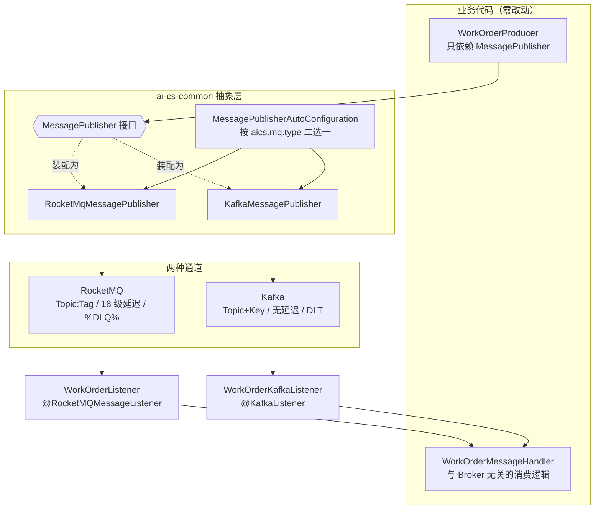
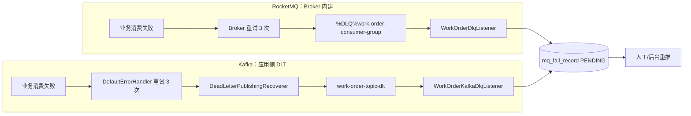

# 12-Kafka 与 RocketMQ 双栈切换：从零理解消息中间件抽象层

> 本文面向第一次接触 Kafka、或者想把「换一个 MQ」变成**改一行配置**的读者。
> 项目现状：`ai-cs-common` 新增了消息发布抽象层 `MessagePublisher`，RocketMQ 与 Kafka 双实现，
> 由开关 `aics.mq.type` 决定谁生效；`ai-cs-mq` 的工单闭环（生产 → 消费 → 重试 → 死信 → 重推）
> 已完整跑在两种 Broker 上，业务逻辑一行没分叉。
>
> **验证状态**：全仓 13 个模块 `mvn compile` 通过；`ai-cs-common`（38 个测试）+ `ai-cs-mq`（7 个测试）
> 全绿，其中本次新增 23 个单测。本机无 Docker CLI（`docker` 命令不存在），因此
> 「Kafka 容器真连真发」的端到端验收步骤已写在第十一节，但**尚未在本机执行**——
> 不要把「编排已写」当成「链路已通」。
>
> 相关文档：[02-RocketMQ消息队列](./02-RocketMQ消息队列.md)、[08-RocketMQ事务消息与死信队列](./08-RocketMQ事务消息与死信队列.md)（RocketMQ 侧基础）、
> [07-Redisson分布式锁](./07-Redisson分布式锁.md)（另一种延迟任务手段）、
> [14-数据工程与OLAP/04-CDC与实时同步链路](../14-数据工程与OLAP/04-CDC与实时同步链路.md)（MQ 在 CDC 中的位置）、
> [13-稳定性工程/05-降级预案与开关治理](../13-稳定性工程/05-降级预案与开关治理.md)（开关治理总原则）。

---

## 一、为什么已经有 RocketMQ 了还要引入 Kafka

先明确一个容易走偏的结论：**引入 Kafka 不是为了替换 RocketMQ，而是为了让「换 MQ」这件事不再是一次伤筋动骨的重构。**

本项目此前所有 MQ 代码都是「写死」的：

```text
生产者：直接注入 RocketMQTemplate，调用 convertAndSend / syncSend / sendMessageInTransaction
消费者：类上标 @RocketMQMessageListener，实现 RocketMQListener<T>
配置：application.yml 里写 rocketmq.name-server
```

这套写法在只用一种 MQ 时完全没问题，但它把**业务语义**和**通道实现**焊死在一起：

| 问题 | 具体表现 |
|------|----------|
| 业务类依赖具体中间件 | `WorkOrderProducer` 的构造函数参数是 `RocketMQTemplate`，换 MQ 就要改它 |
| 消费能力与注解绑定 | RocketMQ 用 `consumerGroup` + `selectorExpression`，Kafka 用 `groupId` + 分区，注解无法平移 |
| 失败语义各自实现 | RocketMQ 用 `maxReconsumeTimes` + `%DLQ%`，Kafka 要自己搭重试和死信主题 |
| 无法灰度/对比 | 想验证「换 Kafka 后行为是否一致」，只能改代码再回滚 |

同时，项目里确实存在**适合 Kafka 的场景与不适合的场景**（这也是面试高频题）：

| 场景 | 更适合 | 原因 |
|------|--------|------|
| 订单超时、支付超时等**延迟消息** | RocketMQ | 服务端 18 级固定延迟，开箱即用；Kafka 没有原生延迟消息 |
| 事务消息（本地事务 + 消息发送最终一致） | RocketMQ | Kafka 事务是「跨分区原子写」，语义不同，不能直接替代 RocketMQ 事务消息 |
| 高吞吐**追加型日志流**：对话审计、模型调用计量、埋点 | Kafka | 顺序写 + 零拷贝 + 分区并行，单分区百万级吞吐，生态（Connect/Flink）成熟 |
| 与 Flink / 数据湖 / CDC 生态对接 | Kafka | Debezium、Flink Kafka Connector 事实标准；RocketMQ 需自建 |
| 超长堆积（按天累积、可回溯重放） | Kafka | 按时间/大小保留策略，消费者可重置 offset 重放历史 |

所以本项目的定位是：**RocketMQ 继续承担业务一致性链路，Kafka 作为可选的第二栈**（面向日志流/数据工程方向），
两者用同一套抽象层，由开关切换。

---

## 二、一张图看懂双栈：开关在哪



三个关键点：

1. **生产者只认识接口**：`WorkOrderProducer` 注入的是 `MessagePublisher`，不是 `RocketMQTemplate`。
2. **消费者由开关决定装配哪一个**：RocketMQ 监听器和 Kafka 监听器都写好了，但同一时刻只有一个被注册为 Bean。
3. **消费逻辑只有一份**：`WorkOrderMessageHandler` 被两边复用，这是「切换后语义一致」的根本保证。

---

## 三、先理解 Kafka：和 RocketMQ 到底哪里不一样

### 3.1 四个核心概念

```text
Broker       : Kafka 服务节点；KRaft 模式下 broker 同时兼任 controller
Topic        : 逻辑主题（与 RocketMQ 同名概念）
Partition    : 分区，Topic 的物理切分单位；分区内严格有序，跨分区无序
Offset       : 分区内的消息位移，消费者用自己的 offset 记录「读到哪了」
ConsumerGroup: 消费组；同组内一个分区只会被一个消费者实例消费（横向扩容的基础）
```

和 RocketMQ 最大的认知差异：

| 维度 | RocketMQ | Kafka |
|------|----------|-------|
| 消息定位 | Topic + Tag | Topic + Partition + Offset |
| 有序性 | 队列级有序（可用 MessageQueueSelector 指定队列） | **分区内有序**；同 Key 落同分区 |
| 消费进度 | Broker 侧维护消费位点（可重置到任意位置） | 消费者侧提交 offset（`__consumer_offsets`） |
| 重试 | Broker 内置重试 Topic（`%RETRY%group`） | **无内置重试**，应用侧实现（`DefaultErrorHandler`） |
| 死信 | Broker 内置 `%DLQ%group` | **无内置 DLQ**，应用侧造 `<topic>-dlt` |
| 延迟消息 | 18 级固定延迟 | 不支持（需自建时间轮 / 定时扫描） |
| 事务消息 | 半消息 + 事务回查（业务级最终一致） | 跨分区原子写（`read_committed`），语义不同 |
| Topic 创建 | 默认自动创建 | 通常**预先创建**并规划分区数（本项目用 `kafka-init` 容器建） |
| 运维依赖 | NameServer + Broker | KRaft（3.3+）已不需要 ZooKeeper |

> 记忆口诀：**RocketMQ 把「重试/死信/延迟/事务」做成 Broker 能力；Kafka 把「吞吐/保留/重放/生态」做成 Broker 能力，业务语义留给应用层。**
> 这就是为什么第五节、第六节、第七节要花力气手写 Kafka 的重试、死信和延迟。

### 3.2 本项目 Kafka 版本

| 组件 | 版本 | 说明 |
|------|------|------|
| `org.springframework.kafka:spring-kafka` | 3.1.4 | 由 Spring Boot 3.2.5 BOM 管理，项目不显式写版本 |
| `org.apache.kafka:kafka-clients` | 3.6.2 | spring-kafka 3.1.x 对应客户端版本 |
| 镜像 `apache/kafka` | 3.7.1 | 官方镜像，KRaft 单节点模式 |

---

## 四、抽象层设计：MessagePublisher

### 4.1 接口定义与参数语义映射

`ai-cs-common/src/main/java/com/aics/common/mq/MessagePublisher.java`

```java
public interface MessagePublisher {
    void send(String topic, String key, Object payload);
    void sendDelayed(String topic, String key, Object payload, long delayMillis);
    MessageBrokerType brokerType();
}
```

为什么是 `key` 而不是 `tag`？因为两个 Broker 对「二级分类」的表达不同，抽象层需要选一个**两者都能落地**的语义：

| 抽象参数 | RocketMQ 落地 | Kafka 落地 |
|----------|---------------|------------|
| `topic` | Topic | Topic |
| `key` | **Tag**（拼接成 `topic:tag`） | **Record Key**（决定分区，同 Key 分区内有序） |

RocketMQ 侧的目的地拼接：

```java
static String destination(String topic, String key) {
    return StringUtils.hasText(key) ? topic + ":" + key : topic;
}
```

Kafka 侧把 `key` 直接作为 Record Key —— 这样「同一工单类型的消息进同一分区」，
等价于 RocketMQ 用 Tag 做业务分组的意图，也让顺序性有据可依。

`brokerType()` 看似多余，实际很有用：启动日志和排查接口都要能一眼看出当前**实际**生效的是谁，
而不是「以为配置生效了」。

### 4.2 两个实现的关键差异

**RocketMQ 实现**（`rocketmq/RocketMqMessagePublisher.java`）：同步发送，失败抛异常；
延迟消息走 18 级固定级别，**向上取整**到最近的级别，而不是静默丢弃：

```java
private static final long[] DELAY_LEVEL_MILLIS = {
    1_000L, 5_000L, 10_000L, 30_000L, 60_000L, 120_000L, /* ... */ 3_600_000L, 7_200_000L
};

static int resolveDelayLevel(long delayMillis) {
    for (int i = 0; i < DELAY_LEVEL_MILLIS.length; i++) {
        if (delayMillis <= DELAY_LEVEL_MILLIS[i]) {
            return i + 1;      // delayLevel 从 1 开始
        }
    }
    throw new IllegalArgumentException("RocketMQ 最大延迟级别为 2 小时 ...");
}
```

超过 2 小时**直接抛异常**而不是「等 2 小时」——把能力边界显式暴露给调用方，比偷偷改语义安全。

**Kafka 实现**（`kafka/KafkaMessagePublisher.java`）：KafkaTemplate 天然异步，
这里用 `future.get(timeout)` 把异步收敛成「失败即抛」的同步语义，让两种实现对外行为一致：

```java
kafkaTemplate.send(topic, key, payload)
        .get(properties.getSendTimeoutMillis(), TimeUnit.MILLISECONDS);
```

### 4.3 自动装配：三层条件缺一不可

`MessagePublisherAutoConfiguration.java` 是整套开关的核心，用**嵌套静态配置类 + 三层条件**实现：

```java
@AutoConfiguration
@EnableConfigurationProperties(MqProperties.class)
@AutoConfigureAfter(name = {
        "org.apache.rocketmq.spring.autoconfigure.RocketMQAutoConfiguration",
        "org.springframework.boot.autoconfigure.kafka.KafkaAutoConfiguration"
})
public class MessagePublisherAutoConfiguration {

    @Configuration(proxyBeanMethods = false)
    @ConditionalOnClass(RocketMQTemplate.class)                                  // ① 类存在
    @ConditionalOnBean(RocketMQTemplate.class)                                   // ② Bean 存在
    @ConditionalOnProperty(prefix = "aics.mq", name = "type",
            havingValue = "rocketmq", matchIfMissing = true)                     // ③ 开关
    static class RocketMqPublisherConfiguration {
        @Bean
        @ConditionalOnMissingBean(MessagePublisher.class)
        public MessagePublisher rocketMqMessagePublisher(RocketMQTemplate t, MqProperties p) {
            return new RocketMqMessagePublisher(t, p);
        }
    }
    // Kafka 分支结构相同，havingValue = "kafka"
}
```

逐条解释「为什么非要这三层」：

| 条件 | 作用 | 少了会怎样 |
|------|------|------------|
| `@ConditionalOnClass` | classpath 有没有 MQ 客户端 | 没引 MQ 的服务（如 gateway）在扫描时直接 `ClassNotFound` |
| `@ConditionalOnBean` | 容器里有没有 `RocketMQTemplate` | 见下方「RocketMQ 的真实条件」 |
| `@ConditionalOnProperty` | 开关 | 双栈都在 classpath 时两个实现同时装配，注入歧义 |

**RocketMQ 的真实条件（读源码得到的结论）**：`RocketMQAutoConfiguration` 上标注的是
`@ConditionalOnProperty(prefix = "rocketmq", value = "name-server", matchIfMissing = true)`，
而 `RocketMQTemplate` 这个 Bean 还有 `@Conditional(ProducerOrConsumerPropertyCondition.class)`：
**必须存在 `DefaultMQProducer` 或 `DefaultLitePullConsumer` 之一才会创建**。
而 `DefaultMQProducer` 的前置条件是 `rocketmq.name-server` **和** `rocketmq.producer.group` 都存在。

```text
只配了 rocketmq.name-server，没配 producer.group
  → 没有 DefaultMQProducer
  → 没有 RocketMQTemplate
  → 如果只有 @ConditionalOnClass，注入 RocketMQTemplate 的 Bean 方法会启动失败
```

这就是必须加 `@ConditionalOnBean` 的原因：**「类在」不等于「Bean 在」**。
加了它，改造后各服务就算只引了 starter 却没配 Broker，也不会因为抽象层而启动失败——
这是本次改造零回归的关键。

**`@AutoConfigureAfter` 也不能省**：`@ConditionalOnBean` 依赖「先注册定义、后判断」，
如果没有声明顺序，判断可能发生在 `RocketMQAutoConfiguration` 之前，导致条件永远为假。
这里用 `name = "..."` 字符串形式（而不是 `Class` 字面量），是为了在 Kafka/RocketMQ 类不在
classpath 时读取注解也不会触发类加载。

### 4.4 用 optional 依赖，让抽象层「可插拔」

`ai-cs-common/pom.xml` 里两个 MQ 依赖都标了 `<optional>true</optional>`：

```xml
<dependency>
    <groupId>org.apache.rocketmq</groupId>
    <artifactId>rocketmq-spring-boot-starter</artifactId>
    <optional>true</optional>
</dependency>
<dependency>
    <groupId>org.springframework.kafka</groupId>
    <artifactId>spring-kafka</artifactId>
    <optional>true</optional>
</dependency>
```

含义：common 编译需要它们，但**不会传递给下游服务**。
于是装配结果变成「看业务模块自己引了什么」：

| 服务情况 | 装配结果 |
|----------|----------|
| 没引任何 MQ | 不装配 `MessagePublisher`，服务照常启动 |
| 只引 RocketMQ（现有 8 个服务） | 默认装配 RocketMQ 实现 |
| 引了 RocketMQ + Kafka（`ai-cs-mq`） | 由 `aics.mq.type` 决定，默认 RocketMQ |

这与项目里幂等组件对 Redis 的处理方式（`spring-boot-starter-data-redis` optional + `@ConditionalOnClass`）是同一套路。

---

## 五、消费端怎么切：注解式监听器的条件装配

生产者好抽象（一次方法调用），消费者难抽象（注解 + 容器 + 生命周期）。
本项目没有强行抽象消费者，而是采用**双监听器 + 条件装配**这个务实方案。

### 5.1 RocketMQ 侧：加一个条件注解

`ai-cs-mq/.../consumer/WorkOrderListener.java`

```java
@Component
@ConditionalOnProperty(prefix = "aics.mq", name = "type",
        havingValue = "rocketmq", matchIfMissing = true)
@RocketMQMessageListener(
        topic = WorkOrderProducer.TOPIC,
        consumerGroup = "work-order-consumer-group",
        maxReconsumeTimes = 3)
public class WorkOrderListener implements RocketMQListener<WorkOrderMessage> {
    private final WorkOrderMessageHandler messageHandler;

    @Override
    public void onMessage(WorkOrderMessage message) {
        messageHandler.handle(message);   // 业务逻辑统一委托
    }
}
```

`matchIfMissing = true` 保证**不配置开关时行为与改造前完全一致**——这是存量兼容的底线。

### 5.2 Kafka 侧：@KafkaListener

`ai-cs-mq/.../consumer/kafka/WorkOrderKafkaListener.java`

```java
@Component
@ConditionalOnProperty(prefix = "aics.mq", name = "type", havingValue = "kafka")
public class WorkOrderKafkaListener {

    private final WorkOrderMessageHandler messageHandler;

    @KafkaListener(topics = WorkOrderProducer.TOPIC, groupId = "work-order-consumer-group")
    public void onMessage(ConsumerRecord<String, WorkOrderMessage> record) {
        log.info("收到 Kafka 工单消息: topic={}, partition={}, offset={}, key={}",
                record.topic(), record.partition(), record.offset(), record.key());
        messageHandler.handle(record.value());
    }
}
```

三个值得注意的点：

1. **入参是 `ConsumerRecord` 而不是消息体**：Kafka 天然能拿到 `partition`/`offset`/`key`/`header`，
   这些是排查「消息为什么乱序」「这条消息来自哪个分区」的关键信息，比只拿消息体更有用。
2. **`groupId` 语义**：同组内一个分区只被一个实例消费；扩容实例数超过分区数时多出的实例会空闲
   （所以 `kafka-init` 把 `work-order-topic` 建成了 3 个分区）。
3. **`auto-offset-reset`**：Kafka 模式里配了 `earliest`，新消费组从头消费，便于本地演示观察历史消息；
   生产上通常用 `latest` 并配合 offset 监控，否则一次误删消费组会引发**全量重放**（幂等必须做好）。

### 5.3 业务逻辑只写一份

`WorkOrderMessageHandler` 是本次改造的「语义锚点」：

```java
public void handle(WorkOrderMessage message) {
    if (Boolean.TRUE.equals(message.getSimulateFail())) {
        throw new RuntimeException("模拟工单消费失败: ticketNo=" + message.getTicketNo());
    }
    // NEW/FAILED -> DONE（幂等：重复消费结果一致）
    ...
}
```

两个监听器都只是「把消息喂给它」。切换 Broker 时，业务语义（幂等、状态流转、跳过不存在的工单）
完全不变——这也是检验抽象是否成功的最好标准：**如果切换后业务代码需要分叉，说明抽象层没做对。**

---

## 六、死信队列：两种 Broker 的实现差异（本节是重点）

### 6.1 RocketMQ：Broker 内建，几乎零代码

```text
业务消费抛异常
  → Broker 按 maxReconsumeTimes=3 自动重试（延迟级别递增：约 10s / 30s / 1m）
  → 仍失败 → Broker 自动把消息投到 %DLQ%work-order-consumer-group
  → WorkOrderDlqListener 消费死信主题，落 mq_fail_record（PENDING）
```

开发者只需要：注解上写 `maxReconsumeTimes`，再写一个监听 `%DLQ%<group>` 的消费者。

### 6.2 Kafka：应用侧自己造 DLT

Kafka 没有死信概念，需要三件套拼出来：

```text
业务消费抛异常
  → DefaultErrorHandler 原地重试 3 次（FixedBackOff(1000L, 3)）
  → 仍失败 → DeadLetterPublishingRecoverer 把原记录转发到 <topic>-dlt
  → WorkOrderKafkaDlqListener 消费 work-order-topic-dlt，落 mq_fail_record（PENDING）
```

`ai-cs-mq/.../config/KafkaConsumerConfig.java`：

```java
@Configuration(proxyBeanMethods = false)
@ConditionalOnProperty(prefix = "aics.mq", name = "type", havingValue = "kafka")
public class KafkaConsumerConfig {

    public static final String DLT_SUFFIX = "-dlt";

    @Bean
    public ConcurrentKafkaListenerContainerFactory<String, Object> kafkaListenerContainerFactory(
            ConsumerFactory<?, ?> consumerFactory, KafkaTemplate<?, ?> kafkaTemplate) {
        var factory = new ConcurrentKafkaListenerContainerFactory<String, Object>();
        factory.setConsumerFactory(castConsumerFactory(consumerFactory));
        var recoverer = new DeadLetterPublishingRecoverer(castOperations(kafkaTemplate));
        factory.setCommonErrorHandler(new DefaultErrorHandler(recoverer, new FixedBackOff(1_000L, 3)));
        return factory;
    }
    // 死信专用工厂：不再重试、不再转发
}
```

三个容易踩的坑，都在代码注释里写明了：

| 坑 | 说明 |
|----|------|
| **必须自定义容器工厂** | Spring Boot 自动配置的 `kafkaListenerContainerFactory` 是 `@ConditionalOnMissingBean(name = "kafkaListenerContainerFactory")`；业务侧定义同名 Bean 就会覆盖它，从而拿到错误处理器的控制权 |
| **默认死信主题是 `<topic>-dlt`** | 由 `DeadLetterPublishingRecoverer` 的默认 `destinationResolver` 决定：`new TopicPartition(topic + "-dlt", partition)` |
| **死信消费必须用「不重试」工厂** | 否则死信消费失败会继续产生 `work-order-topic-dlt-dlt`，无限递归。所以 `workOrderDltContainerFactory` 用 `FixedBackOff(0L, 0)` |

另外注意 `DefaultErrorHandler` 的重试是**原地重试**（同一分区暂停消费、内存中重试同一批记录），
不是重新入队——因此**在成功前不会提交 offset**，重启后会重新消费这些记录，幂等依然是必需品。

### 6.3 幂等键：msgId vs topic-partition-offset

落 `mq_fail_record` 时需要一个幂等键（表上有唯一约束），两个 Broker 提供的东西不一样：

| Broker | 幂等键 | 代码 |
|--------|--------|------|
| RocketMQ | `msgId`（Broker 生成的全局消息 ID） | `message.getMsgId()` |
| Kafka | `topic-partition-offset`（天然唯一，无需额外生成） | `record.topic() + "-" + record.partition() + "-" + record.offset()` |

两者都保证「同一条消息重复投递只落一条失败记录」。

### 6.4 两种死信通道的对照图



重推链路是**共用**的：`WorkOrderService.repush()` 走 `MessagePublisher.send()`，
所以失败记录重推时会自动发到「当前生效的那个 Broker」，不需要区分。

---

## 七、延迟消息：Kafka 没有原生延迟

这是双栈改造里**唯一一处能力不等价**的地方，必须显式承认。

| 方案 | 延迟精度 | 可靠性 | 说明 |
|------|----------|--------|------|
| RocketMQ 延迟级别 | 固定 18 级 | 高（消息落盘） | 本项目 `sendDelayed` 走这条路，向上取整 |
| Kafka + 进程内 `TaskScheduler` | 毫秒 | **低**（进程重启即丢） | 本项目的降级实现，仅够演示 |
| Kafka + 定时任务扫描 | 秒级 | 高 | 落库 + 定时扫到期，需自己写 |
| Kafka + 时间轮（多级延迟 Topic） | 秒级 | 中高 | 业界常见做法，维护成本高 |
| Redis ZSet / Redisson 延迟队列 | 毫秒 | 中（依赖 Redis 持久化） | 项目里 Redisson 已有，见 [07-Redisson分布式锁](./07-Redisson分布式锁.md) |

Kafka 实现的降级代码明确打了 WARN：

```java
log.warn("Kafka 无原生延迟消息，降级为进程内调度（重启会丢失）: topic={}, key={}, delayMillis={}",
        topic, key, delayMillis);
```

**工程结论**：像 `order-timeout-topic`（订单 30 分钟超时）这类**必须可靠**的延迟消息，
在 Kafka 模式下应当改用「定时任务扫描 + 状态字段」而不是依赖本降级实现。
所以本次改造**没有**把 order 服务的超时消息迁到抽象层——这是有意的边界，不是遗漏。

---

## 八、序列化：JsonSerializer / JsonDeserializer 与类型头

RocketMQ 侧由 `rocketmq-spring` 的 `RocketMQMessageConverter` 自动做 JSON 转换；
Kafka 侧需要显式配置序列化器（`ai-cs-mq/src/main/resources/application-kafka.yml`）：

```yaml
spring:
  kafka:
    producer:
      key-serializer: org.apache.kafka.common.serialization.StringSerializer
      value-serializer: org.springframework.kafka.support.serializer.JsonSerializer
      acks: all
      retries: 3
      properties:
        enable.idempotence: true
    consumer:
      group-id: work-order-consumer-group
      auto-offset-reset: earliest
      key-deserializer: org.apache.kafka.common.serialization.StringDeserializer
      value-deserializer: org.springframework.kafka.support.serializer.JsonDeserializer
      properties:
        spring.json.trusted.packages: com.aics.mq.dto
```

要点：

1. **`JsonSerializer` 会写入 `__TypeId__` 头**（值为 `com.aics.mq.dto.WorkOrderMessage`），
   消费端 `JsonDeserializer` 据此还原成原类型，因此监听器可以直接写
   `ConsumerRecord<String, WorkOrderMessage>`。
2. **`trusted.packages` 是安全白名单**，默认不信任任何包。不配就会抛
   `IllegalArgumentException: The class ... is not in the trusted packages` —— 这是防止
   反序列化任意类导致 RCE 的护栏，不要图省事写 `*`。
3. **DLT 转发会保留原 header**，所以死信消费者也能正常反序列化。
4. `acks=all` + `enable.idempotence=true` 是为了对齐 RocketMQ 同步发送的可靠性预期；
   注意 Kafka 的幂等生产者只解决「Broker 内重复写入」，**不解决业务重复消费**。

---

## 九、怎么切换（操作手册）

### 9.1 RocketMQ 模式（默认）

```bash
# 不需要任何额外操作，启动参数什么都不用加
java -jar ai-cs-mq.jar
```

验证：`GET /mq/broker-type` 返回 `brokerType = ROCKETMQ`。

### 9.2 Kafka 模式

```bash
# ① 启动 Kafka（profile=kafka，默认不启动）
docker compose --profile kafka up -d kafka kafka-init

# ② 以 kafka profile 启动服务
java -jar ai-cs-mq.jar --spring.profiles.active=kafka
# 或
SPRING_PROFILES_ACTIVE=kafka java -jar ai-cs-mq.jar
```

验证：`GET /mq/broker-type` 返回 `brokerType = KAFKA`、`publisher = KafkaMessagePublisher`。

### 9.3 为什么开关要「两个同时生效」

| 层 | 配置 | 作用 |
|----|------|------|
| `aics.mq.type` | `rocketmq` / `kafka` | 决定**装配哪个发布器**（抽象层的开关） |
| Spring profile `kafka` | `application-kafka.yml` | 提供 Kafka 连接参数，并**排除 RocketMQ 自动装配** |

为什么不只用其中一个？

- 只用 `aics.mq.type=kafka`：`ai-cs-mq` 同时有 rocketmq starter，`RocketMQTemplate` 仍会被创建，
  `DefaultMQProducer` 会周期性尝试连接 NameServer，Kafka 模式下刷一堆无意义的连接告警。
- 只用 profile：抽象层没有开关依据，且其他只引 RocketMQ 的服务无法用同一套语义。

所以 profile 里同时做了两件事——这正是 `application-kafka.yml` 的第一段：

```yaml
spring:
  autoconfigure:
    exclude:
      - org.apache.rocketmq.spring.autoconfigure.RocketMQAutoConfiguration
aics:
  mq:
    type: kafka
```

> 如果你的服务**只引了 Kafka**（没有 rocketmq starter），那就只需要 `aics.mq.type=kafka`，
> 不需要 profile 里的 exclude。

---

## 十、Kafka 部署：为什么用 KRaft

```yaml
kafka:
  image: apache/kafka:3.7.1
  profiles: ["kafka"]            # 默认不启动，避免占用本地资源
  environment:
    CLUSTER_ID: aics-kafka-cluster-0001
    KAFKA_NODE_ID: 1
    KAFKA_PROCESS_ROLES: broker,controller          # KRaft：一个节点同时是 broker 和 controller
    KAFKA_CONTROLLER_QUORUM_VOTERS: 1@kafka:9093
    KAFKA_LISTENERS: PLAINTEXT://:9092,CONTROLLER://:9093,INTERNAL://:29092
    KAFKA_ADVERTISED_LISTENERS: PLAINTEXT://localhost:9092,INTERNAL://kafka:29092
    KAFKA_OFFSETS_TOPIC_REPLICATION_FACTOR: 1       # 单节点必须为 1
```

四个要点：

1. **KRaft 取代 ZooKeeper**：Kafka 3.3 起 KRaft 生产可用，4.0 起是唯一模式。
   少一个组件、少一套运维、元数据变更更快，学习环境首选。
2. **三套 listener 的原因**：
   - `PLAINTEXT://9092`：宿主机/IDE 里的服务用 `localhost:9092`
   - `INTERNAL://29092`：容器之间互访（`kafka-init`、以后容器化的服务）用 `kafka:29092`
   - `CONTROLLER://9093`：KRaft 内部仲裁，**不要暴露到宿主机**
3. **单节点副本因子必须为 1**：否则创建 Topic 会直接失败（`replication factor larger than available brokers`）。
4. **`kafka-data` 数据卷不能省**：没卷的话 `docker compose down` 一次，消息和 offset 全丢。

`kafka-init` 容器负责预创建 Topic —— 这本身就是 Kafka 与 RocketMQ 的一个运维差异：

```bash
kafka-topics.sh --create --if-not-exists --topic work-order-topic        --partitions 3 --replication-factor 1
kafka-topics.sh --create --if-not-exists --topic work-order-topic-dlt    --partitions 3 --replication-factor 1
```

> 本项目没给 Kafka 加 K8s manifest（RocketMQ 已有 compose 但同样没有 k8s 部署），
> 属于已知的部署缺口，与 [09-AI与治理中间件部署](./09-AI与治理中间件部署.md) 讨论的「部署漂移」是同一类问题。

---

## 十一、端到端验收步骤

### 11.1 Kafka 模式

```bash
# 1. 启动 Kafka 与 topic 初始化
docker compose --profile kafka up -d kafka kafka-init
docker compose --profile kafka ps
docker compose --profile kafka logs kafka-init        # 应看到 topic 列表含 work-order-topic / -dlt

# 2. 以 kafka profile 启动 ai-cs-mq（需 MySQL 可用，工单表在 mq_db）
SPRING_PROFILES_ACTIVE=kafka java -jar ai-cs-mq.jar

# 3. 确认开关生效
curl http://localhost:8090/mq/broker-type             # brokerType 应为 KAFKA

# 4. 正常链路：创建工单 → 消费成功 → 状态 DONE
curl -X POST http://localhost:8090/mq/work-order/create \
     -H "Content-Type: application/json" \
     -d '{"title":"无法退款","content":"订单号 123","simulateFail":false}'
curl http://localhost:8090/mq/work-order/list         # 最新一条 status 应为 DONE
```

### 11.2 死信链路（本演示的核心）

```bash
# simulateFail=true → 消费抛异常 → 重试 3 次 → work-order-topic-dlt → 落 mq_fail_record
curl -X POST http://localhost:8090/mq/work-order/create \
     -H "Content-Type: application/json" \
     -d '{"title":"模拟失败","content":"验证死信","simulateFail":true}'

# 等待约 4 秒（1s 间隔 ×3 次重试）后查看
curl http://localhost:8090/mq/fail-records/list       # 应有 PENDING 记录
curl http://localhost:8090/mq/work-order/list         # 对应工单应变为 FAILED

# 重推（共用链路，自动发到当前 Broker）
curl -X POST http://localhost:8090/mq/fail-records/{id}/repush
curl http://localhost:8090/mq/work-order/list         # 状态应变为 DONE
```

### 11.3 RocketMQ 模式回归

```bash
# 不加任何 profile 启动，重复 11.1/11.2 的步骤，行为应完全一致
java -jar ai-cs-mq.jar
curl http://localhost:8090/mq/broker-type             # brokerType 应为 ROCKETMQ
```

**这一步是本次改造的验收重点**：同一条业务路径在两种 Broker 上产生**相同的状态流转**，
（`NEW → DONE`、失败时 `NEW → FAILED → 重推 → DONE`），才说明抽象层做对了。

> 本机无 Docker CLI，上述容器级验收**尚未执行**；已完成的是编译 + 45 个单测（含开关契约、
> 目的地拼接、延迟级别映射、死信降级调度、消费幂等）。

---

## 十二、常见问题

### Q1：Kafka 模式下为什么还会有 RocketMQ 的 bean/日志？

因为 `ai-cs-mq` 为了演示双栈，同时保留了 rocketmq starter。
`application-kafka.yml` 里用 `spring.autoconfigure.exclude` 排除了 `RocketMQAutoConfiguration`。
如果你看到周期性的 NameServer 连接告警，先检查 profile 是否真的激活了。

### Q2：为什么 `MessagePublisher` 注入不进来，启动报 NoSuchBeanDefinition？

按顺序排查：

1. 该服务有没有引 MQ starter？（没引就是设计上不装配）
2. `aics.mq.type` 配的是不是 `kafka`，但没引 Kafka 依赖？
3. RocketMQ 模式：`rocketmq.name-server` **和** `rocketmq.producer.group` 是否都配了？
   （缺一个就没有 `RocketMQTemplate`，`@ConditionalOnBean` 会让抽象层整体让位）

### Q3：消费端报 `class ... is not in the trusted packages`

`spring.kafka.consumer.properties.spring.json.trusted.packages` 没配或没覆盖到消息类所在包。
正确做法是**精确到 DTO 包**（如 `com.aics.mq.dto`），不要写 `*`。

### Q4：死信主题不存在，转发失败

Kafka 默认 `auto.create.topics.enable=true`，通常会自动建；
但生产环境一般关闭它，必须靠 `kafka-init` 预创建（本项目已建 `work-order-topic-dlt`）。
这也解释了为什么 Kafka 习惯「Topic 先建好再用」。

### Q5：Kafka 消费一直重复消费同一条消息？

说明 listener 抛异常后重试耗尽、但 offset 仍未提交。
检查 DLT 是否转发成功（DLT Topic 不存在也会导致 recoverer 失败，进而阻塞该分区）。

### Q6：能不能把这套抽象直接搬到 chat / order / pay？

可以，但**要分链路评估**，不能无脑切（见下一节）。

---

## 十三、边界与迁移路线（重要）

本次改造的边界，必须说清楚，避免误解成「全项目已支持双栈」：

| 服务/链路 | 现状 | 原因 |
|-----------|------|------|
| `ai-cs-mq` 工单闭环 | ✅ 双栈（生产/消费/死信/重推全部可切） | 作为抽象层的参考实现 |
| order 超时消息（`order-timeout-topic`，delayLevel=16） | ❌ 仍直接使用 RocketMQ 延迟消息 | Kafka 无可靠延迟消息（第七节） |
| pay 支付成功事务消息（`sendMessageInTransaction`） | ❌ 仍直接使用 RocketMQ | Kafka 事务语义不等价，不能平替 |
| 其余 chat/knowledge/notify/message/search | ❌ 仍直接使用 RocketMQ | 迁移需逐链路补齐 Kafka 监听器 + DLT |

**推荐迁移顺序**（按「Kafka 更合适 + 风险更低」排序）：

```text
1. 对话审计 / 模型用量计量（追加型日志流，天然适合 Kafka）
      → 生产者改注入 MessagePublisher；消费者新增 @KafkaListener + 保留原 RocketMQ 监听器
2. 知识库增量同步（knowledge-doc-sync-topic，Tag=CREATE/UPDATE/DELETE）
      → 注意 Tag 迁移为 Kafka 的 Key，可能需要按 action 建多个 Topic 或靠消息体内判定
3. notify 通知（Map<String,String> 简单负载）
4. 最后才是 order / pay（延迟 + 事务语义，需先设计替代方案）
```

每一步的验收标准都一样：**两种 Broker 下业务状态流转完全一致，且失败路径能进死信并可重推。**

---

## 十四、面试要点总结

可以这样描述这次改造：

> 项目原先的 MQ 代码把业务语义和 RocketMQ 实现焊死在一起。我们引入了一个消息发布抽象层
> `MessagePublisher`，提供 RocketMQ 与 Kafka 两套实现，用配置项 `aics.mq.type` 切换；
> 抽象层放在 common 里，MQ 依赖声明为 optional，用 `@ConditionalOnClass` + `@ConditionalOnBean` +
> `@ConditionalOnProperty` 三层条件保证「没引 MQ 的服务不报错、只引一个的自动选择、两个都引的按开关选」。
> 消费端没有强行抽象注解，而是双监听器条件装配，把业务逻辑抽到 `WorkOrderMessageHandler` 复用。
> 最关键的是把 RocketMQ 的 Broker 内建能力在 Kafka 上重新实现了一遍：用 `DefaultErrorHandler` +
> `DeadLetterPublishingRecoverer` 造出 `<topic>-dlt` 等价于 `%DLQ%`，用 `topic-partition-offset`
> 等价于 `msgId` 做幂等，并诚实标注了延迟消息在 Kafka 上只能降级。
> 通过 23 个新增单测锁住开关契约与两条失败路径，做到了零回归（默认仍是 RocketMQ）。

关键词：

```text
消息中间件抽象层 / MessagePublisher
开关 aics.mq.type / matchIfMissing 存量兼容
@ConditionalOnClass + @ConditionalOnBean + @ConditionalOnProperty 三层条件
@AutoConfigureAfter（@ConditionalOnBean 的排序前提）
optional 依赖 + 自动装配
RocketMQ：Topic:Tag / 18 级延迟 / %RETRY% / %DLQ% / 事务消息 / msgId
Kafka：Partition / Offset / ConsumerGroup / 分区内有序 / 消费者侧位点
Kafka：无原生延迟消息、无内置死信（DLT 需应用侧实现）
DefaultErrorHandler + FixedBackOff + DeadLetterPublishingRecoverer
kafkaListenerContainerFactory 覆盖（@ConditionalOnMissingBean(name=...)）
JsonSerializer / JsonDeserializer / __TypeId__ / trusted.packages
KRaft 取代 ZooKeeper / 多 listener 与 advertised.listeners / 单节点副本因子
Topic 预创建 vs 自动创建
双栈验收标准：两种 Broker 下状态流转一致
```
