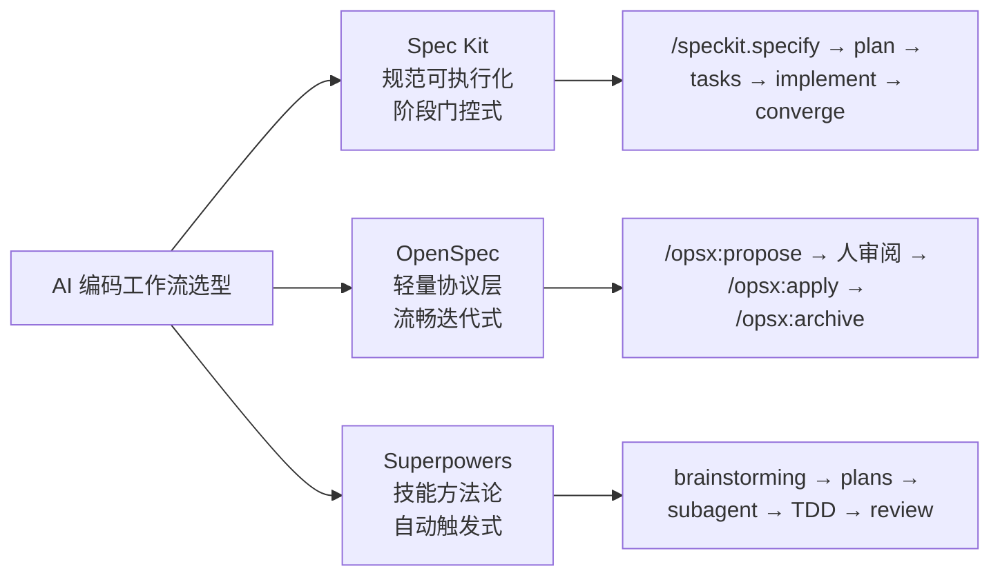
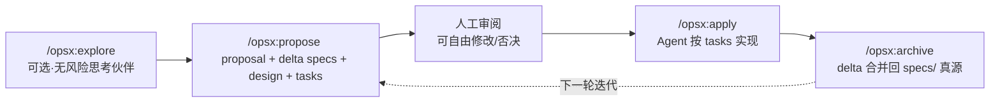
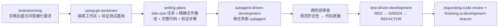

# Spec-Kit、OpenSpec、Superpowers 深度对比与实战指南

> 数据说明：Star 数等动态数据波动极快，文中均注明时间与来源，仅用于量级判断，请以 GitHub 实时为准。本文基于 2026-08 的三方官方文档与仓库信息整理。

## 一、背景：AI 编码正在从「生成代码」走向「约束过程」

当 LLM 直接写代码时，最大的问题不是写不出来，而是**写出来之后没人能说清它为什么这么写**——prompt 越来越长、上下文越来越碎、改动无法审计。Spec-Driven Development（规范驱动开发，SDD）把「需求 → 设计 → 任务 → 实现」变成**可审阅、可迭代、可追踪的文档链路**，让 AI 的输出从"黑盒生成"变成"有依据的执行"。

三款主流工具走的是三条不同路线：



一句话总结三家差异（引自腾讯云《AI 编程工作流选型》的经典概括）：

- **Spec Kit**：规范可执行，直接生成代码；
- **OpenSpec**：规范轻量化，灵活迭代；
- **Superpowers**：技能自动触发，强制质量。

---

## 二、逐个深挖

### 2.1 Spec Kit —— GitHub 官方的「规范即程序」

**定位**：Spec-Driven Development 工具包，由 GitHub 官方团队开源（`github/spec-kit`），核心主张是**规格不止指导实现，而是直接生成实现**。生态数据（官方站点 `docs/index.md`，2026-08）：121K+ Stars、240+ Contributors、35 个 Agent 集成、138 个 Extensions、25 个 Presets。它是 2026 年 GitHub 上增速最快的 AI 工具类项目之一（2026-01 约 6.5 万 Star，半年翻倍）。

**核心工作流**（`docs/quickstart.md`）：

- 精简路径：`/speckit.specify → /speckit.plan → /speckit.tasks → /speckit.implement → /speckit.converge`
- 完整路径（加质量门）：`/speckit.constitution → /speckit.specify → /speckit.clarify → /speckit.checklist → /speckit.plan → /speckit.tasks → /speckit.analyze → /speckit.implement → /speckit.converge`


**关键机制**：

- **三级产物链**：`spec.md`（只写 what，不写 how）→ `plan.md`（设计）→ `tasks.md`（可执行任务）。每一步都是独立文件、可人工审阅修改。
- **`.specify/` 项目目录**：`memory/constitution.md`、`scripts/`、`templates/`、`extensions.yml`、`feature.json`（记录当前活动 feature，不依赖 git 分支）。
- **Constitution（宪法）**：项目治理原则，作为每个阶段的评估基准。
- **扩展与预设**：`extensions`（git 扩展自动管理分支/提交/PR、agent-context 扩展等）+ `presets`（lean 极简、企业合规、多语言、pirate-speak 趣味演示）。模板覆盖优先级：项目本地 override > Preset > Extension > 核心内建。
- **工程底座**：Python 3.11+ / `uv` 打包，`typer` CLI，ruff + pre-commit + pytest，支持离线/air-gapped 环境。

**安装**（PyPI，`specify` CLI）：

```bash
uv tool install specify-cli
specify init <project> --integration copilot   # 按你用的 Agent 选 integration
```

**目录结构**：

```
.specify/                        # 项目级配置
  constitution.md  memory/  scripts/  templates/
  feature.json     extensions.yml
specs/
  001-taskify/     spec.md → plan.md → tasks.md
  002-.../
```

**本地实战示例**：仓库 `D:\Projects\Persion\ai-customer-service`（Java/Spring AI 微服务）就是真实 Spec Kit 项目——`.specify/` 里装有 `speckit-git-*` 系列扩展（git-feature / git-commit / git-validate 等），`specs/001-cart-checkout/` 下是完整产物链：`spec.md`、`plan.md`、`research.md`、`data-model.md`、`contracts/rest-api.md`、`checklists/requirements.md`、`tasks.md`、`quickstart.md`。`.agents/skills/` 中 14 个 `speckit-*` 技能（specify / plan / tasks / implement / analyze / clarify / checklist / constitution / taskstoissues）构成了 chat 内的完整命令面。

---

### 2.2 OpenSpec —— AI 与人之间的「Agreement Layer」

**定位**：Fission AI 开源的轻量规范层，官方定义是 **「AI 与人类之间的协议层」**。核心理念（`docs/overview.md`）：fluid not rigid、iterative not waterfall、easy not complex、**built for brownfield not just greenfield**。Star 数约 6 万+（2026-07 约 62.7K），MIT 许可，TypeScript 实现。

**五大概念**：

1. **Specs are the truth**：`openspec/specs/` 是唯一事实源，用 SHALL 需求 + WHEN/THEN 场景表达行为；
2. **A change is one unit of work**：`openspec/changes/<change-name>/` 一次改动一个变更夹；
3. **Delta specs**：以 ADDED / MODIFIED / REMOVED 增量描述变更，**不重写整个 spec**——这是 brownfield 项目的关键设计；
4. **Artifacts build on each other**：proposal → specs → design → tasks 是 **enabler 不是 gate**，可以随时回头改；
5. **Archiving folds change back into truth**：`/opsx:archive` 把增量合并回 `openspec/specs/`，变更夹移入 `changes/archive/`。

**核心循环**：



**两个易混淆的命令面**（官方文档专门强调这是最常见的坑）：

- `openspec` **CLI 命令**在终端跑：`init` / `update` / `config`；
- `/opsx:*` **slash 命令**在 AI 聊天里跑：explore / propose / apply / archive。

**安装**：Node.js 20.19+，`npm install -g @fission-ai/openspec@latest`，`openspec init`（也支持 pnpm / yarn / bun / nix）。30+ 工具支持，官方推荐 Codex 5.5 和 Claude Opus 4.7；匿名遥测可用 `OPENSPEC_TELEMETRY=0` 关闭。Stores（beta）支持跨仓库/跨团队共享 specs/changes。

**目录结构**：

```
openspec/
  specs/                        # 事实源（合并后的完整 spec）
  changes/
    add-dark-mode/              # 一次改动的所有产物
      proposal.md  design.md  tasks.md
      specs/001-ui-dark-mode.md # delta spec
    archive/                    # 归档
```

**README 自对比**（官方口径）：vs Spec Kit = *"Thorough but heavyweight. Rigid phase gates, lots of Markdown, Python setup"*；vs Kiro = 锁定 IDE + Claude。它对旧式 spec 流程的批评很直接：**那是 waterfall，而 OpenSpec 拒绝阶段门控**。

---

### 2.3 Superpowers —— 可组合技能的「开发方法论」

**定位**：Jesse Vincent（Prime Radiant / obra）的 **"A complete software development methodology for your coding agents, built on composable skills"**。注意：它**不是规范驱动，而是技能驱动**——不产出 spec 体系，而是把工程纪律编码成可自动触发的技能。仓库 `obra/superpowers`，Claude Code 官方插件市场发行。Star 数报道差异极大（2026-05 中旬 6.5 万→6 月底约 24 万，量级 10 万+，仅作参考）。

**哲学**：TDD（先写测试，永远）、Systematic over ad-hoc、Complexity reduction、Evidence over claims。

**技能体系**（`skills/` 按主题组织）：

- **testing**：`test-driven-development`（RED-GREEN-REFACTOR，测试前写的代码会被删除）、testing 相关技能；
- **debugging**：`systematic-debugging`（4 阶段）、`verification-before-completion`；
- **collaboration**：`brainstorming`（苏格拉底式提问细化需求，保存设计文档）、`writing-plans`、`executing-plans`、`dispatching-parallel-agents`、`requesting-code-review`、`using-git-worktrees`、`subagent-driven-development`；
- **meta**：`writing-skills`、`using-superpowers`。

**工作流**（技能自动触发，无需手动命令）：



**writing-plans 的硬规则**（质量的关键）：

- 计划存 `docs/superpowers/plans/YYYY-MM-DD-<feature>.md`；
- **禁止占位符**：不许写 TBD、"add error handling" 这类模糊任务；
- 任务边界 = 可独立测试的交付物；`Interface` 块定义消费/产出签名；
- 执行交接时，Agent 必须询问用户选 subagent-driven 还是 inline。

**安装**（多 harness 支持）：

```
# Claude Code（官方市场）
/plugin install superpowers@claude-plugins-official
# 也支持 Codex App/CLI、Gemini CLI、Cursor、Copilot CLI、Antigravity、OpenCode、Kimi、Pi、Factory Droid
```

遥测仅加载视觉 logo 版本号，可用 `SUPERPOWERS_DISABLE_TELEMETRY=1` 关闭。

---

## 三、横向对比矩阵

| 维度                    | Spec Kit                                                         | OpenSpec                                   | Superpowers                               |
| --------------------- | ---------------------------------------------------------------- | ------------------------------------------ | ----------------------------------------- |
| 出品方                   | GitHub 官方                                                        | Fission AI                                 | obra / Prime Radiant                      |
| 定位                    | SDD 工具包，规范可执行化                                                   | 轻量 Agreement Layer                         | 开发方法论，技能驱动                                |
| 核心机制                  | 阶段门控 + 文档产物链                                                     | Delta specs + 变更夹                          | 可组合 skills + 自动触发                         |
| 阶段模型                  | **严格阶段门**（quality gates）                                         | **无门控**，enablers not gates                 | **强制纪律**（TDD/计划/审查）                       |
| 产物                    | spec.md / plan.md / tasks.md + research / data-model / contracts | proposal / delta specs / design / tasks.md | 设计文档 + 计划 md + 测试                         |
| 是否强制 TDD              | 不强制（由 constitution 约定）                                           | 不强制                                        | **强制**（测试前写代码会被删）                         |
| Brownfield 支持         | 一般（偏 greenfield）                                                 | **极强**（delta spec 设计）                      | 强（worktrees + 测试基线）                       |
| 运行环境                  | Python 3.11+ / uv                                                | Node.js 20.19+ / TypeScript                | Shell/JS 技能（随 harness）                    |
| 工具支持数                 | 35 Agent 集成（2026-08 官方）                                          | 30+（2026-08）                               | 多 harness（Claude/Codex/Cursor 等）          |
| 生态定制                  | Extensions(138) + Presets(25)                                    | custom schemas / 命令面 / Stores(beta)        | composable skills，可自写技能                   |
| 离线/企业能力               | 强（支持 air-gapped，内置企业 preset）                                     | 一般（npm 安装，遥测可关）                            | 一般（遥测可关）                                  |
| 人机协作点                 | 每个阶段产物均可人工审阅                                                     | propose 后人工审阅、apply 前可改                    | brainstorming 问答 + 计划审阅 + 两阶段 code review |
| Star 量级（2026-08，仅供参考） | 12 万+（官方站点）                                                      | 6 万+（2026-07 约 62.7K）                      | 10–20 万+（各家口径差异大）                         |
| 上手成本                  | 较高（文档多、门控多）                                                      | 低（<30 秒装好，文档少）                             | 中（概念多但自动触发）                               |

**一句话选型**：Spec Kit 重流程可控，OpenSpec 重轻量迭代，Superpowers 重执行质量。

---

## 四、实战指南（端到端最小示例）

### 4.1 Spec Kit：做一个任务清单应用

```bash
# 1. 安装并初始化
uv tool install specify-cli
specify init taskify --integration copilot
cd taskify
```

```text
# 2. 在 AI 聊天里逐步执行（每条命令都可人工审阅中间产物）
/speckit.specify 我要做一个任务清单应用，支持添加、完成、删除任务，数据存 SQLite
/speckit.plan          # 产出 plan.md + research.md + data-model.md + contracts/
/speckit.tasks         # 产出依赖排序的 tasks.md
/speckit.implement     # 逐条执行任务并跑测试
/speckit.converge      # 检查结果，不满足 spec 就继续迭代
```

```text
# 3. 质量门（可选，用于严肃项目）
/speckit.constitution 项目要求：所有改动必须有测试，接口变更需过评审
/speckit.clarify       # 对 spec 中的歧义提出 ≤5 个问题并回写
/speckit.checklist     # 生成需求清单
/speckit.analyze       # spec/plan/tasks 与代码的一致性检查
```

**看本地例子**：`specs/001-cart-checkout/` 是"购物车结算"feature 的完整产物链，`.specify/extensions.yml` 启用了 git 扩展（每步自动建分支/提交）。当前活动 feature 记录在 `.specify/feature.json`。

### 4.2 OpenSpec：给现有应用加暗色模式

```bash
npm install -g @fission-ai/openspec@latest
openspec init          # 生成 openspec/specs + changes
```

```text
# 1. 聊天里：
/opsx:propose 为应用添加暗色模式，支持系统主题跟随，并在设置页提供手动切换
  # → 生成 openspec/changes/add-dark-mode/
  #   proposal.md · design.md · tasks.md
  #   specs/001-ui-dark-mode.md（delta：ADDED 主题切换 / MODIFIED 设置页）
# 2. 人工审阅 propose 产物（可自由改），然后：
/opsx:apply            # Agent 按 tasks.md 实现
/opsx:archive          # delta 合并进 openspec/specs/，变更夹归档
```

**特点**：改动只描述"增量"，不重写整个 spec；中间任何一步都能回头，没有门禁。

### 4.3 Superpowers：实现「记住我」登录功能

```bash
# Claude Code 里安装
/plugin install superpowers@claude-plugins-official
```

```text
# 全流程自动触发，Agent 会引导你：
1. brainstorming  苏格拉底式问答：记住多久？Cookie 还是 Token？多设备登录策略？
                   → 保存设计文档
2. writing-plans  → docs/superpowers/plans/2026-08-10-remember-me.md
                   每个任务含精确文件路径、完整代码、验证步骤
3. TDD            先写测试（RED）→ 最小实现（GREEN）→ 重构（REFACTOR）
4. subagent 执行  每个任务由新 subagent 完成，两阶段审查
5. review + finish requesting-code-review → finishing-a-development-branch
```

**特点**：没有 `/命令` 体系，技能按上下文自动唤起；质量靠"铁律"而非"流程文档"。

---

## 五、选型场景表

| 场景                    | 推荐                         | 理由                                        |
| --------------------- | -------------------------- | ----------------------------------------- |
| 大型企业 / 强合规 / 需审计追踪    | **Spec Kit**               | 阶段门控、constitution 治理、企业 preset、离线部署       |
| 新项目 / 从零开始 / 多人协作     | **Spec Kit**               | spec→plan→tasks 全链路清晰，适合"严肃开发"            |
| 快速迭代 / 个人 / 原型验证      | **OpenSpec**               | <30 秒装好、无门控、想改就改                          |
| 现有代码库持续演进（brownfield） | **OpenSpec**               | delta specs 不重写真源，增量改造成本最低                |
| 跨工具 / 常换 IDE 或 Agent  | **OpenSpec / Superpowers** | 30+ 工具 / 多 harness 支持，不锁平台                |
| 质量优先 / 强制测试文化         | **Superpowers**            | TDD 铁律 + 计划硬规则 + 两阶段审查                    |
| 独立开发者想"少踩坑"           | **Superpowers**            | 自动触发，纪律内建，不用自己记流程                         |
| 想要可组合、可自写的流程          | **Superpowers**            | skills 即代码，方法论可版本化                        |
| 需要社区扩展生态              | **Spec Kit**               | 138 extensions + 25 presets，覆盖 git/合规/多语言 |
| 追求极致轻量 + 良好文档         | **OpenSpec**               | 概念少、文档精炼、协议清晰                             |

**组合拳**：社区已有把 OpenSpec（规划层）与 Superpowers（执行纪律层）融合的实践——OpenSpec 负责"要做什么"的规范与变更管理，Superpowers 负责"怎么做得对"的 TDD 与审查。这对想要两者兼得的团队是成熟路线。

---

## 六、局限与权衡（诚实提醒）

- **Spec Kit**
  - 阶段门控对探索型/实验型任务偏重，容易"为了流程而流程"；
  - Python + uv 环境要求、大量 Markdown 产物，文档学习曲线陡；
  - 官方 README 也被第三方评价为 "thorough but heavyweight"。
- **OpenSpec**
  - 轻量意味着约束少，质量高度依赖 Agent 自律与人的审阅；
  - Delta spec 需要纪律维护，否则 changes 堆积、归档混乱；
  - Node 20.19+ 要求；Stores 仍属 beta。
- **Superpowers**
  - 强制 TDD 不适用于一次性脚本、纯探索、写文档等场景；
  - 技能行为绑定特定 harness（各平台的技能触发能力有差异）；
  - 计划/审查流程对"随便写点代码"的小改动是负担，可能过度工程。

**通用建议**：三者的共同前提是——**人的审阅不可省略**。规范工具解决的是"AI 为什么这么写"，而不是"替人做决定"。选型前先用最小示例各跑一遍，看哪个的中间产物你愿意每天读。

---

## 七、参考链接

- Spec Kit：https://github.com/github/spec-kit ｜ 官方站点 https://github.github.com/spec-kit/ ｜ quickstart：`docs/quickstart.md`
- OpenSpec：https://github.com/Fission-AI/OpenSpec ｜ 核心概念：`docs/overview.md`
- Superpowers：https://github.com/obra/superpowers ｜ Claude 市场：`/plugin install superpowers@claude-plugins-official`
- 本地实战：`D:\Projects\Persion\ai-customer-service\.specify` 与 `specs\001-cart-checkout`
